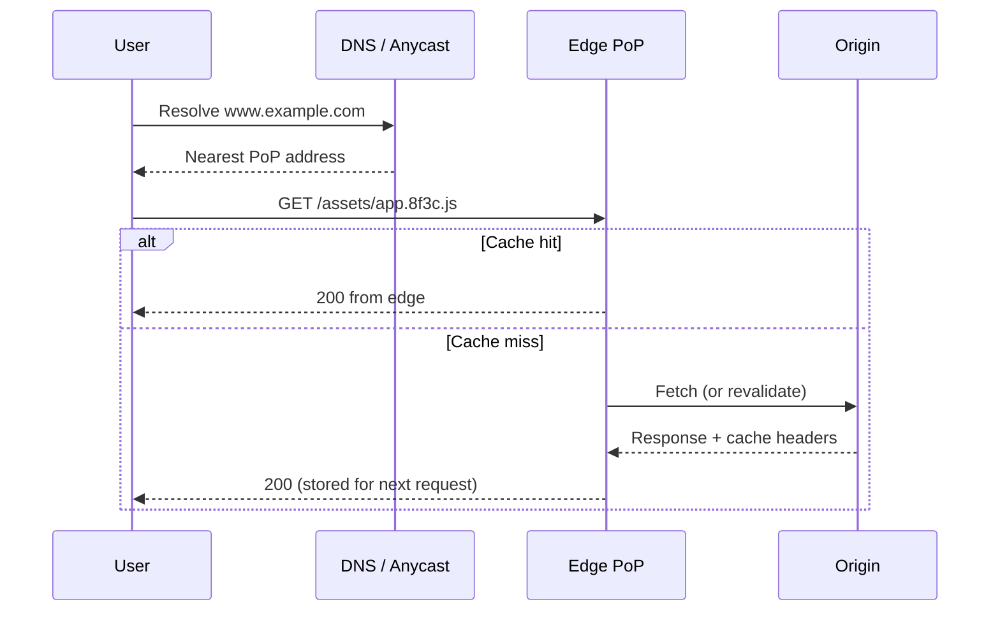
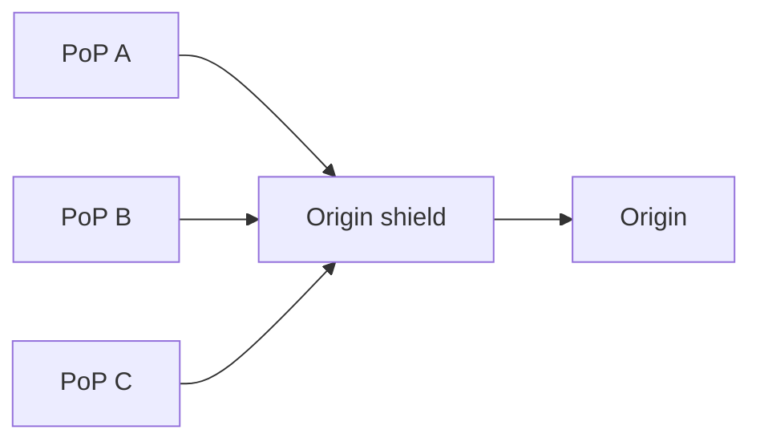

# CDN (Content Delivery Network)

A CDN is a geographically distributed network of caches and reverse proxies that serve content from a point of presence (PoP) close to the user.

It exists to cut user-facing latency, absorb traffic that would otherwise hit the origin, and survive spikes that a single region cannot.

## Why CDNs exist

Three constraints show up in almost every global product:

- **Physics**: Cross-continent round trips are 100-300ms before the origin does any work. Putting bytes in a nearby PoP removes most of that delay for cacheable content.
- **Origin capacity**: A popular image, JS bundle, or video segment can be requested millions of times. Serving it once from origin and many times from edge is the difference between a viable architecture and a melted origin.
- **Blast radius**: DDoS, traffic spikes, and regional outages hit the edge first. A CDN is a large, shared front door with more bandwidth than a typical origin.

A CDN is a poor fit as the *only* scale story for highly personalized, write-heavy, or strongly consistent reads. Those still need origin design; the CDN helps with the cacheable and connection-heavy parts.

## Request flow

1. DNS or anycast sends the client to a nearby PoP.
2. The edge looks up the object by **cache key** (usually scheme + host + path + selected headers/query).
3. **Hit**: serve from edge. **Miss**: fetch from origin (or from a shield PoP), store if headers allow, then respond.
4. Subsequent requests in that region skip the origin until TTL expires or the object is purged.

Even on a miss, the edge still helps: TLS is terminated nearby, connections to origin are reused, and HTTP/2 or HTTP/3 can multiplex many objects over one connection.

## Push vs pull

### Pull (origin fetch)

The CDN fetches from origin on first miss and caches the result.

Pros:

- Simple: deploy to origin, set cache headers, done
- Only popular objects occupy edge storage

Cons:

- First request per PoP is slow (cold miss)
- A sudden global miss can stampede the origin

Default for websites, APIs, and most object storage frontends.

### Push (pre-position)

You upload content to the CDN (or to a storage bucket the CDN is built on) before users ask for it.

Pros:

- No origin on the hottest path
- Predictable availability for known catalogs (game patches, video libraries)

Cons:

- Operationally heavier; unused objects still cost storage
- Updates require republish, not just origin deploy

Use when the catalog is known, large, and origin fetch would be too slow or too expensive.

## Cache policy

The origin (or CDN config) decides *what* is cacheable and *for how long*. HTTP headers are the contract. `Cache-Control` is the one that matters; the others refine who may store the response, how long, and how to revalidate it.

### Who may store it

- `public` means a shared cache (the CDN, a reverse proxy) is allowed to store the response and reuse it for other users. Without it, some intermediaries will refuse to cache anything that looks user-specific.
- `private` means only the end-user's browser may cache it. The CDN must not store a copy. Use this for HTML or JSON that is tied to a session.

### How long it may be reused

- `max-age=N` is the TTL in seconds, counted from when the response was generated. During that window a cache may serve the object without asking the origin. Short TTLs mean fresher content and more origin load.
- `s-maxage=N` is the same idea, but **only for shared caches**. Browsers still follow `max-age`. That split is how you give the CDN a longer (or shorter) life than the browser:
  hashed JS might be `max-age=31536000` everywhere, while HTML is `max-age=0, s-maxage=60` so users always revalidate and the edge still absorbs most origin traffic.
- `immutable` tells the browser the bytes will not change during `max-age`, so a refresh should not revalidate.

### When it must not be served from cache

- `no-store` means do not write the response to any cache, browser or CDN. Use it for secrets, banking payloads, and anything that must not land on disk.
- `no-cache` does **not** mean "do not cache." It means a cache may store the response but must revalidate with the origin before each reuse. You still save a full download on `304`, but you do not save the origin round trip.
- `must-revalidate` applies once the TTL has expired: the cache must check origin and must not serve the stale body. Contrast with stale serving below, which *allows* a stale body on purpose.

### Cheap revalidation

When a TTL expires, the cache does not have to refetch the whole object. If the origin sent `ETag` (a content hash) or `Last-Modified`, the cache repeats the request with `If-None-Match` or `If-Modified-Since`.

Unchanged origin replies `304 Not Modified` with no body. Bandwidth drops; origin QPS does not, unless the CDN is the one revalidating on behalf of many browsers.

### `Vary` and the cache key

The default cache key is roughly scheme + host + path + selected query params. `Vary` adds request headers to that key.

- `Vary: Accept-Encoding` is the common, correct case: gzip and brotli are different objects. `Vary: Accept` or `Vary: Accept-Language` is reasonable for content negotiation, at the cost of more variants and a lower hit ratio.

- `Vary: Cookie` or `Vary: Authorization` is usually a mistake at the CDN. It explodes cardinality (one entry per user) and, if misconfigured, can leak one user's response to another.
  Personalized content belongs behind `private` / `no-store`, not behind a huge `Vary` list.

### How you change a cached object

TTL is the baseline safety net. After it expires, the next request is a miss or a revalidation.

**Versioned URLs** (`app.8f3c.js`) are the reliable strategy for static assets: a new build is a new cache key, so you can set a long TTL and never purge.
The HTML that *references* those URLs keeps a short TTL (or `no-cache`) so users pick up the new filenames quickly.

**Purge / invalidation** deletes or marks an object stale across PoPs. Treat it as eventually consistent: some PoPs update in seconds, others lag.
Do not rely on purge as the only safety net for legal or security takedowns; combine it with short TTL or token expiry.

### Serving stale on purpose

- `stale-while-revalidate=N` lets the edge return the expired object immediately and refresh it in the background within `N` seconds. Users see old content for one request and they do not wait on origin.
- `stale-if-error=N` lets the edge keep serving that expired object if origin is down or erroring, for up to `N` seconds.

Both improve tail latency and availability at the cost of a bounded window of old content.

## Origin protection

A CDN that misses badly can *increase* origin load (every PoP stampedes at once). Design the origin as if the CDN will fail open.

Patterns:

- **Origin shield**: one (or a few) regional caches talk to origin; other PoPs fetch from the shield. Collapses duplicate misses.
- **Request coalescing**: one in-flight miss per object per PoP; others wait. Same idea as cache stampede protection.
- **Restrict origin**: allowlist CDN egress IPs, or require a shared secret header, so clients cannot bypass the CDN.
- **Tiered TTLs**: HTML short, hashed assets long, so origin sees mostly HTML and API traffic.

Monitor **origin request rate** and **cache hit ratio**, not only edge traffic. A 99% hit ratio on bytes can still melt origin if the 1% are uncacheable, huge, or thundering.

## Routing users to an edge

Two common control planes:

- **Anycast**: the same IP is announced from many PoPs. BGP sends the client to a nearby announcement. Fast failover, fewer DNS TTLs to wait out, but routing is "BGP-near," not always "user-near."
- **GeoDNS**: DNS answers with a PoP IP based on resolver location or latency measurements. Easier traffic steering and load shedding per region.

Many providers combine both. The interview point is the same as [global load balancing](./13-load-balancing.md): you are choosing a **user → region** map, then a **region → origin** map,
and those maps have different failure modes.

## Dynamic content and private files

Not everything is a public image.

- **Uncacheable or personalized responses**: Can still terminate at the edge — TLS, WAF, rate limits, geo routing — then proxy to origin.
- **Signed URLs / cookies**: Grant time-limited access to private objects (downloads, video) without putting the origin on the hot path. The edge checks the signature and origin never sees most requests.
- **Edge compute** (workers, functions): Runs small logic at the PoP — A/B cookies, header rewrites, auth checks, HTML assembly from fragments.
  Keep it tiny; heavy work belongs at origin, and the edge is for latency-sensitive, stateless decisions.
- **APIs**: Cache GET responses only when the body is shareable (public catalog, config, featured lists). Authenticated, user-specific JSON is usually `private` or `no-store`.
  If you cache it, the cache key must include the authorization dimension, or you will leak data across users.

## Large files and video

Video and software downloads are why CDNs exist at terabit scale.

- Split media into **segments** (HLS/DASH). Each segment is a small, immutable, highly cacheable object.
- Support **range requests** so a miss does not refetch an entire multi-GB file.
- Prefetch the next segment at the edge when possible and the player pipeline is sequential and predictable.

The architectural lesson: turn a huge, sequential object into many small, independently cacheable objects with stable keys.

## Common pitfalls

- Caching authenticated or `Vary`-incorrect responses (data leak)
- Query-string cache keys that explode cardinality (`?utm_...`) and destroy hit ratio
- Purging as the only deploy strategy for JS/CSS (use hashed filenames)
- Assuming purge is globally instantaneous
- Treating CDN as HA for writes or for data the origin never stored durably

## Design guidelines

- Default static assets to long TTL + content-hashed URLs
- Keep HTML and API TTLs short unless the body is truly shareable
- Put an origin shield or coalescing in front of any origin that cannot absorb a global miss
- Lock origin so clients cannot bypass the CDN
- Measure hit ratio, origin QPS, and purge lag as product metrics
- Decide staleness explicitly (`stale-while-revalidate` vs must-revalidate)

## Interview talking points

- A CDN is a **global reverse-proxy cache**. Hits cut latency and origin load; misses still help via TLS and connection reuse.
- Name **cache key, TTL, and invalidation** (hashed assets vs purge).
- Call out **origin protection**: shield, coalescing, allowlisting.
- Separate **static/public** content from **personalized** content; do not cache the latter at a shared edge.
- For video, talk **segments + range requests**, not one giant file.

## Reference materials

- [MDN: HTTP caching](https://developer.mozilla.org/en-US/docs/Web/HTTP/Caching)
- [RFC 9111: HTTP Caching](https://www.rfc-editor.org/rfc/rfc9111.html)
</content>
