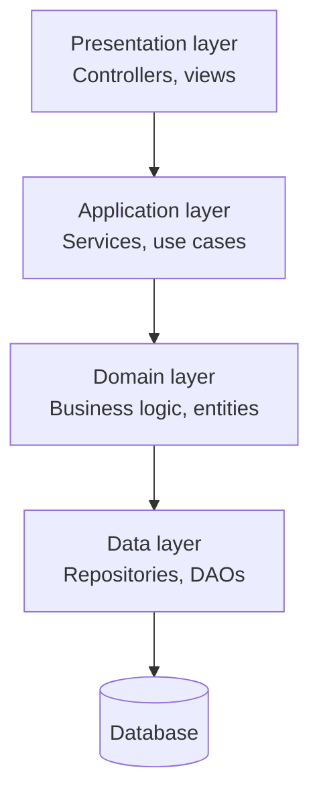
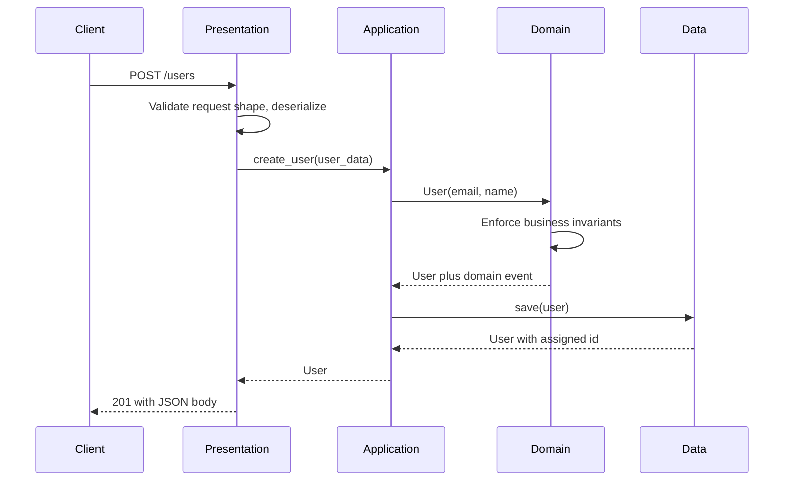
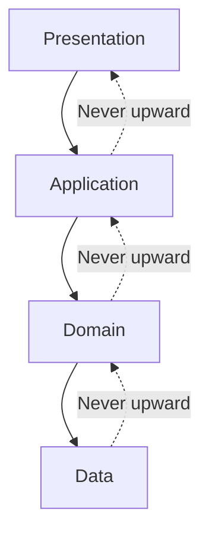
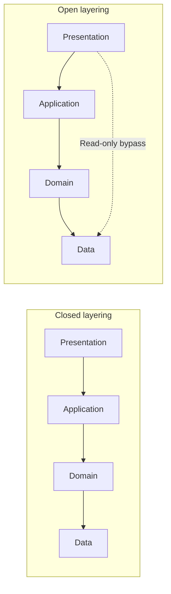
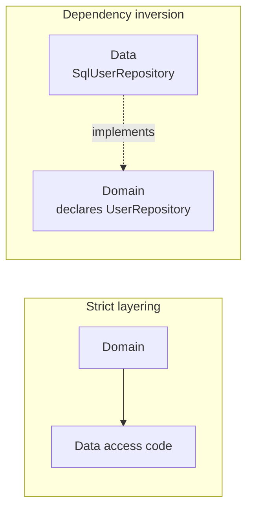

# Layered architecture (n-tier)

Layered architecture organizes a single deployable application into horizontal layers, where each layer offers services to the layer above it and consumes services from the layer below it.

It is the entry point of the decoupling spectrum this folder walks: layered architecture separates concerns **inside one process**, [hexagonal architecture](./02-hexagonal-architecture.md) rearranges those same concerns so the domain depends on nothing external, and [microservices](./03-microservices-architecture.md) push the boundaries across process and network lines.

Most microservices are internally layered or hexagonal, so this pattern does not compete with the other two so much as underpin them.

## Core concept

Also known as **n-tier architecture**, the pattern groups code by technical responsibility rather than by business capability. Each layer is an abstraction that hides its implementation details from the layers around it.



A note on terminology: **layer** is a logical grouping of code, **tier** is a physical deployment boundary. Four layers commonly run in one process on one tier. The terms get used interchangeably, but the distinction matters the moment someone proposes deploying a layer separately.

## The four layers

A single request passes through all four in order, and each one hands off in the vocabulary of the layer below it rather than in the vocabulary of the transport it arrived on.



### Presentation layer

- **Purpose**: Manages user interfaces and external communication.
- **Responsibilities**: Request handling, response formatting, input shape validation.
- **Examples**: REST controllers ([REST API](../fundamentals/05-rest-api.md)), web pages, mobile clients, CLI entry points.

A controller here does three things and nothing else: deserialize the request, call one application service, and turn the result or the exception into a response. Validation at this layer is about the *shape* of the request (is the field present, is it a string). Validation of business rules belongs in the domain layer, and duplicating those rules in the controller is the first step toward an anemic domain model.

### Application layer

- **Purpose**: Orchestrates workflows and coordinates the other layers.
- **Responsibilities**: Transaction boundaries, authorization, sequencing of steps, side effects.
- **Examples**: Application services, use case handlers, facades.

This layer holds no business rules of its own. Its job is to say *what happens in which order* — construct the entity, persist it, send the welcome email, commit — not *what is allowed*. The distinction is what keeps it thin, and it is also what makes the layer the natural home for the transaction boundary: it is the only place that knows the full set of writes a single use case performs.

### Domain layer

- **Purpose**: Holds the core business rules.
- **Responsibilities**: Entities, invariants, business validation, domain events.
- **Examples**: Domain models, domain services, value objects.

```python
class User:
    def __init__(self, email, name):
        self.email = self._validate_email(email)   # Invariant enforced at construction
        self.name = self._validate_name(name)

    def change_email(self, new_email):
        old_email = self.email
        self.email = self._validate_email(new_email)
        return EmailChangedEvent(self.id, old_email, new_email)
```

The entity enforces its own invariants and returns a domain event describing what happened. That returned event is also the seam other patterns hook into: it is the unit [event-driven architecture](./04-event-driven-architecture.md) publishes and the record [event sourcing](./09-event-sourcing.md) persists.

### Data layer

- **Purpose**: Manages persistence and retrieval.
- **Responsibilities**: Database access, object-relational mapping, external data sources.
- **Examples**: Repository implementations, ORM mappings, data access objects.

```python
class SqlUserRepository:
    def find_by_email(self, email):
        row = self.db.query('SELECT * FROM users WHERE email = ?', [email])
        if not row:
            return None
        user = User(row['email'], row['name'])   # Re-runs every invariant on stored data
        user.id = row['id']
        return user
```

Reconstructing an entity through its constructor re-runs every invariant against data that was already accepted once. That is fine while the rules never tighten, and it becomes a production incident the day a stricter rule makes existing rows unloadable. Mature codebases give entities a separate reconstitution path that trusts stored data, and keep the validating constructor for genuinely new objects.

## Dependency rules

### Strict downward dependencies

Upper layers depend on lower layers and never the reverse. This keeps boundaries predictable and prevents dependency cycles.



The rule is enforced socially by default, which means it decays. Package-level import checks, module boundaries, or a build-time dependency rule turn it into something the build fails on rather than something a reviewer has to notice.

### Closed and open layering

**Closed layering** (the common default) means a request must pass through every layer in order. **Open layering** allows a layer to skip the one below it, usually so a read path can reach the database directly.



**Closed layering pros:**

- Predictable data flow, so a change has a bounded blast radius.
- Each layer genuinely encapsulates its responsibility.
- Easier to debug, because there is one path through the system.

**Open layering pros:**

- Removes pass-through code for queries that carry no business rules.
- Reduces object mapping overhead on read-heavy and reporting paths.

**Open layering cons:**

- Couples non-adjacent layers, so a data layer change now breaks the presentation layer.
- Business logic leaks into the bypass path over time, because the bypass is the convenient place to add it.
- Two paths to the same data means two places to fix a bug.

If the read path genuinely wants a different shape than the write path, the disciplined version of open layering is [CQRS](./10-cqrs.md), which makes the second path explicit and gives it its own model rather than letting it grow as an exception.

### Inverting the data dependency

The diagram at the top of this document says the domain layer depends on the data layer. That is the honest description of naive layering, and it is also its main structural weakness: the part of the system that should be most stable ends up depending on the part most likely to change.

The fix is **dependency inversion**. The domain layer declares the interface it needs, and the data layer implements it. The arrow flips without the runtime behavior changing.



Concretely: the domain layer owns an abstract `UserRepository` with `save` and `find_by_email`, expressed entirely in domain types. `SqlUserRepository` in the data layer implements it, and the composition root at startup is the only place that knows which implementation is in use.

At runtime the same objects call the same methods in the same order; what changed is that the domain layer no longer imports anything from the data layer, so persistence can be replaced or faked without the domain noticing.

Applied to one or two interfaces, this is a local fix. Applied as the organizing principle of the whole system, it stops being layering at all and becomes [hexagonal architecture](./02-hexagonal-architecture.md), which is where the full treatment of ports, adapters, and what the inversion buys you lives.

## Benefits and challenges

**Pros:**

- **Clear separation**: Each layer has a distinct, nameable responsibility.
- **Maintainability**: Changes usually stay inside one layer.
- **Testability**: Layers can be tested independently by substituting the layer below.
- **Reusability**: The same business logic serves a web UI, an API, and a batch job.
- **Onboarding**: The structure is widely understood, so new engineers find their way quickly.

**Cons:**

- **Pass-through overhead**: A field addition can touch four layers and change no behavior.
- **Over-engineering**: Simple CRUD gains ceremony without gaining safety.
- **Anemic models**: The most common failure mode, covered below.
- **Rigidity**: Grouping by technical concern means a single feature is spread across the codebase, which is exactly the complaint that motivates organizing by business capability instead.

That last point is the seam microservices exploit: layered architecture cuts the system horizontally, and [microservices](./03-microservices-architecture.md) cut it vertically by business capability.

## Practical guidelines

### Keep layers thin and focused

```python
# Good: thin controller focused on HTTP concerns
class OrderController:
    def create_order(self, request):
        order = self.order_service.create_order(request.json)
        return jsonify({"order_id": order.id})

# Bad: fat controller carrying business logic and data access
class OrderController:
    def create_order(self, request):
        order_data = request.json
        # Business rule in the wrong layer
        if order_data['total'] < 0:
            return {"error": "Invalid total"}
        # Data access in the wrong layer
        db.execute("INSERT INTO orders...")
```

### Wire dependencies at the edge

Layers should receive their collaborators rather than construct them. Composition happens once, at application startup, which is the only place that knows about every layer at the same time.

```python
def create_app():
    database = Database(connection_string)
    user_repository = SqlUserRepository(database)
    email_service = SMTPEmailService()
    user_service = UserService(user_repository, email_service)
    user_controller = UserController(user_service)

    return App(user_controller)
```

### Handle cross-cutting concerns without threading them through

Logging, caching, metrics, and retries apply to every layer, so putting them inline in each one duplicates them everywhere. Wrapping a layer in a decorator keeps the concern in one place and the wrapped class ignorant of it.

```python
class LoggingUserService:                  # Same interface as UserService
    def __init__(self, user_service, logger):
        self.user_service = user_service
        self.logger = logger

    def create_user(self, user_data):
        try:
            return self.user_service.create_user(user_data)
        except Exception:
            self.logger.exception("Failed to create user")
            raise
```

The decorator must expose the same interface as the class it wraps, which is what lets the composition root substitute one for the other without any caller knowing. Re-raising rather than swallowing matters for the same reason: a decorator that changes the outcome is no longer a cross-cutting concern, it is business logic hiding in the wiring.

## When to use layered architecture

**Ideal scenarios:**

- **Traditional business applications**: CRUD-heavy systems with recognizable workflows.
- **Stable domains**: Well-understood requirements where the structure will not be relitigated monthly.
- **Small teams**: One deployable, one mental model, no distributed systems tax.

**Consider alternatives when:**

- Technology choices are expected to change, or the same core must serve many different entry points, which is the [hexagonal](./02-hexagonal-architecture.md) case.
- Independent deployment and independent scaling per capability matter more than a single coherent codebase, which is the [microservices](./03-microservices-architecture.md) case.
- The read and write paths have genuinely different shapes and scaling profiles, which is the [CQRS](./10-cqrs.md) case.

## Common anti-patterns

### Anemic domain model

The characteristic failure of layered architecture: entities decay into field bags and all the rules end up in services. The layers still exist on paper, but the domain layer no longer contains the domain.

```python
# Anti-pattern: a field bag, with every rule in the service layer
class User:
    def __init__(self):
        self.email = None

class UserService:
    def validate_user(self, user):
        if not user.email or '@' not in user.email:
            raise ValidationError("Invalid email")

# Better: the entity owns its invariants and cannot exist in an invalid state
class User:
    def __init__(self, email):
        if not email or '@' not in email:
            raise ValidationError("Invalid email")
        self.email = email
```

It is worth being precise about why this hurts. Nothing is technically broken, and the code runs. The cost is that an invariant enforced in a service is only enforced on the paths that go through that service, so the second caller, the batch import, and the admin tool each get to forget it. An invariant enforced in the constructor cannot be bypassed by a new caller.

Every pattern in this folder that puts the domain at the center inherits this concern. [Hexagonal architecture](./02-hexagonal-architecture.md) is essentially the structural answer to it, and this section is the canonical explanation the other documents refer back to.

### Layer bypassing

A controller issuing SQL directly, as in the fat controller above, is the common form: the layers still exist, but this request does not use them.

The distinction from open layering is intent. Open layering is a deliberate, documented bypass for a class of read paths. This is one developer taking a shortcut, and the tell is that no one can say which bypasses exist.

### God services

A service class that accumulates unrelated responsibilities becomes a monolith inside the layer, and defeats the separation the layers were meant to provide. Keep each service scoped to one business capability. When a service grows past what one person can hold in their head, splitting it along capability lines is the same instinct that eventually motivates splitting the application into services.

## Interview talking points

- **Layers group by technical concern, services group by business capability.** Name which axis you are cutting on and why.
- **Say which way the arrows point.** Naive layering has the domain depending on persistence; inverting that one dependency is the whole idea behind hexagonal architecture.
- **Closed versus open layering is a real trade-off**, not a purity argument. Open layering buys read performance and costs you a second path to maintain.
- **The anemic domain model is the pattern's characteristic failure**, and the reason is enforceability, not elegance: rules in services are skippable, rules in constructors are not.
- **Layered architecture is not the opposite of microservices.** It is what usually lives inside each one.

## Reference materials

- [N-tier architecture](https://docs.microsoft.com/en-us/azure/architecture/guide/architecture-styles/n-tier)
- [Presentation domain data layering](https://www.martinfowler.com/bliki/PresentationDomainDataLayering.html)
- [Anemic domain model](https://martinfowler.com/bliki/AnemicDomainModel.html)
