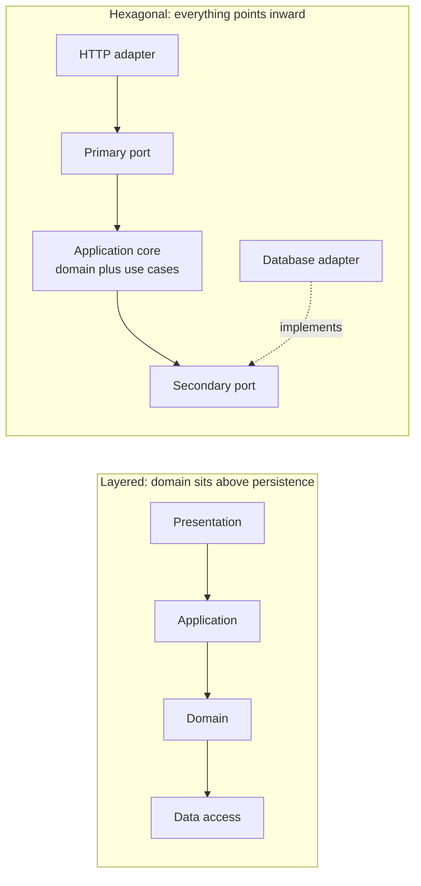
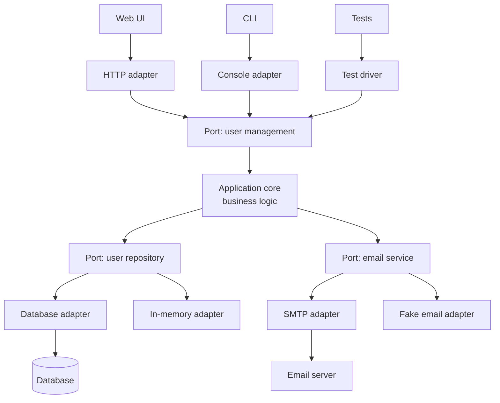
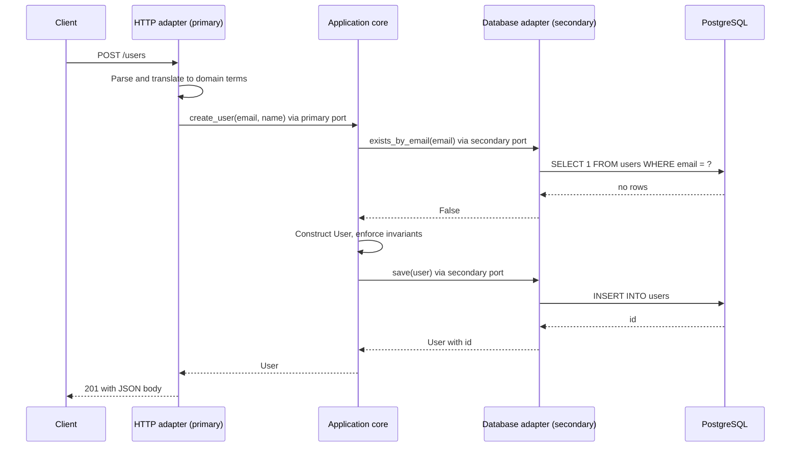
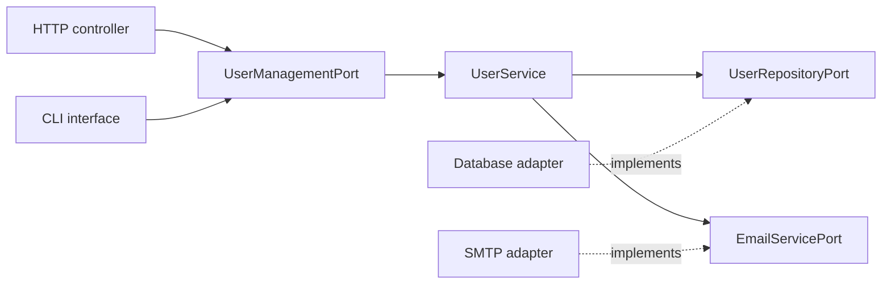

# Hexagonal architecture (ports and adapters)

Hexagonal architecture, also called **ports and adapters**, isolates business logic from every external concern by making each interaction with the outside world pass through an interface the core itself defines.

It is the second step of this folder's decoupling spectrum. [Layered architecture](./01-layered-architecture.md) separates concerns inside one process but leaves the domain depending on the persistence layer beneath it.

Hexagonal architecture takes that one inverted dependency and makes it the organizing principle: nothing the core depends on is allowed to be a concrete technology. [Microservices](./03-microservices-architecture.md) then take the same decoupling across the network.

## What actually changes from layering

The layers do not disappear. What changes is the shape of the dependency graph and, with it, what is allowed to reference what.



The practical test is a build-time one: in a hexagonal codebase you can delete the database adapter, the HTTP adapter, and the SMTP adapter, and the core still compiles. In a layered codebase it usually does not, because the domain imports the persistence types directly.

This is why the shared vocabulary between the two documents is worth stating once: hexagonal architecture's **application core** is layered architecture's **domain layer plus application layer**, wrapped so that nothing outside can be referenced from within it.

The rules about what belongs in a domain entity, and why an [anemic domain model](./01-layered-architecture.md#anemic-domain-model) undermines the whole arrangement, are the same in both documents and are explained in full in the layered architecture document. This one covers what the ports and adapters wrapper buys you.

## Core concept

The name comes from the hexagon conventionally drawn around the core. The number of sides is arbitrary and carries no meaning; the point is that a shape with many sides suggests many entry points rather than a single top and bottom.

- **Core**: The business logic, unaware of how it is invoked or where its data goes.
- **Ports**: Interfaces owned by the core. **Primary** (driving) ports describe what the outside world can ask the core to do; **secondary** (driven) ports describe what the core needs from the outside world.
- **Adapters**: Implementations that bind a port to a concrete technology. **Primary** adapters call into primary ports; **secondary** adapters implement secondary ports.



The asymmetry between the two sides is the part people most often get wrong. A primary adapter **calls** a port the core implements. A secondary adapter **is called through** a port the core declares. Both arrows in a dependency sense point at the core, but control flows in opposite directions.



Notice what the core never sees: no request object, no SQL, no connection, no status code. Translation in both directions happens in the adapters, and that translation work is the price of the pattern.

## Architecture components

### Application core

The business logic and the use cases that sequence it. Entities enforce their own invariants exactly as they do in [layered architecture](./01-layered-architecture.md#domain-layer); the difference is that here the core is not permitted to import anything from the adapter side.

```python
class UserService:
    def __init__(self, user_repository, email_service):
        # Both arguments are ports, never concrete adapters
        self.user_repository = user_repository
        self.email_service = email_service

    def create_user(self, email, name):
        if self.user_repository.exists_by_email(email):
            raise UserAlreadyExistsError(email)   # Domain exception, not an HTTP error
        user = User(email, name)                  # Constructor enforces the invariants
        saved_user = self.user_repository.save(user)
        self.email_service.send_welcome_email(user.email, user.name)
        return saved_user
```

Two things in `create_user` are worth naming. The exceptions it raises are domain exceptions, not HTTP errors, which is what lets the CLI adapter render them as text and the HTTP adapter render them as a 400.

The check-then-write on email uniqueness is a race under concurrency: the core expresses the intent, but the actual guarantee has to come from a unique constraint in the adapter's schema. Ports let you hide the technology, not the [concurrency semantics](../fundamentals/25-database-concurrency-control.md).

### Ports

#### Primary ports (driving, input)

What external actors can ask the application to do. This is the application's own API, expressed in domain terms. `UserService` above is one implementation of such a port: its operations are `create_user(email, name)`, `get_user(user_id)`, and `update_user_email(user_id, new_email)` — arguments and return values the domain understands, never a request object, a session, or a status code.

The test for a primary port is whether a completely different channel could call it unchanged. If a method takes an HTTP request or returns a serialized response, the transport has been baked into the application's API and every other entry point now has to fake being a web request.

#### Secondary ports (driven, output)

What the core needs from the outside world, expressed in terms the core chose rather than terms the technology imposes.

```python
class UserRepositoryPort(ABC):
    @abstractmethod
    def save(self, user: User) -> User:
        pass

    @abstractmethod
    def exists_by_email(self, email: str) -> bool:
        pass
```

Who owns the interface is the whole game. `UserRepositoryPort` lives with the core and is written to suit the core; the database adapter has to satisfy it. If the interface is written to suit the ORM and the core adapts to it, you have the same coupling with more files.

### Adapters

Both kinds of adapter do translation, but they sit on opposite ends of the control flow, which changes what each is responsible for.

| Aspect         | Primary (driving) adapter                                                                                 | Secondary (driven) adapter                                                       |
| -------------- | --------------------------------------------------------------------------------------------------------- | -------------------------------------------------------------------------------- |
| Control flow   | Calls into the core                                                                                       | Is called by the core                                                            |
| Port ownership | Implements nothing; consumes a primary port the core implements                                           | Implements a secondary port the core declared                                    |
| Translates     | External input into domain arguments, and results or domain exceptions back into the channel's vocabulary | Domain arguments into technology calls, and rows or responses back into entities |
| Examples       | HTTP controller, CLI command, message consumer, scheduled job, test driver                                | SQL repository, SMTP sender, payment gateway client, in-memory fake              |

#### Primary adapters (driving)

Translate an external input into a core operation, and a core result or exception into whatever the channel expects.

```python
# HTTP adapter: domain exceptions become status codes
class UserController:
    def create_user_endpoint(self, request):
        try:
            user = self.user_service.create_user(request.json['email'], request.json['name'])
            return {"user_id": user.id}, 201
        except UserAlreadyExistsError:
            return {"error": "email already registered"}, 409

# CLI adapter: the same exceptions become exit codes
class UserCLI:
    def handle_create_command(self, args):
        try:
            self.user_service.create_user(args.email, args.name)
            return 0
        except (UserAlreadyExistsError, InvalidEmailError) as e:
            print(f"Error: {e}")
            return 1
```

The two adapters map the same domain exceptions onto entirely different vocabularies: HTTP status codes on one side, process exit codes on the other. That mapping is the adapter's actual job, and it is the reason the core must not know about either vocabulary. A core that raised an HTTP 409 would force every non-HTTP entry point to understand HTTP.

#### Secondary adapters (driven)

Implement what the core declared it needs. `DatabaseUserRepository` satisfies `UserRepositoryPort` with SQL, `InMemoryUserRepository` satisfies the same port with a dictionary, and `SMTPEmailService` satisfies `EmailServicePort` by talking to a mail server. The core cannot distinguish them, which is exactly the property being bought.

Two details of these adapters are load-bearing. The first is that they own the technology's guarantees as well as its calls: the uniqueness check in `create_user` is only advisory until the schema behind the repository has a unique constraint on the email column.

The second is entity reconstruction. An adapter that rebuilds entities through the validating constructor re-checks invariants against rows the system already accepted, with the same consequence described under the [data layer](./01-layered-architecture.md#data-layer): tighten a rule and old rows become unloadable. A separate reconstitution path that trusts stored data is the usual fix.

### Composing the application

Nothing in the core knows which adapters exist. One composition root at startup picks them, and that is the only file that imports both sides.

```python
def build_production_app():
    database = PostgresDatabase(os.environ['DATABASE_URL'])
    user_service = UserService(
        user_repository=DatabaseUserRepository(database),
        email_service=SMTPEmailService(host, 587, user, password),
    )
    return HttpApp(UserController(user_service))

def build_test_app():
    # Same core, substituted adapters, no infrastructure required
    user_service = UserService(
        user_repository=InMemoryUserRepository(),
        email_service=RecordingEmailService(),
    )
    return UserController(user_service)
```

`build_test_app` is the payoff, and it is more than a testing convenience. Because every use case can run against in-memory adapters, the business rules get tested at full speed with no database, no network, and no fixtures, which usually means they get tested at all.

## Dependency inversion

Dependencies point inward. The core depends only on abstractions it defines; concrete technology depends on those same abstractions from the outside.



High-level policy does not depend on low-level detail; both depend on the abstraction. The reason this is more than a slogan is that it decides which changes are cheap. Swapping PostgreSQL for DynamoDB touches one adapter. Adding a gRPC entry point alongside REST touches one adapter. Changing a business rule touches the core and nothing else. The pattern buys nothing when the technology never changes, which is exactly when it feels like overhead.

## Benefits and trade-offs

**Pros:**

- **Technology independence**: Infrastructure choices become replaceable rather than load-bearing.
- **Testability**: Use cases run against in-memory adapters, with no database, broker, or network.
- **Multiple entry points**: HTTP, CLI, a message consumer, and a scheduled job can drive the same core ([communication patterns](../fundamentals/06-communication-patterns.md) covers what those entry points look like).
- **Explicit contracts**: Every external dependency is a named interface, so the full set of things the system touches is enumerable.
- **Deferred decisions**: The persistence choice can be postponed past the point where the domain is understood.

**Cons:**

- **More indirection**: An interface, an implementation, and a mapping for every external concern.
- **Translation cost**: Data is converted at every boundary, which is real code and real CPU.
- **Overkill for thin domains**: If the application is a database with HTTP on top, the ports add ceremony around nothing.
- **Discipline dependent**: One direct import from core to adapter quietly removes the guarantee, so it needs enforcement in the build rather than in review.

## When to use hexagonal architecture

**Ideal scenarios:**

- **Long-lived systems** where the technology stack will outlast at least one of its current components.
- **Complex domains** where the business rules deserve to be tested and reasoned about in isolation.
- **Multiple entry points** into the same functionality: web, mobile API, CLI, batch, event consumer.
- **Integration-heavy applications** where the number of external systems is the dominant complexity.

**Consider alternatives when:**

- The application is thin CRUD, where [layered architecture](./01-layered-architecture.md) delivers most of the benefit for less structure.
- The stack is fixed and the domain is simple, so the substitution you are paying for will never happen.

Hexagonal architecture is also the natural internal structure for a [microservice](./03-microservices-architecture.md). A service that keeps its domain behind ports can change its database, its transport, and its message broker without its business rules noticing, which is what makes independent evolution of a service more than a deployment story.

## Common anti-patterns

### Leaky abstractions

```python
# Anti-pattern: port exposing implementation details
class UserRepositoryPort(ABC):
    @abstractmethod
    def execute_sql(self, sql: str) -> List[Dict]:  # Leaks SQL into the core
        pass

# Better: domain-focused interface
class UserRepositoryPort(ABC):
    @abstractmethod
    def find_active_users_by_department(self, department: str) -> List[User]:
        pass
```

A port that leaks its technology gives you the file structure of hexagonal architecture with none of the substitutability. The check is simple: could a plausible second adapter, backed by a completely different technology, implement this interface honestly? `execute_sql` fails that check immediately.

### Anemic ports

```python
# Anti-pattern: a generic CRUD port that describes a database
class GenericRepository(ABC):
    @abstractmethod
    def read(self, id):
        pass

# Better: a port that describes what the core actually needs to ask
class UserRepositoryPort(ABC):
    @abstractmethod
    def find_user_by_email(self, email: str) -> User:
        pass
```

A generic CRUD port describes a database, not a need. The consequence is that query logic migrates outward into the callers, so the core ends up assembling results by hand and the adapter can no longer optimize anything, because it was never told what was being asked.

### Fat adapters

Business rules that drift into adapters are the mirror image of the [anemic domain model](./01-layered-architecture.md#anemic-domain-model), and they fail for the same reason: a rule implemented in the HTTP adapter is not enforced for the CLI, the consumer, or the batch job. Adapters translate and integrate. Anything that decides what is *allowed* belongs in the core.

### Ports invented for things that are not external

Not every collaborator deserves a port. An interface around a pure function, a date formatter, or a value object adds a seam nobody will ever substitute. Ports earn their cost at boundaries where the technology could genuinely change or where the dependency makes tests slow. Everywhere else they are indirection for its own sake.

## Interview talking points

- **State the invariant, not the shape**: the core imports nothing from the adapters. That single rule, enforced at build time, is the whole pattern.
- **Primary versus secondary is about control flow.** Primary adapters call in, secondary adapters get called; both depend on the core.
- **Ports are owned by the core.** An interface written to fit the ORM is not a port, it is the coupling relocated.
- **The concrete payoff is a test suite that runs the real use cases with no infrastructure.** If you cannot do that, the arrangement is not paying for itself.
- **It complements rather than replaces layering**, and it composes well as the inside of a microservice.
- **Say when it is not worth it**: thin CRUD on a stack that will not change.

## Reference materials

- [The hexagonal (ports and adapters) architecture](https://alistair.cockburn.us/hexagonal-architecture/)
- [Ports and adapters pattern explained](https://jmgarridopaz.github.io/content/hexagonalarchitecture.html)
- [Ready for changes with hexagonal architecture](https://netflixtechblog.com/ready-for-changes-with-hexagonal-architecture-b315ec967749)
- [Hexagonal architecture: the what, why and when](https://www.youtube.com/watch?v=qGp66Oc3zTg)
- [Implementing hexagonal architecture in Go](https://medium.com/@matiasvarela/hexagonal-architecture-in-go-cfd4e436faa3)
