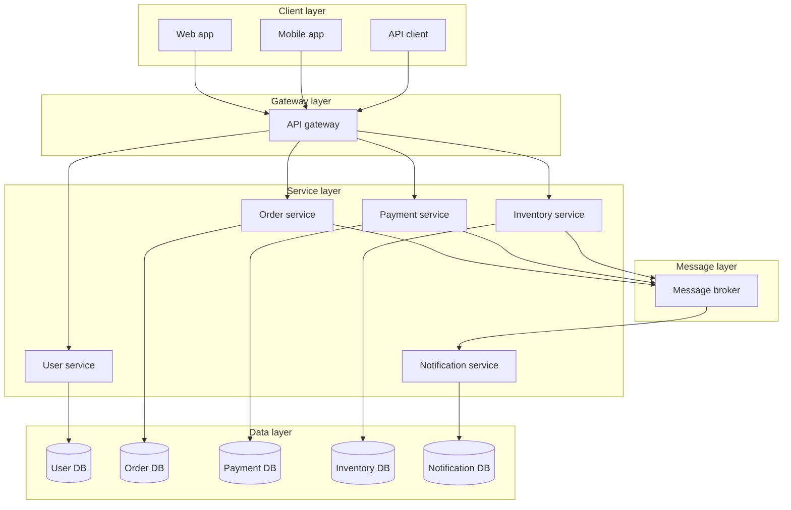
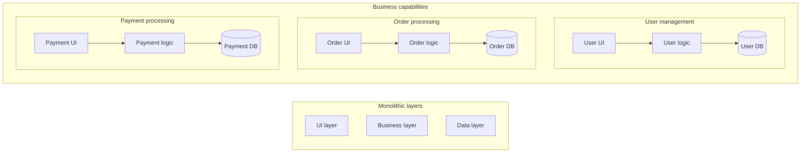
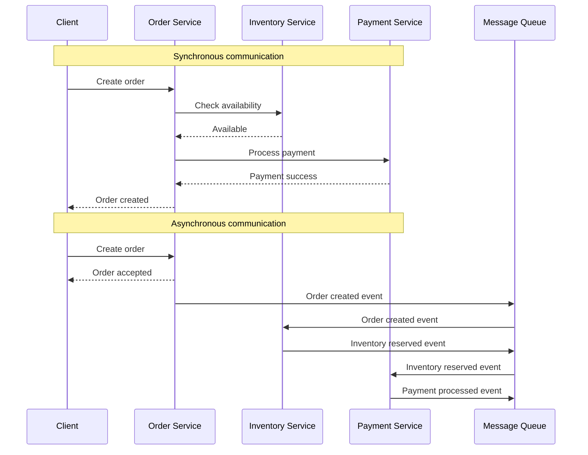
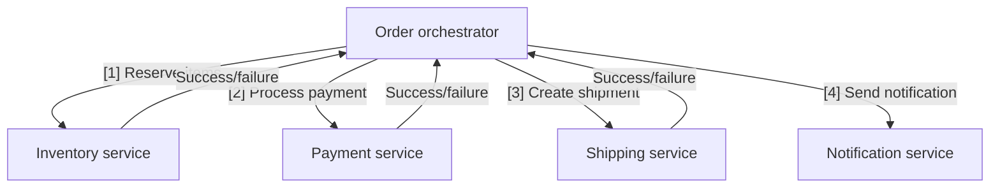
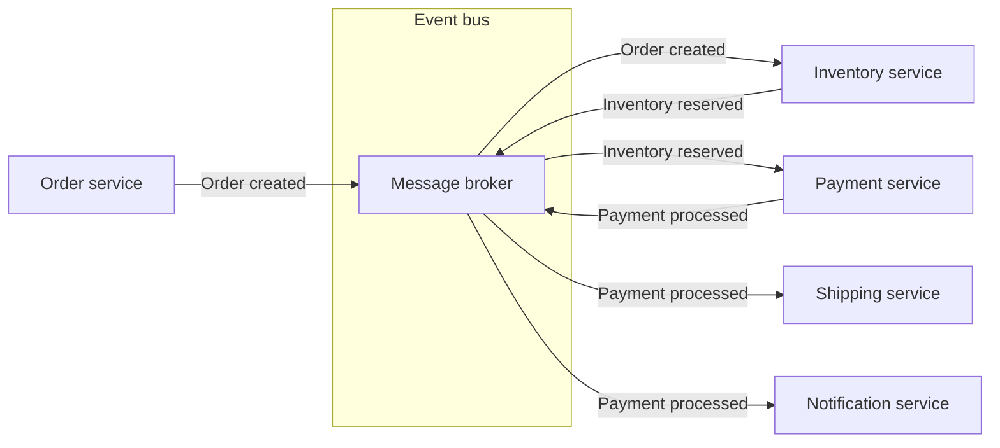
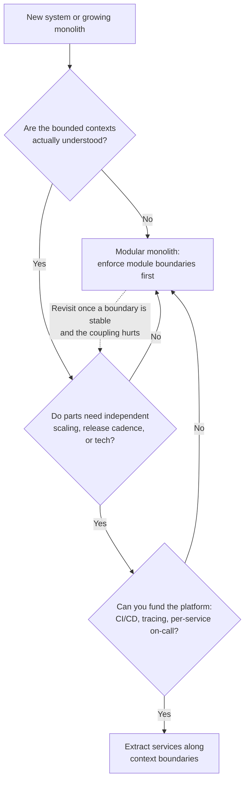
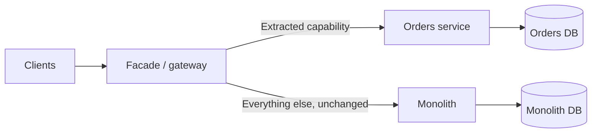
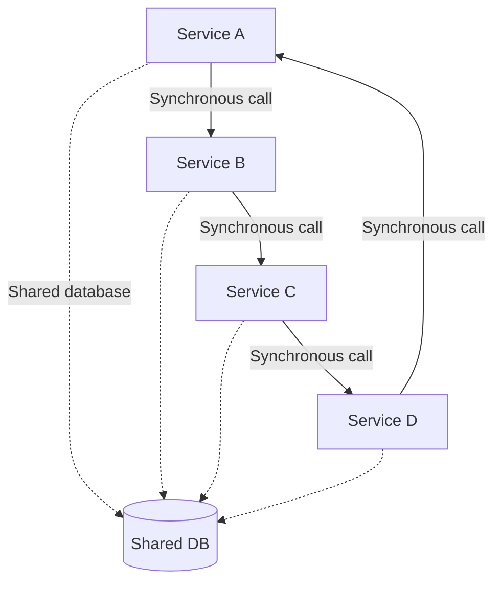
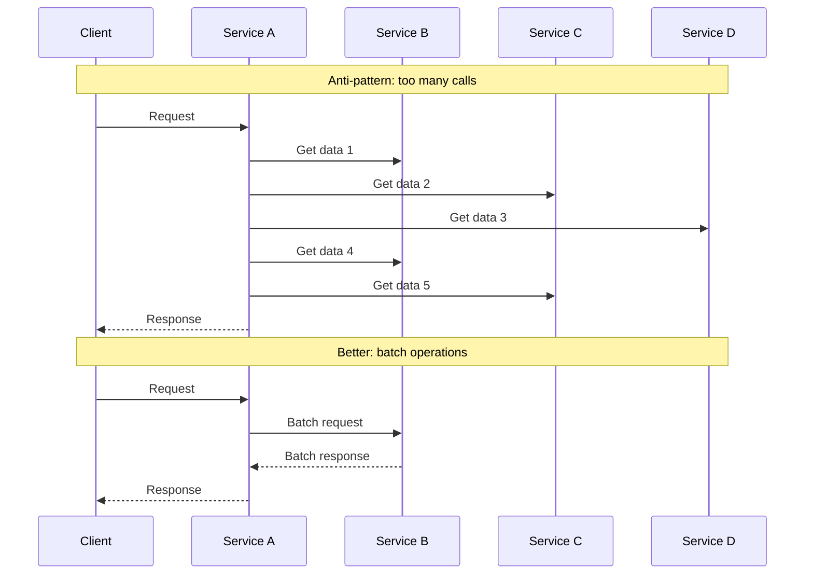

# Microservices architecture

Microservices architecture decomposes an application into small, independently deployable services that own their data and communicate over the network.

It is the far end of this folder's decoupling spectrum. [Layered architecture](./01-layered-architecture.md) separates concerns inside one process, [hexagonal architecture](./02-hexagonal-architecture.md) isolates the domain from every external technology, and microservices move the boundary onto the network so that each capability can be built, deployed, and scaled on its own schedule.

The step is qualitatively different from the first two. Moving a boundary across a process line converts compile-time coupling into runtime coupling: a call that could not fail now can, a refactor that a compiler used to verify now requires a coordinated release, and a transaction that used to be one `COMMIT` now needs a [saga](./06-saga.md). Everything hard about microservices follows from that one change.

## Core concept

Rather than a single deployable unit, the application is a set of loosely coupled services. Each implements a business capability, owns its data, and can use whatever language and storage suits it.



Note what is inside each of those service boxes: almost always a layered or hexagonal application. Microservices decide where the *network* boundaries go; the internal structure of a service is still the subject of the previous two documents, and services with a well-defined core behind ports are the ones that can actually change independently.

## Key characteristics

### Business capability alignment

Each service is organized around a business capability rather than a technical layer. Invoking Conway's law, this also means the service map and the team map should look alike, because the communication structure of the organization ends up encoded in the system either way.



The cut is a vertical slice through what layered architecture cuts horizontally. Getting the slice right is the hardest part of the whole architecture, because a boundary drawn in the wrong place shows up later as two services that must always be deployed together.

### Decentralized data management

Each service owns its store, and no other service reads or writes it. This is the constraint that makes services genuinely independent, and it is also the one most often quietly broken, because a shared database is so much easier in the moment.

```python
# Anti-pattern: order service reading a table the user service owns
def get_order_summary(self, order_id):
    order = self.db.query("SELECT * FROM orders WHERE id = ?", [order_id])
    user = self.db.query("SELECT name FROM users WHERE id = ?", [order.user_id])
    return {"order": order, "customer": user["name"]}

# Better: ask the owner, and degrade when the owner is unavailable
def get_order_summary(self, order_id):
    order = self.order_db.find_order(order_id)
    try:
        customer_name = self.user_client.get_user(order.user_id).name   # Timeout plus breaker
    except UserServiceUnavailable:
        customer_name = None                                            # The order is still worth returning
    return {"order": order, "customer": customer_name}
```

The join is what does the damage: the user service can no longer change that table without breaking a service it has never heard of, and the coupling is invisible from the owner's side, so it is discovered by a failed migration. Going through the owner's API makes the dependency explicit and, crucially, makes it a dependency that can be degraded rather than one that silently constrains someone else's schema.

Three consequences follow, and each is covered in depth elsewhere in the repo:

- **No cross-service joins or transactions.** A write spanning two services is a distributed transaction, with the same isolation problems as a cross-shard write; [database partitioning](../fundamentals/24-database-partitioning.md#cross-partition-work) covers why colocating data or accepting eventual consistency beats coordinating. When atomicity is genuinely required, the options are [2PC](./05-two-phase-commit.md) or a [saga](./06-saga.md).
- **Polyglot persistence.** Each service picks the store that fits its access path, the same decision [SQL vs NoSQL](../fundamentals/21-sql-vs-nosql.md#hybrid-is-the-default) and [non-relational databases](../fundamentals/20-non-relational-databases.md#picking-a-model) walk through. Microservices mostly remove the last excuse not to make that choice deliberately: one store per service, rather than one store bent to serve everything.
- **Deliberate duplication.** Services keep local read-only copies of data they need from others, refreshed by events. That is the same denormalization trade described under [modeling: copy on purpose](../fundamentals/20-non-relational-databases.md#modeling-copy-on-purpose): fast reads, in exchange for owning a refresh story.

```python
class OrderService:
    # A local projection of just the fields this service needs, kept fresh by events.
    # Reads no longer depend on the user service being up.
    def on_user_renamed(self, event):
        self.order_db.update_denormalized_customer_name(event.user_id, event.new_name)
```

Keeping that copy correct requires that the event actually gets published whenever the write commits, which is the [dual-write problem](./07-transactional-outbox.md) and the reason the transactional outbox pattern exists. Writing to your database and publishing to a broker as two separate operations will diverge.

Because the copies are refreshed asynchronously, the system is eventually consistent by construction. What that means for what you can promise a user is the subject of [CAP and PACELC](../fundamentals/27-cap-and-pacelc-theorems.md); the practical version is that the consistency window becomes a product decision, so it needs to be stated rather than discovered in an incident.

### Independent deployability

The characteristic is not "small." It is that a service can be released without coordinating with anyone else. That requires backward-compatible API changes, versioned or tolerant event schemas, and consumers that survive a producer being briefly unavailable. A set of services that must be deployed in a fixed order is a [distributed monolith](#distributed-monolith), whatever its repository layout says.

## Communication between services

The mechanics of REST, RPC, GraphQL, polling, webhooks, and message queues are covered in [communication patterns](../fundamentals/06-communication-patterns.md), and the delivery semantics of the asynchronous options in [pub/sub](../fundamentals/30-pub-sub.md) and [messaging patterns](../fundamentals/31-messaging-patterns.md). What matters here is which one to reach for at a service boundary and what it does to coupling.

| Dimension        | Synchronous request-response                               | Asynchronous messaging                                  |
| ---------------- | ---------------------------------------------------------- | ------------------------------------------------------- |
| Caller waits     | Yes, so the caller's latency includes the callee's         | No, the caller returns immediately                      |
| Availability     | Callee's availability caps the caller's                    | Caller stays up while the consumer is down              |
| Consistency      | Immediate result                                           | Eventually consistent                                   |
| Failure handling | Timeout, retry, [circuit breaker](./08-circuit-breaker.md) | Broker retries, dead-letter queue, replay               |
| Good for         | Reads a user is waiting on, queries with a single owner    | Workflows, fan-out, anything the user need not wait for |
| Cost             | Runtime coupling and cascading failure risk                | Harder debugging, ordering and duplicate handling       |

The default worth stating explicitly: use synchronous calls for reads a user is blocked on, and asynchronous events for anything that changes state in more than one service. The synchronous chain is what turns one slow service into a system-wide outage, which is why [resilience](../fundamentals/14-resilience.md) treats timeouts, bulkheads, and circuit breakers as mandatory rather than optional at these boundaries.



In the synchronous version the client learns the outcome; in the asynchronous version it learns only that the request was accepted, and the outcome arrives later through some other channel. That difference is a product decision before it is a technical one.

### Orchestration and choreography

Once a workflow spans services, something has to decide the order of steps and what happens when step three fails. There are two shapes, and the full treatment of both, including compensation and failure recovery, is in [saga](./06-saga.md); the event-plumbing side is in [event-driven architecture](./04-event-driven-architecture.md).

**Orchestration**: a coordinator holds the workflow and calls each service in turn.



**Choreography**: each service reacts to events and publishes its own, with no central coordinator.



The trade is where the workflow knowledge lives. Orchestration puts it in one readable place, at the cost of a component that knows about everyone and can become a bottleneck or a single point of failure. Choreography keeps services ignorant of each other, at the cost of a workflow that exists only as an emergent property of subscriptions, which is why the second question in any incident is "what is actually subscribed to this event."

A reasonable default is choreography for simple fan-out and orchestration once a workflow has more than about three steps, conditional branches, or compensations that must run in a specific order.

## The platform microservices assume

Microservices move complexity out of the codebase and into the space between services, and that space needs infrastructure that a monolith gets for free. Treat the following as a prerequisite list, not a wish list, since adopting the architecture without them is how teams end up with all of the costs and none of the benefits.
[Service infrastructure patterns](./11-service-infrastructure-patterns.md) is the full treatment of the first three items below — gateway, discovery, and mesh — including client-side vs server-side load balancing and configuration/secret distribution.

- **API gateway**: A single entry point for clients that handles routing, authentication, rate limiting, and response aggregation, so clients are not coupled to the service topology. See [service infrastructure patterns](./11-service-infrastructure-patterns.md#api-gateway) for aggregation, fan-out, and the backend-for-frontend variant; related reading: [proxies](../fundamentals/12-proxies.md), [rate limiting](../fundamentals/32-rate-limiting.md).
- **Service discovery**: Instances come and go, so addresses cannot be static configuration. A registry plus client-side or [load-balancer-side](../fundamentals/13-load-balancing.md) resolution is the baseline; see [service infrastructure patterns](./11-service-infrastructure-patterns.md#service-discovery) for the registry, client-side vs server-side resolution, and DNS-based discovery.
- **Service mesh**: A sidecar proxy per instance handling mTLS, retries, and observability uniformly across polyglot services, so no client library has to reimplement them. See [service infrastructure patterns](./11-service-infrastructure-patterns.md#service-mesh-and-sidecar-proxies) for the control-plane/data-plane split and what it costs.
- **Distributed tracing and correlated logs**: A single user request now touches a dozen services, and "where did the latency go" is unanswerable without trace propagation. [Observability](../fundamentals/15-observability.md#distributed-tracing) covers the mechanics.
- **Failure containment**: Timeouts on every remote call, retries with backoff and jitter, bulkheads, and [circuit breakers](./08-circuit-breaker.md); see [resilience](../fundamentals/14-resilience.md) for how these fit together.
- **Idempotent consumers**: Retries and at-least-once delivery mean every handler will eventually see a duplicate. [Reliability](../fundamentals/09-reliability.md#idempotency) covers idempotency keys and deduplication.
- **Independent delivery pipelines**: Per-service build, test, and deploy, or the independence exists only on paper.

## Service granularity

Granularity is the scope of business functionality one service covers. Coarse-grained services do more per call and need fewer calls; fine-grained services are simpler individually and chattier collectively.

The guiding principle is that a service should be small enough to encapsulate one business capability and large enough to own it end to end, including its data. Two practical tests are more useful than any size heuristic:

- **The transaction test**: If two pieces of data must change atomically, they probably belong in one service. Splitting them means every write becomes a saga.
- **The deployment test**: If two services are always released together, the boundary between them is not real, and merging them removes coordination cost for nothing.

Both directions have a failure mode. Services that are too large recreate the monolith's coupling with added network latency. Services that are too small ("nanoservices") make every operation a distributed call graph, so the coordination cost exceeds anything the decomposition bought.

When in doubt, err coarse. Splitting a service later is a well-understood refactor; merging two services that share a broken boundary means unpicking two schemas, two deploy pipelines, and usually two teams.

## Benefits and challenges

**Pros:**

- **Strong module boundaries**: A network boundary cannot be bypassed by an import, so modularity is enforced rather than agreed.
- **Independent deployment**: Small, autonomous releases with a smaller blast radius per change.
- **Independent scaling**: Scale the payment service without scaling everything that shares its process.
- **Technology diversity**: Each service picks its language, framework, and data store.
- **Team autonomy and fault isolation**: Teams own services end to end, and a contained failure degrades one capability instead of the system.

**Cons:**

- **Distributed systems tax**: Remote calls are slow, fail partially, and fail in ways local calls do not.
- **Eventual consistency**: Strong consistency across services is impractical, so every workflow must tolerate a window of inconsistency.
- **Operational complexity**: Many deployables need automation, monitoring, tracing, and on-call coverage per service.
- **Debugging difficulty**: A single request spans services and logs, so a stack trace no longer tells the story.
- **Refactoring cost**: Moving a responsibility across a service boundary is a migration with data movement and API versioning, not an IDE operation.

## When to use microservices

The most useful framing is that microservices trade a codebase problem for an infrastructure and coordination problem. That trade is worth it when the codebase problem is real and the organization can pay for the infrastructure.



**Ideal scenarios:**

- **Multiple teams** blocked on each other's release cadence in a shared codebase.
- **Divergent scaling profiles**, where one capability needs ten times the capacity of the rest.
- **Divergent technology needs**, such as a machine learning path that wants a different runtime entirely.
- **Independent availability requirements**, where a payment path must stay up while a recommendations path may fail.

**Consider alternatives when:**

- The domain is not yet understood, so boundaries are still guesses and every wrong guess is expensive to move.
- The team is small enough that coordination is not the bottleneck, in which case a [layered](./01-layered-architecture.md) or modular monolith gets more done.
- The operational platform does not exist and nobody is funded to build it.

The intermediate option deserves to be named: a **modular monolith** keeps one deployable while enforcing module boundaries internally, which buys most of the design discipline with none of the distributed systems tax.

Because [hexagonal architecture](./02-hexagonal-architecture.md) already forces each module's dependencies through explicit ports, a well-structured hexagonal monolith is the cheapest thing to eventually split, and the modules that survive contact with reality are the ones worth promoting to services.

### Extracting services from a monolith

The reliable path is incremental, usually described as the strangler fig: route traffic through a facade, move one capability at a time behind it, and delete the old path only once the new one carries production traffic.



The order of moves matters more than the destination:

1. Put a facade in front of the monolith so routing can change without clients changing.
2. Pick a capability with few inbound dependencies and a clear data boundary, not the most painful one.
3. Split the data first, since a service still reading the monolith's tables is not extracted.
4. Move reads before writes, so the new path is exercised before it owns correctness.
5. Cut over behind a flag, keep the old path runnable, then delete it once it is genuinely unused.

A rewrite that stands up all the services at once is the version that fails, because it needs every boundary to be right on the first attempt.

## Common anti-patterns

### Distributed monolith

Services deployed separately but still tightly coupled through synchronous call chains and a shared database. This combines the operational cost of distribution with the coupling of a monolith and delivers the benefits of neither.



The diagnostic questions are concrete: can any service be deployed alone, can it serve traffic while its neighbors are down, and does it own its schema. Three noes mean a monolith with network latency added.

### Chatty services

A single operation fans out into many small remote calls, usually an N+1 pattern where a list endpoint calls another service once per item. Latency compounds, and every additional call is another chance to fail.



The two fixes work at different levels. A batch endpoint (`get_users(ids)` instead of `get_user(id)` in a loop) collapses N calls into one and is the immediate remedy; serving the field from a local projection kept fresh by events removes the call from the request path entirely, at the cost of the refresh story described above.

Persistent chattiness between two services is usually evidence that the boundary is in the wrong place, so batching is the fix for the symptom and moving the boundary is the fix for the cause.

### Shared database

Two services writing the same tables cannot be deployed, scaled, or reasoned about independently, because either one can break the other with a migration. It is the single most common way decentralized data management is abandoned, and it is worth calling out separately from the distributed monolith because it often arrives alone, as a pragmatic exception that never gets removed.

### Entity services

Splitting by noun rather than by capability produces a `Customer` service, an `Order` service, and a `Product` service that do nothing but CRUD, with all the actual business logic in whatever calls them.

The result is a distributed data access layer, which reproduces the [anemic domain model](./01-layered-architecture.md#anemic-domain-model) at the level of the architecture: the services hold data, and the rules live somewhere they cannot be enforced.

## Interview talking points

- **Lead with the trade, not the pattern.** Microservices exchange a codebase coordination problem for an infrastructure and operations problem; say why that trade is worth it here.
- **Data ownership is the load-bearing constraint.** One store per service, no cross-service joins, no shared tables. Everything else follows.
- **Name the consistency model.** Once writes span services you are eventually consistent, so state the window and how the workflow compensates ([saga](./06-saga.md)).
- **Sync for reads a user waits on, async for state changes across services**, with timeouts and circuit breakers on every remote call.
- **Propose the modular monolith when boundaries are unclear.** Recognizing that microservices are premature is a stronger answer than adopting them by default.
- **Watch for the distributed monolith.** If services deploy together or share a database, the decomposition has not happened yet.

## Reference materials

- [Microservices](https://martinfowler.com/articles/microservices.html)
- [Microservice patterns](https://microservices.io/patterns/index.html)
- [Microservice trade-offs](https://martinfowler.com/articles/microservice-trade-offs.html)
- [Monolith first](https://martinfowler.com/bliki/MonolithFirst.html)
- [Strangler fig application](https://martinfowler.com/bliki/StranglerFigApplication.html)
