# Event-driven architecture (EDA)

Event-driven architecture is a style in which components communicate by producing and consuming events rather than calling each other directly.

Services stay loosely coupled by reacting to state changes, which is what makes it possible to add a new consumer of an existing fact without touching the service that produced it.

This document covers the architectural style: what an event is, the three shapes an event can take, how flows are coordinated, and the failure modes the style introduces.

The transport mechanics underneath it (topics, subscriptions, delivery semantics, dead-letter handling) are covered in [Pub/Sub](../fundamentals/30-pub-sub.md) and [Messaging Patterns](../fundamentals/31-messaging-patterns.md), and [Kafka Architecture](../advanced/05-kafka-architecture.md) is the concrete implementation to reason about when you need a real broker.

## Core concept

An **event** is a record of something that already happened: a fact, named in the past tense, that the producer publishes without knowing or caring who reads it.

Unlike request-response, an event is fire-and-forget. Multiple consumers react independently, and the producer's job is finished the moment the event is durably published.

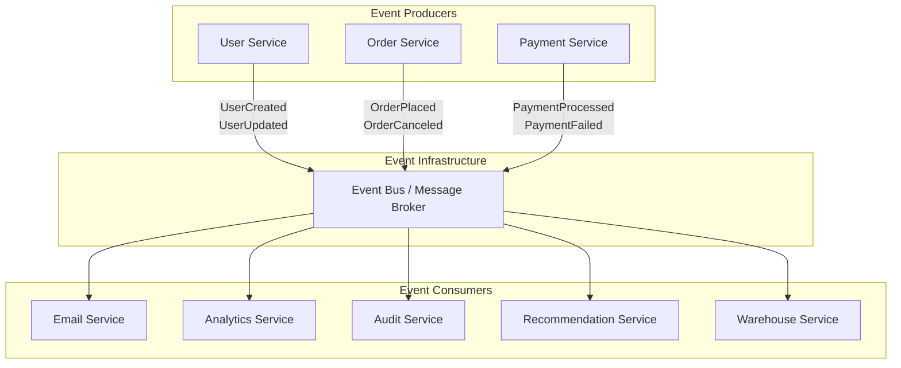

### Events versus commands

The single most common modelling mistake in an event-driven system is publishing a command and calling it an event. The two look identical on the wire and behave completely differently in a design.

| Aspect       | Event                                | Command                              |
| ------------ | ------------------------------------ | ------------------------------------ |
| Meaning      | A fact that already happened         | A request for something to happen    |
| Naming       | Past tense (`OrderPlaced`)           | Imperative (`PlaceOrder`)            |
| Audience     | Anyone interested; zero to many      | Exactly one handler                  |
| Can it fail? | No, it is already true               | Yes, it can be rejected              |
| Coupling     | Producer knows nothing about readers | Sender knows the receiver exists     |
| Channel      | Topic, fan-out                       | Queue or direct call, point-to-point |

Publishing `SendWelcomeEmail` to a topic that exactly one service subscribes to is a command wearing an event's clothes; it breaks as soon as a second subscriber appears. Publishing `UserRegistered` and letting the email service decide what to do with it is the event-driven version of the same feature.

This vocabulary is shared across the whole family of patterns in this folder: [CQRS](./10-cqrs.md) separates the command side from the query side, and [Event Sourcing](./09-event-sourcing.md) persists the resulting events as the system of record.

## Event patterns

There are three broadly useful shapes for an event, distinguished by how much state they carry and how much of the system's truth they own. They are not exclusive; a large system typically uses all three in different places.

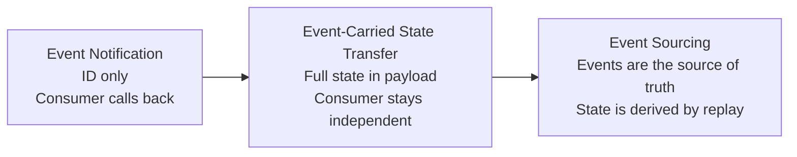

### Event notification

Services emit a lightweight event carrying little more than an identifier, and consumers call back to the producer for details if they need them.

Coupling stays minimal because the only shared contract is "this happened, to this ID". The cost is a synchronous read dependency back on the producer, and a possible read storm when a single event fans out to many consumers that all immediately call back.

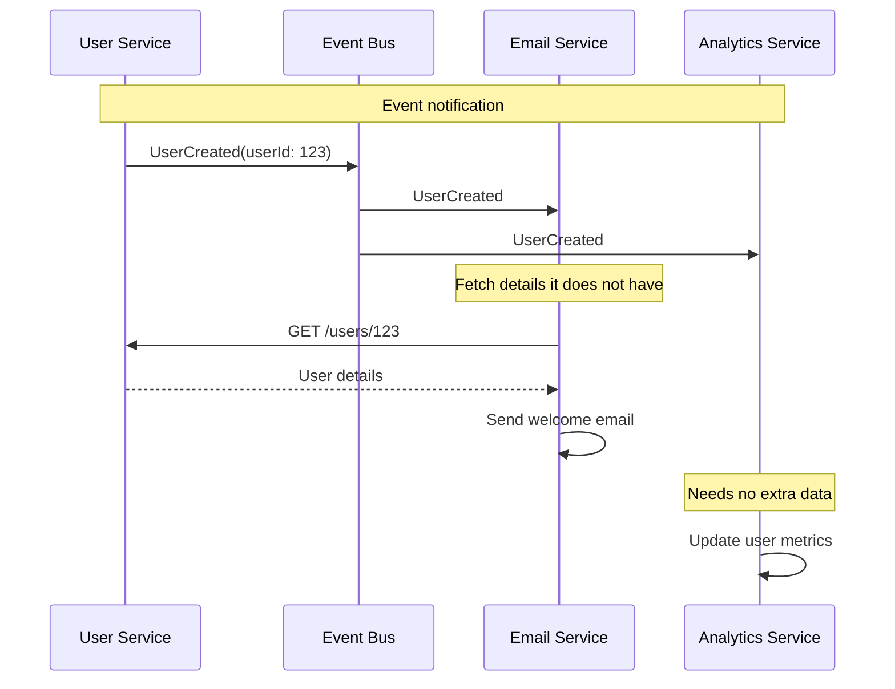

```python
class UserCreatedEvent:
    def __init__(self, user_id):
        self.event_type = "user_created"
        self.user_id = user_id  # The whole payload: consumers fetch the rest

class EmailService:
    def handle_user_created(self, event):
        user = self.user_service.get_user(event.user_id)  # Callback to producer
        self.send_welcome_email(user.email, user.name)
```

One subtlety worth stating in an interview: the callback returns *current* state, not the state as of the event. If three updates happen in quick succession, all three notifications can read back the same final value.

### Event-carried state transfer

The event carries the state the consumer needs, so the consumer can maintain its own local copy and never call back.

This removes the runtime dependency on the producer entirely, and lets a consumer process a backlog while the producer is down. It costs larger payloads, duplicated state in every consumer, and a much wider contract to keep compatible.

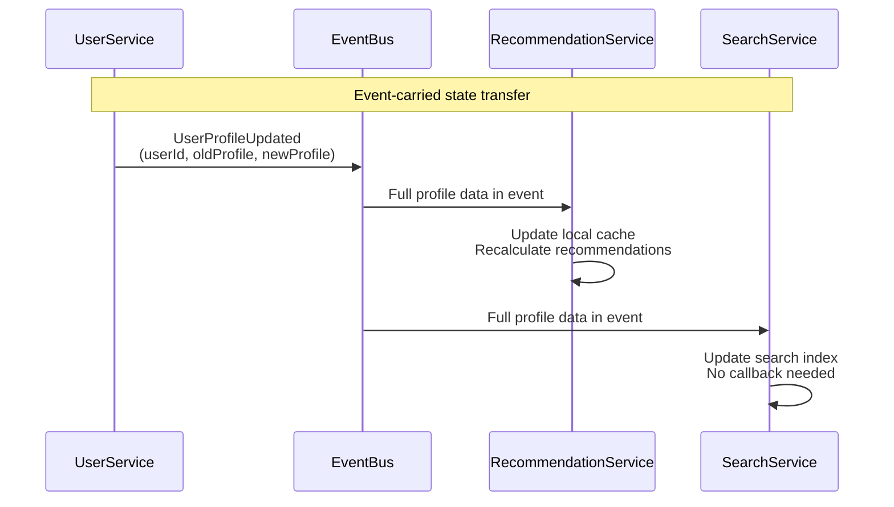

```python
class UserProfileUpdatedEvent:
    def __init__(self, user_id, old_profile, new_profile):
        self.event_type = "user_profile_updated"
        self.user_id = user_id
        self.old_profile = old_profile  # Both sides travel with the event, so a
        self.new_profile = new_profile  # consumer can diff without asking anyone

class RecommendationService:
    def handle_user_profile_updated(self, event):
        self.user_cache.update(event.user_id, event.new_profile)  # No callback
        self.recalculate_recommendations(event.user_id)
```

The thin-versus-fat payload trade-off, and the event envelope and versioning conventions that make either one survivable, are worked through in [Pub/Sub](../fundamentals/30-pub-sub.md).

### Event sourcing

The first two patterns use events to *communicate* state that lives somewhere else. Event sourcing goes further: the event stream **is** the state. Nothing is updated in place, and current state is derived by replaying the events for an entity.

That buys a complete audit trail and the ability to answer questions about any past point in time, at the cost of schema evolution being permanent (old events are never rewritten) and reads needing separate projections.

Treat it as an option for the services whose history is genuinely part of the domain, not as the default for every service in an event-driven system. [Event Sourcing](./09-event-sourcing.md) covers the aggregates, event store, projections, snapshotting, and schema-evolution machinery in full.

## Coordination patterns

Once several services react to each other's events, a multi-step business process emerges. There are two ways to make that process happen, and the choice is one of the load-bearing decisions in an event-driven design.
The full treatment of both — compensation, idempotency, orchestrator state, and a complete trade-off table — is in [saga](./06-saga.md); this section covers only the general coordination shape and how it differs from that pattern's specific concerns.

### Choreography (decentralized)

Each service subscribes to the events it cares about and emits its own. No component owns the workflow; the workflow is the emergent result of the subscriptions.

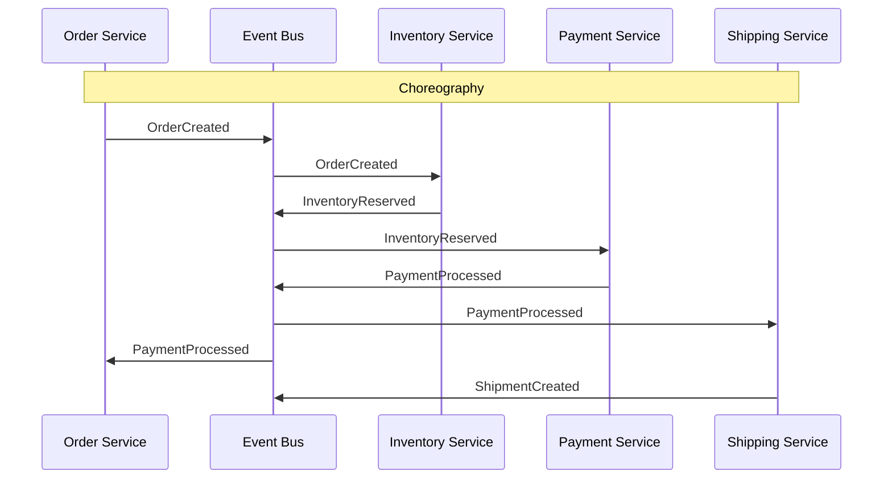

### Orchestration (centralized)

A coordinator owns the workflow, issuing commands to each service and reacting to their replies.

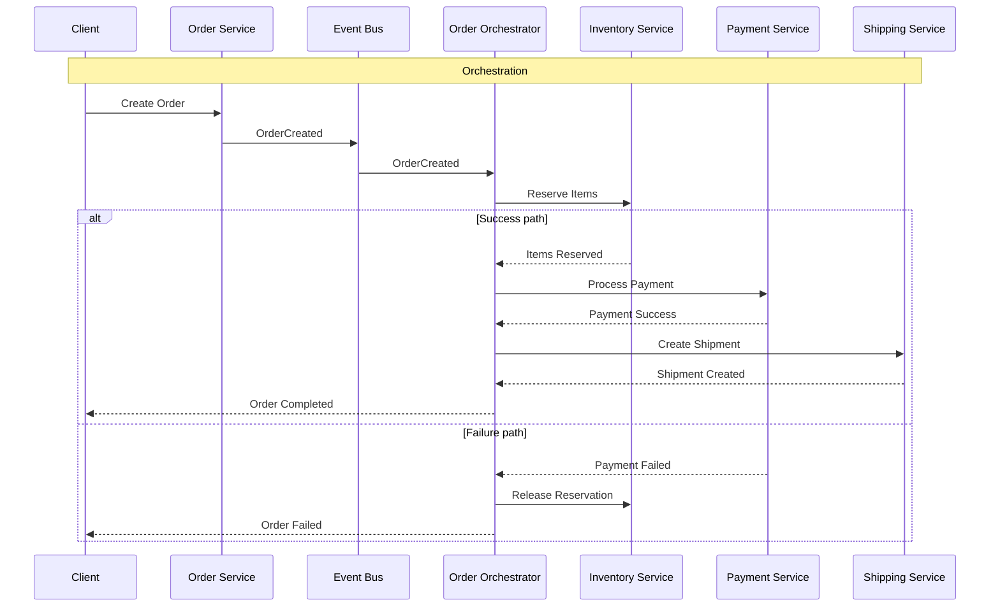

Note the vocabulary shift in the orchestration diagram: the coordinator sends **commands** (`Reserve Items`) and receives **replies**, while choreography moves purely on **events**.
That distinction is the practical difference between the two, not just a drawing convention — it is also why choreography composes naturally with the rest of this document (everything is an event) while orchestration introduces a component that speaks a second, command-based vocabulary.

A rough rule: choreography for flows of two or three steps with no compensation, orchestration once the process has branches, timeouts, or work that must be undone. When steps span services and each needs a compensating action on failure, that orchestrated flow has a name and a full treatment of its own: see [saga](./06-saga.md) for the pros, cons, and implementation of both coordination styles in that context.

## Event delivery infrastructure

### In-process event bus

An in-memory dispatcher that invokes registered handlers directly when an event is published. Everything runs in one process, usually synchronously on the publishing thread.

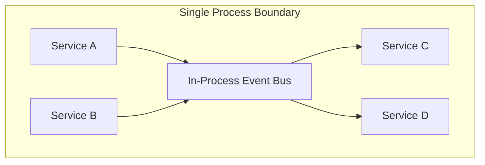

Reasonable for decoupling modules inside a monolith, for tests, and for simple flows that do not need to survive a process restart. The important limitation is durability, not scale: if the process dies between the state change and the handler running, the event is gone. Nothing about it is a step toward a distributed system except the shape of the code.

### Broker-based event bus

A durable broker (Kafka, RabbitMQ, SQS/SNS, Pub/Sub) sits between producers and consumers, so events survive restarts and consumers can be scaled, added, or replayed independently.

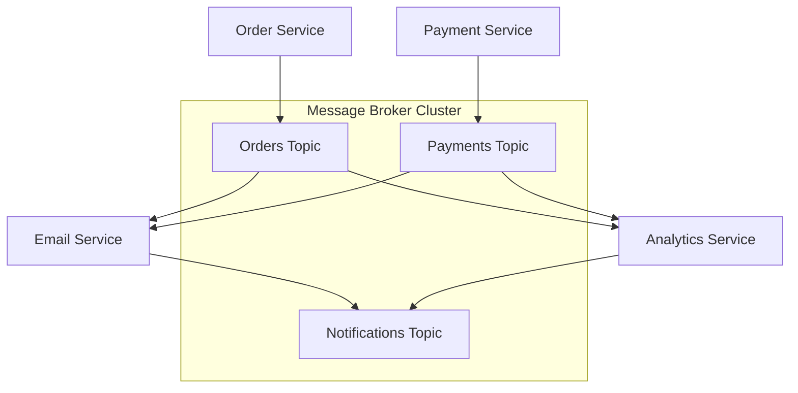

The architectural decisions this forces (topic granularity, push versus pull, retention and replay, competing consumers versus fan-out) are broker-level concerns covered in [Pub/Sub](../fundamentals/30-pub-sub.md) and [Messaging Patterns](../fundamentals/31-messaging-patterns.md). [Kafka Architecture](../advanced/05-kafka-architecture.md) shows how a partitioned commit log implements retention, replay, and per-partition ordering in practice.

One decision does belong here, because it is an application-design question rather than a broker one: **how the event gets published in the first place**. Writing to the database and then publishing to the broker is a dual write, and it will eventually leave one of the two done and the other not. Use the [Transactional Outbox](./07-transactional-outbox.md) to make the event part of the same transaction as the state change.

## Consistency, ordering, and duplicates

An event-driven system is eventually consistent by construction. Consumers see a fact some time after it became true, and there is no moment at which the whole system agrees on the current state. That is the trade being made deliberately: availability and independent scaling in exchange for a consistency window. [CAP and PACELC](../fundamentals/27-cap-and-pacelc-theorems.md) frames why the trade is unavoidable rather than a design flaw.

Three consequences follow, and every event-driven design has to answer them:

- **Events arrive out of order.** Ordering is usually guaranteed only within a partition or a single stream key, never globally.
- **Events arrive more than once.** At-least-once is the delivery guarantee you should assume; handlers must be idempotent. See [messaging patterns](../fundamentals/31-messaging-patterns.md) for delivery semantics and the dedup techniques.
- **Events sometimes cannot be processed at all.** A poison message needs a dead-letter path, or it blocks the consumer forever.

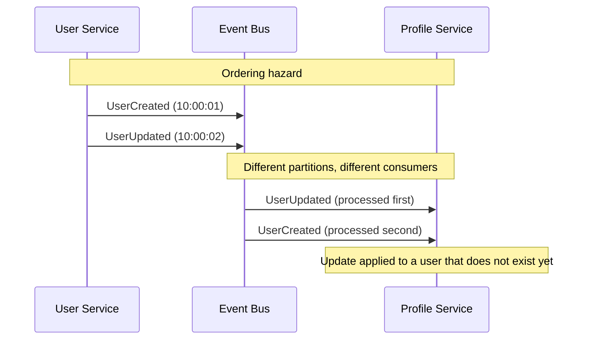

Practical defences, in rough order of preference:

- **Partition by entity key** so all events for one entity land on one partition and are delivered in order. This solves ordering for the case that usually matters.
- **Carry a version or sequence number** in the event and have consumers ignore anything older than what they have already applied.
- **Make handlers commutative** where you can, so order stops mattering (incrementing a counter rather than setting a total).
- **Buffer and reorder** only as a last resort; it needs a timeout, and the timeout is a guess.

## Design guidelines

- **Model events as business facts, not database operations**. `DatabaseRecordInserted`, `CacheUpdated`, and `LogEntryCreated` leak the producer's implementation into every consumer's contract; `OrderPlaced`, `PaymentProcessed`, and `CustomerRegistered` do not.
- **Name events in the past tense**. If the name reads as an instruction, it is a command and belongs on a point-to-point channel.
- **Version events and evolve additively**. New optional fields are safe; removing, renaming, or narrowing a field is a new version, and both versions have to be published while consumers migrate.
- **Make every handler idempotent**. At-least-once delivery makes duplicates a certainty, not an edge case.
- **Give every event a correlation ID and propagate it**. An asynchronous failure that cannot be traced across hops is close to undebuggable.
- **Give every consumer a retry policy and a dead-letter queue**, and alert on DLQ depth rather than treating it as an archive.
- **Publish through the outbox** when the event must not diverge from the state change that produced it.
- **Retain events long enough to replay**. A consumer that can be rebuilt from the log is a consumer whose bugs are recoverable.

## Common anti-patterns

### Event storms

Publishing high-frequency, low-value events for every minor state change, so the broker and every consumer pay for data nobody acts on.

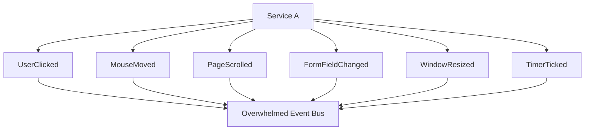

The fix is to publish at the granularity of business decisions rather than UI or storage operations, and to aggregate telemetry through a separate path that is allowed to drop data.

### Coupling through event payloads

Events that expose the producer's internal structure, or that require consumers to understand the producer's implementation choices, recreate the coupling the pattern was meant to remove. The producer can then no longer change anything without a coordinated release.

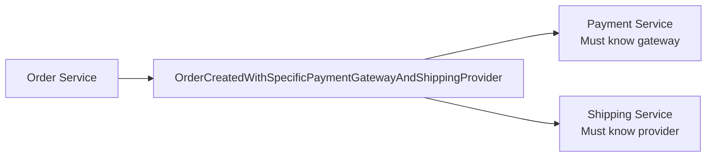

### The distributed monolith with extra latency

Replacing synchronous calls with events, but keeping a flow that still requires every step to complete before anything is useful, produces a system with all the coupling of the original and none of the debuggability. If the caller has to wait for the result anyway, a synchronous call is the more honest design; see [Microservices Architecture](./03-microservices-architecture.md).

## Interview talking points

- Distinguish the three event patterns by what the payload carries: notification (an ID, forcing a callback), state transfer (the data itself), event sourcing (the event *is* the state — there is no other copy).
- Choreography versus orchestration is a trade of implicit versus explicit workflow ownership. Justify the choice by step count, branching, and whether compensation is needed — and cite [saga](./06-saga.md) as the full treatment once compensation enters the picture.
- Say what consistency is given up (eventual, not immediate) and name the concrete mechanisms that make it tolerable: partition-by-key ordering, version numbers, idempotent consumers — not just the word "eventually".
- A broker-based event bus buys durability and replay at the cost of infrastructure; an in-process bus is simpler but loses both the moment the process dies mid-delivery.
- Name the distributed-monolith failure mode: a synchronous request chain hidden behind asynchronous transport is not decoupled, it is just slower and harder to trace.
- Raise the dual-write problem unprompted: a service cannot atomically update its own state and publish an event without either an outbox or accepting at-least-once duplicates downstream.

## Reference materials

- [What do you mean by Event-Driven?](https://martinfowler.com/articles/201701-event-driven.html)
- [Event-Driven Architecture Patterns](https://microservices.io/patterns/data/event-driven-architecture.html)
- [Commands vs Events](https://codeopinion.com/commands-events-whats-the-difference/)
- [Event-Driven Architecture Pitfalls](https://medium.com/wix-engineering/event-driven-architecture-5-pitfalls-to-avoid-b3ebf885bdb1)
