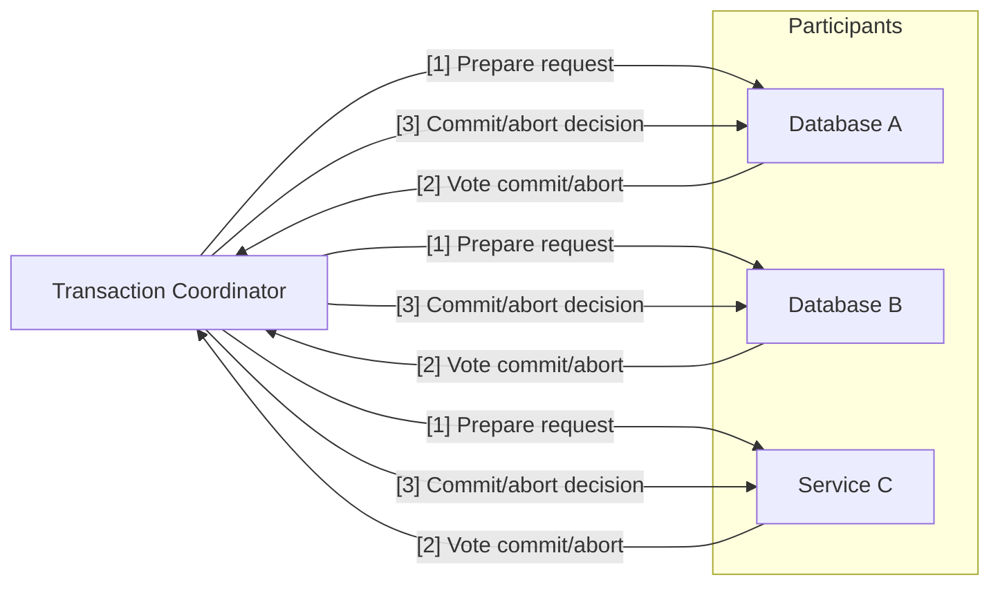
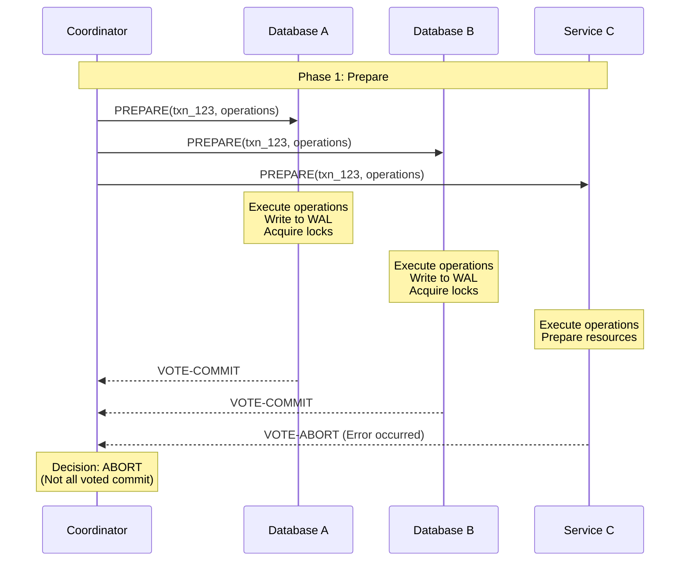
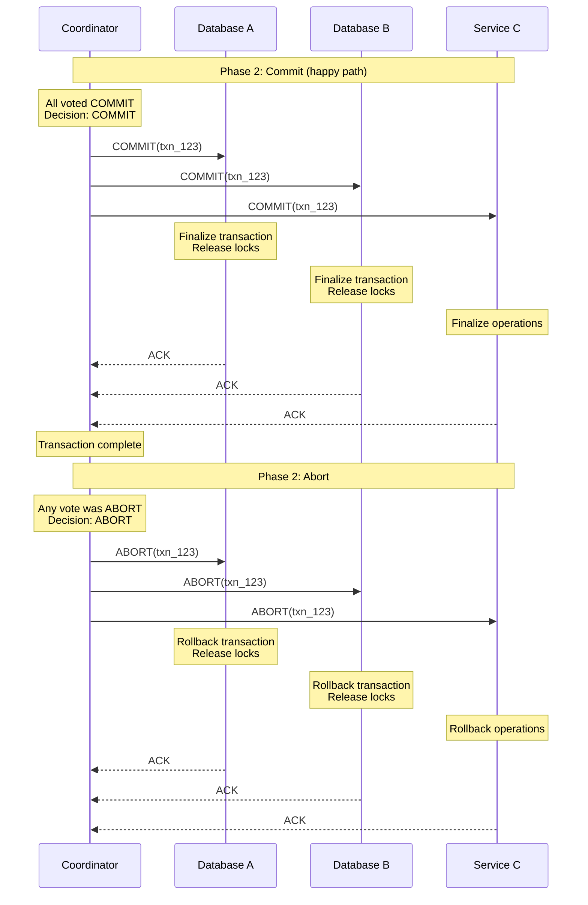
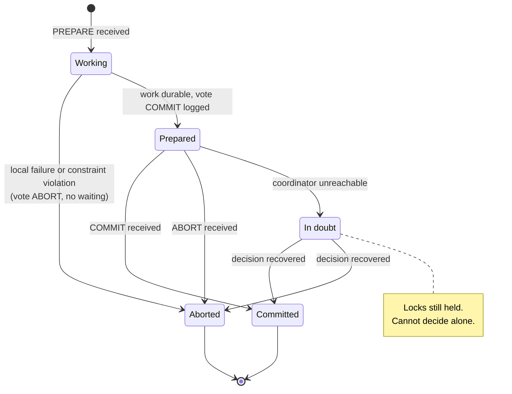
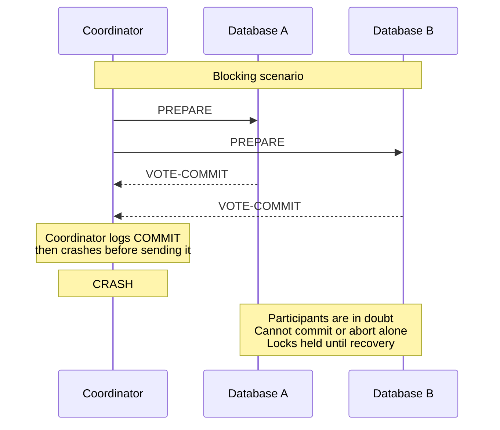

# Two-phase commit (2PC)

Two-phase commit is an **atomic commit protocol**: it makes several independent participants — databases, services, shards — agree on a single outcome for one distributed transaction, so that either all of them commit or all of them abort.

It is the answer to "how do multiple databases stay consistent" that keeps ACID semantics intact.
The two alternatives in this folder give that up on purpose: a [Saga](./06-saga.md) trades atomicity for availability and repairs failures with compensating transactions, and the [Transactional Outbox](./07-transactional-outbox.md) narrows the problem to one database plus one message broker.
Understanding what 2PC costs is what makes those trade-offs legible.

## Core concept

The commit is split into two phases: a **prepare phase** in which every participant promises it *can* commit, and a **commit phase** in which the coordinator tells everyone the decision it derived from those promises.

The promise is the whole protocol. Once a participant votes to commit, it has durably written everything it needs and given up the right to change its mind — it must be able to commit later, even across a crash and restart. That is what lets the coordinator decide on behalf of everyone.



Two rules make the protocol correct:

- **Unanimity**: The decision is COMMIT only if every participant voted commit. A single abort vote, timeout, or unreachable participant decides ABORT.
- **Durability before response**: Both the participant's vote and the coordinator's decision are written to a durable log *before* they are sent. A message can be lost and replayed; a forgotten decision cannot be reconstructed.

## Protocol roles

### Transaction coordinator

The coordinator drives the transaction lifecycle and owns the final commit/abort decision. It can be a dedicated service or one of the participating nodes. Its responsibilities are narrow but all of them are durability-critical:

- **Register the participants** for a transaction ID, so recovery knows who must be told the outcome
- **Fan out prepare and collect votes**, treating a timeout or unreachable participant as an abort vote
- **Write the decision to its own log before announcing it**, which is the point of no return
- **Drive the decision to completion**, retrying delivery to every participant until each one acknowledges

The coordinator holds no application state — only the transaction log. That log, not the process, is what has to survive a crash.

### Participants

Participants are the distributed components (databases, services, message queues) that hold resources involved in the transaction. A participant does the work during prepare, makes it durable, and then surrenders the decision:

```python
def prepare(self, transaction_id, operations):
    local_txn = self.db.begin_transaction()
    for operation in operations:
        operation.execute(local_txn)

    local_txn.prepare()            # work written to the WAL, locks held, not committed
    self._log_vote_commit(transaction_id)   # vote durable BEFORE it is sent
    return VoteCommit()
```

The ordering in the last two lines is the protocol's core requirement: if the vote reached the coordinator but did not reach the participant's own log, a restart would leave a participant that has forgotten a promise the coordinator is already relying on.

`commit(transaction_id)` and `abort(transaction_id)` then finalize or roll back that prepared transaction, and both are written so that a repeat call for an already-finalized transaction is a no-op.
That matters because the coordinator retries the decision until it is acknowledged: 2PC's decision delivery is **at-least-once**, so participants must handle duplicates.
This is the same idempotency requirement that shows up in [Saga](./06-saga.md) compensations and [outbox](./07-transactional-outbox.md) publishing — the general treatment is in [Reliability](../fundamentals/09-reliability.md#idempotency).

## Protocol phases

### Phase 1: prepare

The coordinator asks all participants whether they can commit. Each participant executes the work, makes it durable, and votes.



The coordinator sends prepare to every participant and waits for the votes. A missing vote is not ambiguous: no answer within the timeout is treated as an abort vote, because the coordinator is still free to decide either way until it has logged a decision. Aborting is the only unilateral move the protocol ever allows, and it is available exactly until the decision is written.

Fan the prepare requests out in parallel and wait on the whole set. Sending them one at a time adds a round-trip per participant for no benefit, since the phase cannot finish before the slowest participant answers regardless.

### Phase 2: commit or abort

The coordinator logs its decision, then informs all participants and retries until each one acknowledges.



The order of operations in phase 2 is what makes recovery possible, and it is the same on both branches:

1. **Write the final decision to the coordinator's log.** After this point the outcome is fixed; a coordinator that crashes mid-broadcast resumes the same decision on restart rather than inventing a new one
2. **Send it to every participant.** Delivery failures are queued for redelivery, never dropped — a participant that voted commit will commit as soon as it is reachable, and the coordinator's job is to make sure it hears
3. **Mark the transaction complete** once every participant has acknowledged

The abort path is symmetric and equally must be retried: a participant that prepared and never hears "abort" holds its locks forever. This is why a coordinator that "gives up" on an unreachable participant is a bug rather than a graceful degradation — an undelivered decision is an indefinitely locked row on the other end.

### Participant state machine

The reason 2PC blocks is visible in a single state. Before voting, a participant can unilaterally abort; after voting commit, it cannot do anything but wait for the decision.



`Working` is safe: a participant that fails here just aborts. `Prepared` is the dangerous state, because the outcome is now owned by the coordinator and the participant is holding locks until it learns what that outcome was.

## What 2PC guarantees

2PC delivers the **atomicity** and **consistency** halves of ACID across resources that have no shared transaction manager:

- **Atomicity**: Every participant reaches the same outcome — all commit, or all abort
- **Consistency**: The set of participants moves from one consistent state to the next, with no window where half the transaction is visible

Isolation and durability are still provided by each participant locally, which is why prepared transactions keep their locks: releasing them early would let other transactions read a state that might yet be rolled back. See [database concurrency control](../fundamentals/25-database-concurrency-control.md) for what those locks are doing.

The canonical example is a transfer between accounts in two different databases: debit in one, credit in the other, under one transaction ID. 2PC is what makes "money is never in both places or neither" true without either database knowing about the other.
The equivalent [saga](./06-saga.md) would debit immediately, credit afterwards, and refund the debit if the credit fails — correct in the end, but with a window in which the money is visibly nowhere.

### 2PC is not consensus

A common confusion in interviews: 2PC and Raft/Paxos both "get nodes to agree", but they solve different problems.

| Aspect              | Two-phase commit                                              | Consensus (Raft, Paxos)                       |
| ------------------- | ------------------------------------------------------------- | --------------------------------------------- |
| Question answered   | Should *this transaction* commit?                             | What is the next entry in the replicated log? |
| Voting rule         | Unanimous — any participant can veto                          | Majority quorum — a minority can be outvoted  |
| Availability        | Blocks if the coordinator (or a prepared participant) is down | Makes progress while a majority is up         |
| Failure of one node | Can stall the outcome indefinitely                            | Tolerated by design                           |

The unanimity requirement is exactly why 2PC cannot be made non-blocking by itself: there is no quorum to fall back on when a vote is missing. See [consensus](../fundamentals/29-consensus.md) for the majority-quorum model.

## Challenges and limitations

### The blocking problem

2PC's defining weakness: if the coordinator fails after participants have prepared but before the decision reaches them, those participants are **in doubt**. They cannot commit (the decision may have been abort) and cannot abort (it may have been commit), so they wait — holding locks the whole time.



Note what the participants *cannot* do: ask each other. Even if both know they voted commit, neither knows whether some third participant voted abort. Only the coordinator's logged decision resolves it.

The mitigations, from weakest to strongest:

- **Timeouts before the vote**: A participant still in `Working` aborts on its own. This is free and always correct, but it does nothing for the `Prepared` state
- **Presumed abort**: The coordinator logs nothing for aborted transactions, so a recovering coordinator with no record answers "abort" to any inquiry. This shrinks logging and speeds up the common failure path, but still requires the coordinator to be reachable
- **Cooperative termination**: Participants ask each other; if any of them already received the decision it is propagated. Helps only when at least one participant learned the outcome
- **Three-phase commit (3PC)**: Inserts a pre-commit phase so that the outcome can be inferred from the participants' states. It is non-blocking only under a fail-stop model with bounded message delay, which real networks do not provide — 3PC can violate atomicity under a network partition, which is why it is essentially unused in practice
- **Replicating the coordinator**: The only mitigation that genuinely holds. See below

### Hardening the coordinator

The coordinator's transaction log is the single point of failure — not the coordinator process. The fix is to make that log survive the process:

- Elect the coordinator role rather than pinning it to one host, so a standby can take over. Use fencing tokens so a resurrected old coordinator cannot broadcast a stale decision. See [leader election](../fundamentals/28-leader-election.md)
- Replicate the decision log through a consensus protocol, so the decision is durable on a majority before it is sent, and any new coordinator reads the same log. See [consensus](../fundamentals/29-consensus.md)

This is exactly what production systems do. Google Spanner runs 2PC *across* Paxos groups: each participant is itself a replicated state machine, so a participant crash does not lose a prepared transaction, and the coordinator's log is replicated too. The protocol still blocks in principle, but the probability of an unrecoverable coordinator collapses.

The cost is real: every logged decision now needs a majority round-trip, adding latency to a protocol that already has two of them.

### Performance impact

2PC pays twice. The latency cost is at least two round-trips plus the durable log writes on both sides, so commit latency is bounded by the slowest participant.

The bigger cost is **lock hold time**. Locks are taken during prepare and held until the decision arrives, so every conflicting transaction on those rows queues behind a network round-trip rather than behind local work. Throughput on hot rows drops accordingly, and the effect compounds: the more participants, the higher the chance that one of them is slow, and the longer everyone else waits.

### Heuristic decisions

When an in-doubt transaction blocks long enough to threaten the participant's availability, an operator (or the resource manager's own timeout) may break the tie manually — a **heuristic commit** or **heuristic rollback**.
If the guess disagrees with the coordinator's actual decision, atomicity is violated and the damage has to be reconciled by hand. XA exposes this explicitly as `XA_HEURHAZ` / `XA_HEURMIX`.
Treat every heuristic outcome as an incident, not a recovery mechanism.

### Availability under partition

In [CAP](../fundamentals/27-cap-and-pacelc-theorems.md) terms, 2PC is firmly CP: when the network partitions the coordinator from a participant, the transaction stops rather than diverging. That is the intended behavior, and it is the precise thing a [Saga](./06-saga.md) refuses to do.

## 2PC in practice

You rarely implement 2PC yourself; you turn it on:

- **XA / JTA**: The standard interface between a transaction manager and resource managers (databases, JMS brokers). Widely available, widely avoided, because it drags every participant's availability into every transaction
- **PostgreSQL prepared transactions**: `PREPARE TRANSACTION 'txn_id'`, then `COMMIT PREPARED` or `ROLLBACK PREPARED`. Disabled by default (`max_prepared_transactions = 0`) precisely because an abandoned prepared transaction holds locks and blocks vacuum indefinitely
- **Distributed SQL databases**: Spanner, CockroachDB, YugabyteDB run 2PC internally for cross-shard writes, layered over consensus-replicated shards. This is 2PC done right — and it is a database team's problem, not yours
- **Kafka transactions**: Often described as 2PC-like, and internally similar, but scoped to Kafka topics plus consumer offsets. It does not make a Kafka write atomic with a database write; that is what the [outbox](./07-transactional-outbox.md) is for

The two phases are visible directly in PostgreSQL's syntax, along with the monitoring query that every 2PC deployment needs:

```sql
PREPARE TRANSACTION 'txn_123';   -- phase 1: durable, locks held, not yet committed
COMMIT PREPARED 'txn_123';       -- phase 2 (or ROLLBACK PREPARED)

-- The health check: any prepared transaction older than seconds is an incident
SELECT gid, prepared, age(now(), prepared) AS stuck_for FROM pg_prepared_xacts ORDER BY prepared;
```

The pattern worth noticing: 2PC is used heavily *inside* single systems that control all participants, and avoided *between* independently operated services.

## When to use two-phase commit

### Ideal scenarios

- **Cross-shard writes inside one database**: All participants are the same system, run by the same team, on the same network — the assumptions 2PC needs actually hold. See [database partitioning](../fundamentals/24-database-partitioning.md)
- **A small, fixed set of ACID resources**: Two databases plus a queue, all in one datacenter, with short transactions
- **Correctness requirements that forbid a visible intermediate state**: Regulatory or ledger constraints where "temporarily inconsistent, repaired shortly" is not an acceptable answer

### Consider alternatives when

- **Participants are independently deployed services**: Their availability multiplies, and one team's deploy blocks another team's transactions — use a [Saga](./06-saga.md)
- **A step is a third-party API**: An external payment provider will not join your prepare phase
- **The transaction is long-running**: Lock hold time is measured in human decisions, not milliseconds
- **The write path is latency-sensitive or high-throughput**: The extra round-trips and lock hold times land directly on p99
- **Only one database and one broker are involved**: This is the [Transactional Outbox](./07-transactional-outbox.md) case, and it needs no distributed protocol at all

## Common anti-patterns

- **Long-running 2PC transactions**: Holding prepared locks across user think-time or third-party calls turns one slow dependency into a stalled database
- **Ignoring the in-doubt state**: Implementing prepare and commit but never building recovery — no decision log replay, no redelivery, no monitoring of stuck prepared transactions
- **Treating a timeout as an abort after the decision is logged**: Before the decision, a timeout safely means abort. After it, the outcome is fixed and the only correct action is retrying delivery
- **A non-idempotent commit handler**: The decision is delivered at-least-once, so a second `COMMIT` for the same transaction ID must be a no-op
- **Using 2PC to compensate for bad service boundaries**: If a single business operation constantly needs an atomic write across three services, the boundaries are wrong. Fix the decomposition instead of coordinating it

## Interview talking points

- Lead with the invariant: prepare is a durable promise, and after the vote a participant has surrendered the right to decide.
- Name the failure that matters — coordinator crash after prepare leaves participants in doubt, holding locks. Everything else about 2PC follows from this.
- Distinguish 2PC from consensus: unanimity versus majority quorum. That is why 2PC blocks and Raft does not.
- Say how you would harden it: replicate the coordinator's decision log via consensus, fence the old coordinator, monitor prepared-transaction age.
- Know the practical escapes: 2PC inside one distributed database is fine; 2PC between independently deployed services is the thing to argue against, in favor of a saga or an outbox.
- Quantify the cost qualitatively: two round-trips plus lock hold time bounded by the slowest participant, and availability that is the product of all participants' availability.

## Reference materials

- [Two-Phase Commit](https://martinfowler.com/articles/patterns-of-distributed-systems/two-phase-commit.html)
- [Consensus Protocols: Two-Phase Commit](https://www.the-paper-trail.org/post/2008-11-27-consensus-protocols-two-phase-commit/)
- [Starbucks Does Not Use Two-Phase Commit](https://www.enterpriseintegrationpatterns.com/ramblings/18_starbucks.html)
- [It's Time to Move on from Two Phase Commit](https://dbmsmusings.blogspot.com/2019/01/its-time-to-move-on-from-two-phase.html)
- [PostgreSQL: PREPARE TRANSACTION](https://www.postgresql.org/docs/current/sql-prepare-transaction.html)
