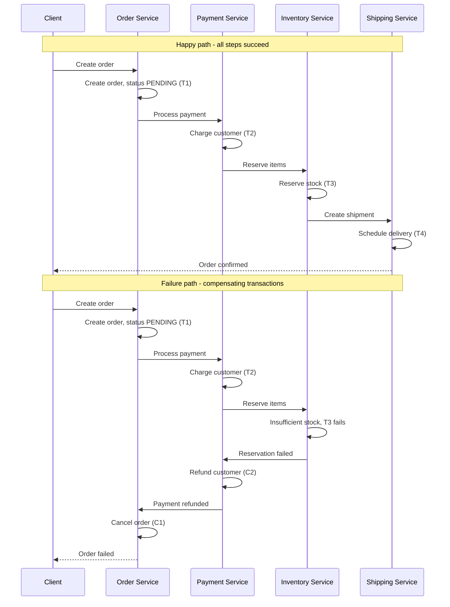
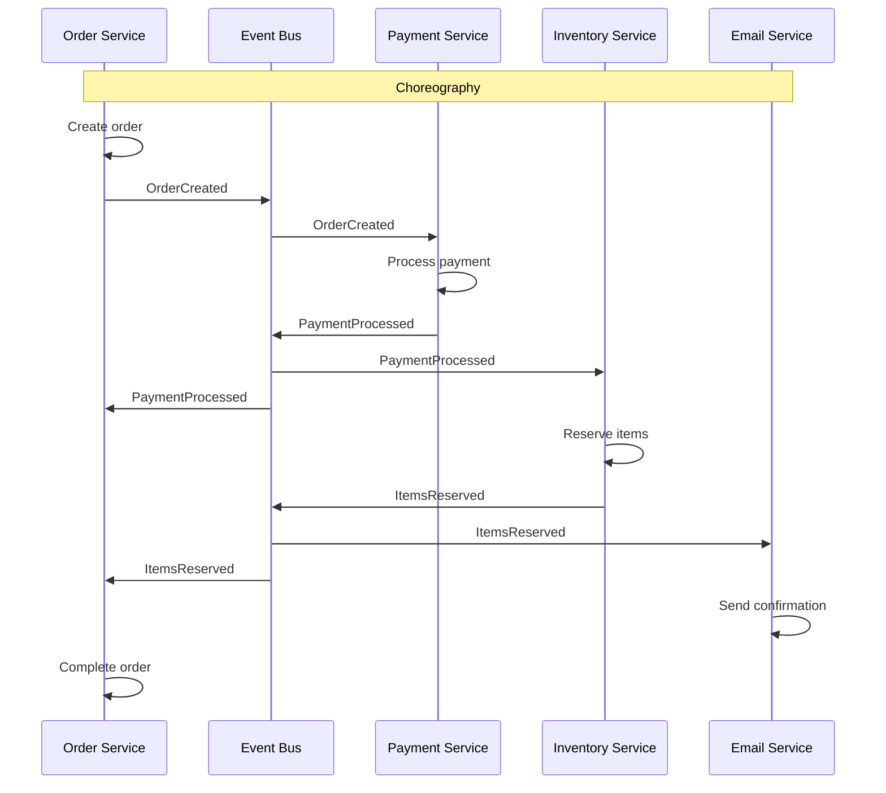
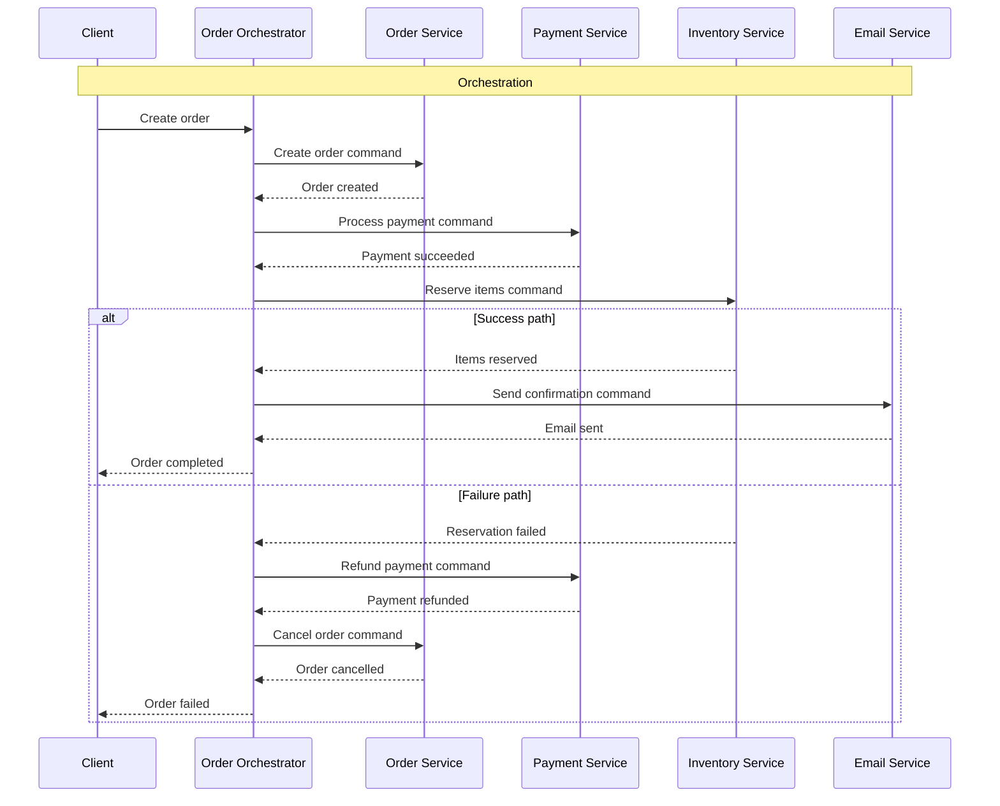
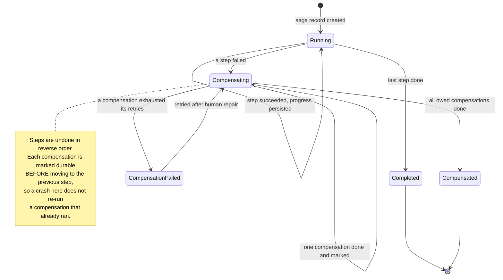
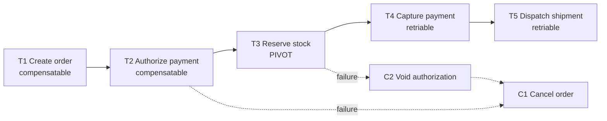
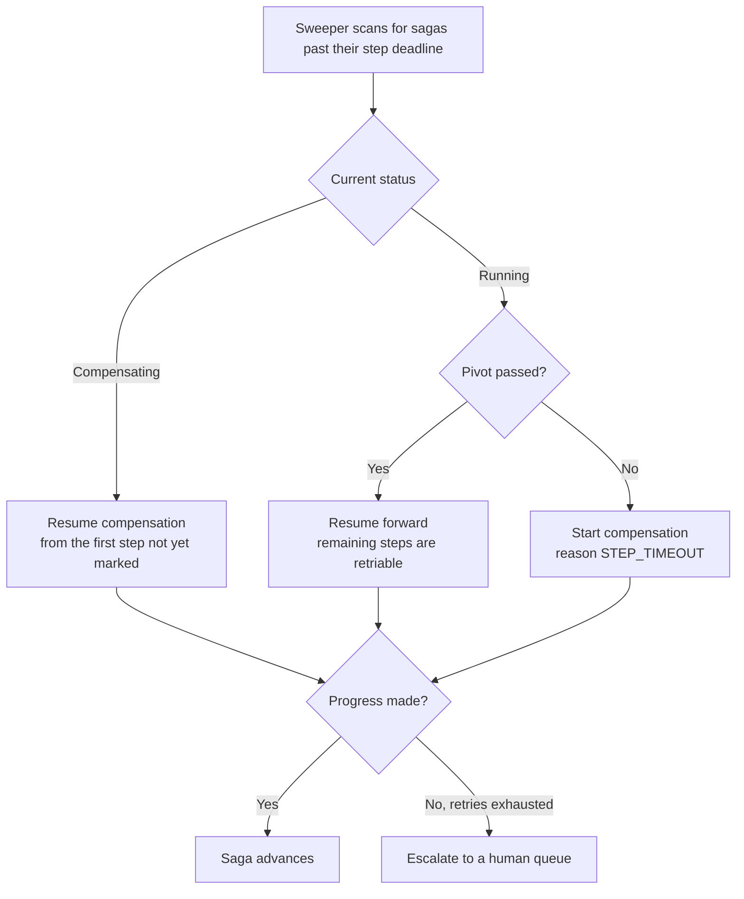

# Saga

A saga manages a business transaction that spans multiple services by breaking it into a sequence of **local** transactions, each of which commits independently, and pairing each step with a **compensating transaction** that semantically undoes it.

Where [two-phase commit](./05-two-phase-commit.md) keeps every participant in suspense until a single global decision, a saga lets every step commit immediately and repairs the damage afterwards if a later step fails. That is the trade: atomicity and isolation are given up in exchange for availability, loose coupling, and the ability to include participants — third-party APIs, long-running human approvals — that could never join a prepare phase.

## Core concept

Each step `T1..Tn` updates data in exactly one service and commits there. If `Tk` fails, the saga runs `Ck-1..C1` — the compensations for the steps that already committed — in reverse order.

A compensation is not a rollback. The original transaction is already durable and may already have been observed by other readers; the compensation is a *new* transaction that produces a semantically opposite effect. A charge is undone by a refund, not by erasing the charge. A shipment is undone by a recall, not by pretending it never shipped.



Three consequences follow immediately, and they drive everything else in this document:

- **There is no isolation.** Between `T1` and `Tn` other transactions can read the half-finished state — the order exists but is unpaid, the money left the account but the goods are not reserved
- **Compensations must succeed eventually.** There is no "give up" branch: a compensation that fails is retried until it works or a human intervenes
- **Every step and compensation runs at-least-once.** Steps are triggered by messages and messages are redelivered, so both must be idempotent

## Saga coordination patterns

The steps have to be sequenced by something. The two options differ in *where* that sequencing logic lives.

### Choreography (decentralized)

In choreography there is no coordinator. Each service publishes an event when its local transaction commits, and the services that care subscribe and perform the next step. The workflow is an emergent property of the subscriptions.



Compensation is choreographed the same way: a failure event is published, and each service that already committed subscribes to it and runs its own compensation. A compensating handler is small — it is one local transaction plus the event that lets the next service upstream compensate in turn:

```python
def handle_inventory_reservation_failed(self, event):
    """Compensation for T2: refund the charge this saga made."""
    payment = self.payments.find_by_order(event.order_id)

    # Keyed by the saga's order id, so a redelivered failure event refunds once
    refund = self.payments.refund(payment.id, idempotency_key=f"refund_{event.order_id}")

    # Propagates the compensation upstream: Order Service cancels on this event
    self.event_bus.publish(PaymentRefunded(event.order_id, refund.id, refund.amount))
```

Two properties of that handler generalize to every choreographed compensation. It is idempotent through a key derived from the saga, because the failure event will be redelivered. And it publishes its own completion event rather than calling the previous service directly, which is what unwinds the chain in reverse without anyone holding the whole sequence in their head — and also what makes the sequence hard to see anywhere in the code.

**Pros:**

- No coordinator to build, deploy, scale, or fail over
- Services stay loosely coupled — adding a subscriber does not change any existing service
- Naturally asynchronous and horizontally scalable

**Cons:**

- The workflow exists nowhere in the code; understanding it means reading every subscription in every service
- No single place holds saga state, so "which sagas are stuck and where" is a hard question
- Cyclic dependencies between services creep in easily (Order publishes for Payment, Payment publishes for Order)
- Compensation ordering is implicit and easy to get wrong as steps are added

### Orchestration (centralized)

An orchestrator owns the workflow: it sends a command to each service, waits for the reply, records progress in durable saga state, and decides whether to advance or compensate.



The orchestrator's own state is the important part. It must be persisted after every step, because the orchestrator will crash mid-saga and the replacement instance has to know exactly which compensations are owed.
The saga record therefore holds a saga ID, a status, the ordered list of completed steps with the data each compensation will need (the payment ID, the reservation ID), and a per-step flag saying whether its compensation has already run.



Two transitions in that diagram carry the whole design:

- **Every arrow persists before the next call is made.** Progress is written after each step and each compensation, not batched at the end. A saga whose state is only in memory is a saga that cannot be recovered — the orchestrator crash is expected, not exceptional
- **`CompensationFailed` is a terminal state that alerts, not a branch that continues.** A failed compensation must not be swallowed so the loop can move on to the next step: the saga is parked with the remaining compensations still owed, and a human or a retry job resumes from exactly there. Skipping ahead would leave money refunded but stock still reserved, with nothing recording that fact

Compensations are dispatched by step type — release the reservation, refund the payment, cancel the order — each keyed by the saga ID so a retry is a no-op. Steps that cannot be undone get a semantic compensation instead: an email is not unsent, it is followed by a cancellation email.

**Pros:**

- The workflow is readable in one place, which makes it reviewable and testable
- Saga state is explicit and queryable: stuck sagas, current step, owed compensations
- Compensation order is explicit rather than emergent
- New steps are added without touching the participating services' subscriptions

**Cons:**

- The orchestrator is another service to run, and its saga state must be durable and replicated
- Business logic drifts into the orchestrator until services become anemic CRUD wrappers
- Participants are coupled to the orchestrator's command contract
- A single orchestrator instance is a bottleneck and a failure domain — it needs [leader election](../fundamentals/28-leader-election.md) or partitioned ownership by saga ID

The orchestrator is not a single point of failure in the 2PC sense, though. It holds no locks, and participants are never in doubt: if the orchestrator dies, its steps have already committed locally and a restarted orchestrator resumes from persisted saga state.

### Choosing between them

| Signal                               | Prefer choreography                  | Prefer orchestration                           |
| ------------------------------------ | ------------------------------------ | ---------------------------------------------- |
| Number of steps                      | Two or three                         | Four or more                                   |
| Branching or conditional logic       | None                                 | Any                                            |
| Need to answer "where is order 123?" | Rare                                 | Routine                                        |
| Team ownership                       | One team per service, loose coupling | A process the business reasons about as a unit |
| Likelihood of adding steps later     | Low                                  | High                                           |

Mixing is normal: an orchestrated core saga that emits events for choreographed side effects (analytics, notifications, loyalty points) keeps the critical path explicit without dragging every downstream consumer into the workflow.

## Saga vs two-phase commit

Both answer "how do multiple services stay consistent without a single local transaction", from opposite ends.

| Aspect              | Two-phase commit                                                        | Saga                                                                      |
| ------------------- | ----------------------------------------------------------------------- | ------------------------------------------------------------------------- |
| Atomicity           | Real: no participant commits unless all can                             | Eventual: every step commits, failures are repaired by compensation       |
| Isolation           | Provided by locks held from prepare until the decision                  | None between steps — intermediate state is visible to other transactions  |
| Failure handling    | Abort before anything becomes visible                                   | Compensating transactions after the fact, which must eventually succeed   |
| Availability        | Product of all participants' availability; all must be up at once       | Each step proceeds independently; a slow participant delays, not blocks   |
| Coordinator failure | Prepared participants are in doubt and hold locks until recovery        | No locks held; a restarted orchestrator resumes from persisted saga state |
| CAP behavior        | CP — stops making progress during a partition                           | AP — keeps making progress and converges afterwards                       |
| Latency cost        | Two round-trips plus durable log writes, bounded by slowest participant | Asynchronous; total duration can be seconds to days                       |
| Natural scope       | Cross-shard writes inside one database, XA resources on one network     | Business processes across independently deployed services                 |
| Breaks down when    | Participants are independent services or third-party APIs               | Steps have no meaningful compensation, or dirty reads are unacceptable    |

The [CAP and PACELC](../fundamentals/27-cap-and-pacelc-theorems.md) framing is worth stating precisely, because it is commonly garbled: partition tolerance is not something either protocol chooses.
Both must tolerate partitions; they differ in what they sacrifice when one occurs. 2PC stops (choosing consistency, giving up availability); a saga continues (choosing availability, accepting a window of inconsistency).
PACELC adds the else-branch: even with no partition, 2PC pays latency for its consistency, while a saga's steps return as soon as the local transaction commits.

## Designing compensating transactions

The compensations are where sagas actually get hard.

- **Compensations are semantic, not literal**: `refund`, not `DELETE FROM payments`. Downstream systems may already have reacted to the original transaction, and the audit trail should show both events
- **Compensations must be idempotent and retried until they succeed**: There is no compensation for a compensation. A refund that fails is retried with backoff and escalated to a human, never abandoned
- **Some steps cannot be compensated**: An email is sent, a physical package is dispatched, a third-party API has no reversal endpoint. These are **pivot steps**
- **Order the saga so compensatable steps come first**: Steps before the pivot are undoable; the pivot decides the saga's outcome; steps after the pivot are *retriable* — they are guaranteed to eventually succeed and are never rolled back. Once the pivot commits, the saga only moves forward
- **Prefer reservations to commitments for early steps**: Authorizing a card and capturing it later is far easier to compensate than charging and refunding. A stock *reservation* with a TTL compensates by expiring on its own if the release message is lost



Once `T3` succeeds, the saga cannot fail — everything after it is retried until it completes. Placing the pivot as late as possible while keeping all irreversible work after it is the core design decision.

## Publishing saga events atomically

Every saga step has the same internal problem: it must update its local database *and* emit the message that triggers the next step (or the compensation), and those are two different systems. If the process dies in between, the saga stalls with no event and no one to retry it.

This is the **dual-write problem**, and the answer is the [Transactional Outbox](./07-transactional-outbox.md): the step's business write and an insert into an outbox table happen in one local transaction, so both rows commit or neither does, and a separate relay publishes what the outbox holds.
The relay may publish a row twice, which is why every step and compensation must be idempotent — the outbox gives at-least-once publishing, not exactly-once.

Note that this applies to orchestrated sagas too: the orchestrator's "record step completed" write and its "send next command" must be atomic in exactly the same way. An orchestrator that persists progress and then fails to send the command has stalled the saga just as thoroughly as a service that updates its rows and fails to publish its event.

## Challenges and considerations

### Idempotency and retries

Saga steps are triggered by messages, and messages are delivered at-least-once — the outbox relay republishes, the broker redelivers on a missed ack, the orchestrator retries a timed-out command it cannot tell succeeded. Every step and every compensation therefore runs more than once, and must produce the same result.

The mechanics are general rather than saga-specific: idempotency keys, conditional writes, and dedup tables are covered in [Reliability](../fundamentals/09-reliability.md#idempotency), and the consumer-side view — acknowledgments, delivery semantics, dead-letter queues, idempotent consumers — in [Messaging patterns](../fundamentals/31-messaging-patterns.md#idempotent-consumer).
What is saga-specific is the natural key: the **saga ID plus step name** is a ready-made idempotency key, stable across retries and unique per logical operation, which is why it is threaded through every command the orchestrator sends and every compensation it dispatches.

One distinction the saga must get right, which a generic retry wrapper does not: **a business failure is not a technical failure.** "Insufficient inventory" means the saga should compensate; "inventory service timed out" means the step should be retried. Conflating them either compensates a saga that would have succeeded or retries forever on a decision that will never change.

```python
def reserve_inventory(self, saga_id, items):
    key = f"{saga_id}_reserve_inventory"          # saga id plus step name

    if recorded := self.operation_log.get_result(key):
        return recorded                           # replay, do not reserve twice

    try:
        reservation = self.inventory.reserve_items(items, idempotency_key=key)
        self.operation_log.record_success(key, reservation)
        return reservation
    except InsufficientInventoryError as e:
        raise SagaStepFailed(key, str(e))         # business: compensate the saga
    except TemporaryServiceError as e:
        raise SagaStepRetryable(key, str(e))      # technical: retry this step
```

Two things are load-bearing here beyond the key itself. The recorded result is persisted *before* being returned, so a replay answers from the log rather than reserving again — and because the process can still die between the reservation and `record_success`, the same key is passed down to the inventory service so its own deduplication covers that window.
The two exception types are what separate the failure modes: raising the wrong one either compensates a saga that would have succeeded, or retries forever against a decision that will never change.

### Lack of isolation

The gap that surprises people: a saga is ACD, not ACID. Between `T1` and `Tn`, other transactions can read and act on partial state. Two classic anomalies:

- **Dirty reads**: A report sums orders that include one whose payment is about to be refunded
- **Lost updates**: Another saga reads a value the first saga is midway through changing, and overwrites it

Standard countermeasures:

- **Semantic lock**: The record carries an explicit in-progress marker (`status = 'PENDING'`, `PAYMENT_PROCESSING`) and other actors are written to respect it. This is the most common one, and the reason saga examples are full of intermediate statuses
- **Commutative updates**: Design operations so ordering does not matter — `credit`/`debit` instead of `set balance`
- **Reread value**: Re-read the record before writing and abort if it changed since the step began, which is optimistic concurrency ([concurrency control](../fundamentals/25-database-concurrency-control.md))
- **By-value routing**: Route low-value requests through the saga and high-value ones through a stricter mechanism, accepting the anomaly only where it is cheap

Semantic locks push the problem out to readers rather than removing it: everyone who reads the record has to know what `PENDING` means. That knowledge is part of the API contract, so document it as such.

### Saga state, timeouts, and recovery

Sagas get stuck. A service is down, a message is lost, a compensation cannot complete, a step is waiting on a human who went on holiday. Without an active sweeper, stuck sagas accumulate silently, holding semantic locks that block other work.

Every saga therefore needs:

- A **persisted state record** with a status, current step, and last-updated timestamp
- A **timeout per step**, not just per saga, so a stall is attributed to the step that caused it
- A **sweeper** that finds sagas past their deadline and either resumes them, compensates them, or escalates
- An **alert on age**, because the count of in-flight sagas is a leading indicator of an outage in a downstream service

What the sweeper does with a stuck saga is decided entirely by where the saga sits relative to the pivot:



A stuck saga is never simply abandoned or marked failed: every branch either moves it forward, unwinds it, or hands it to a person. There is nowhere else for it to go, because each step has already committed somewhere.

Because saga steps are idempotent, the sweeper can safely retry a step it cannot tell whether the saga completed — which is the whole reason idempotency is non-negotiable rather than a nice-to-have. Without it, a sweeper is as likely to double-charge a customer as to repair the saga.

### Observability

A saga's execution is spread across services and time, so the local logs of any one service explain nothing. Propagate the saga ID as a correlation ID on every command, event, and log line, and track a small set of saga-level metrics: sagas started and completed by type, compensation rate, per-step duration, and the age of the oldest in-flight saga. A rising compensation rate is usually the first visible symptom of a downstream failure.

## When to use the Saga pattern

### Ideal scenarios

- **Business processes spanning independently deployed services**: Where a shared transaction is impossible and each service owns its data
- **Long-running processes**: Steps that take seconds, days, or a human approval, where holding locks is out of the question
- **Availability over immediate consistency**: The process should keep working when one participant is degraded
- **Steps with genuine business reversals**: Refunds, cancellations, releases — operations the domain already understands

### Consider alternatives when

- **A visible intermediate state is unacceptable**: Regulatory or ledger constraints that forbid a temporarily inconsistent view point back to [2PC](./05-two-phase-commit.md) or to co-locating the data
- **The operation fits in one local transaction**: If the data lives in one database, use a transaction — a saga across tables in the same schema is pure overhead
- **Key steps have no compensation**: If the irreversible work cannot be moved after the pivot, the design does not fit
- **The workflow is a simple sequence of independent side effects**: Plain event-driven fan-out ([event-driven architecture](./04-event-driven-architecture.md)) is lighter than a saga when nothing needs undoing

## Common anti-patterns

### The god saga

One saga tries to own every concern in the business process, so it becomes a distributed monolith: long, branch-heavy, coupled to a dozen services, and impossible to change without touching all of them.
The giveaway is a step list that runs from credit checks and payment through to loyalty points, marketing emails, analytics, and third-party sync — the order transaction and everything that merely happens afterwards, fused into one unit of compensation.

The test for whether a step belongs: **if it fails, does the order need to be cancelled?** Loyalty points do not roll back a shipment, so they are not part of the order saga.
Split on that line — a focused order saga (create, reserve, pay, ship) that emits a completion event, and separate downstream sagas or plain subscribers for engagement, analytics, and reporting. The split also shrinks the blast radius: a marketing service outage can no longer compensate a paid order.

### Blocking the caller for the whole saga

Synchronous calls *within* an orchestrator are fine — the orchestrator's own thread waiting on a service is an implementation detail. The anti-pattern is holding the client's request open until the last step completes, which makes end-to-end latency the sum of every step and turns any participant's outage into a failed user request.

```python
# Anti-pattern: the request blocks until the entire saga finishes
def create_order(self, request):
    saga = self.orchestrator.run_order_saga(request.data)   # seconds to minutes
    return HttpResponse(saga.result)

# Better: commit T1, return an identifier, let the client poll or subscribe
def create_order(self, request):
    saga_id = self.orchestrator.start_order_saga(request.data)
    return HttpResponse(status=202, body={'saga_id': saga_id, 'status': 'PENDING'})
```

### Fire-and-forget compensation

Logging a failed compensation and moving on leaves money charged for an order that does not exist. A compensation that fails must be retried, and if it exhausts retries it must land in a queue a human works — the same [dead-letter](../fundamentals/31-messaging-patterns.md#dead-letter-queue-dlq) discipline used for poison messages.

### Compensations that assume the world did not move

`release_reservation` assumes the reservation still exists; `refund` assumes the charge has not already been disputed. Compensations run against a system that has changed since the original step, so they must handle "already undone", "no longer exists", and "partially applied" as normal cases rather than errors.

## Interview talking points

- Define the saga by its two halves: a sequence of local transactions, and a compensating transaction for each one. Then say the compensation is semantic, not a rollback.
- Name what is given up: isolation. Intermediate states are visible, and semantic locks (`status = PENDING`) are how you contain that.
- Pick choreography or orchestration deliberately, and justify it by step count, branching, and whether the business needs to ask "where is this order?".
- Raise the dual-write problem before being asked: each step must commit its state change and its outgoing event together, which is the outbox pattern.
- Insist on idempotency and give the key: saga ID plus step name. Distinguish business failures (compensate) from technical failures (retry).
- Order the steps around a pivot: compensatable work first, irreversible work after, so the saga can only move forward once it is committed.
- Mention the sweeper and the metrics — stuck sagas and compensation rate — because that is what operating one actually involves.

## Reference materials

- [Pattern: Saga](https://microservices.io/patterns/data/Saga.html)
- [Sagas: Long Lived Transactions](https://www.cs.cornell.edu/andru/cs711/2002fa/reading/sagas.pdf)
- Managing data consistency in a microservice architecture using Sagas
  - [Part 1: Overview of Sagas](https://microservices.io/post/microservices/2019/07/09/developing-sagas-part-1.html)
  - [Part 2: Coordinating Sagas](https://microservices.io/post/sagas/2019/08/04/developing-sagas-part-2.html)
  - [Part 3: Choreography-based Sagas](https://microservices.io/post/sagas/2019/08/15/developing-sagas-part-3.html)
  - [Part 4: Orchestration-based Sagas](https://microservices.io/post/sagas/2019/12/12/developing-sagas-part-4.html)
- [Applying the Saga Pattern](https://www.youtube.com/watch?v=xDuwrtwYHu8)
