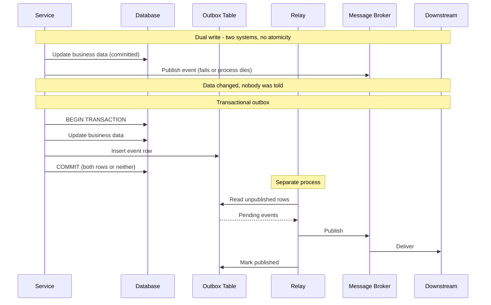
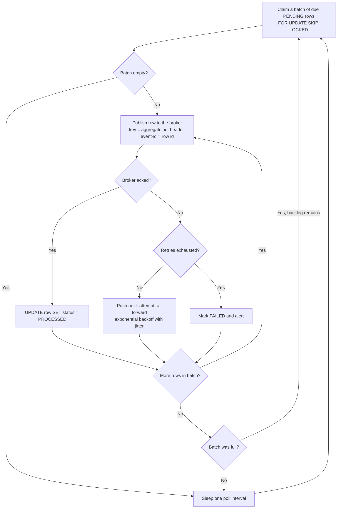
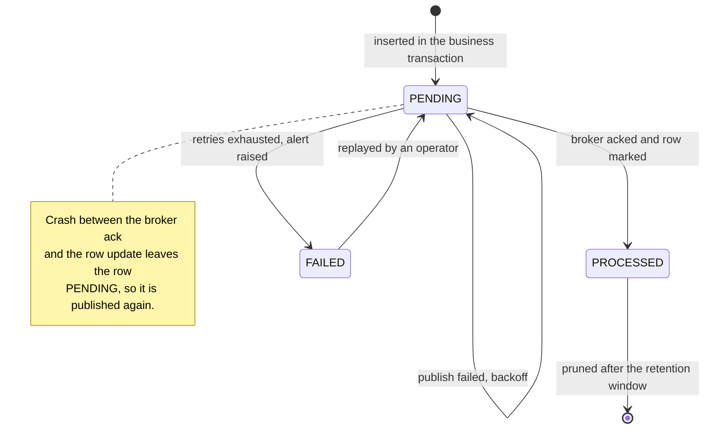
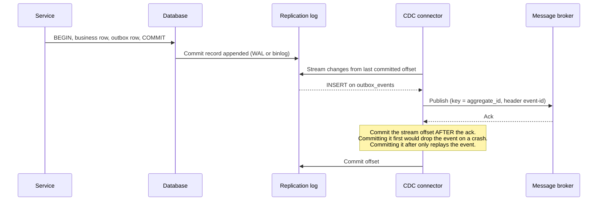

# Transactional outbox

The transactional outbox solves the **dual-write problem**: a service that must both change its own data and tell someone else about it, using two systems that fail independently.

Instead of writing to the database and then publishing to a broker, the service does one thing:

1. Write the business change and the outgoing event into the same database, in the same local transaction
2. Let a separate relay read committed events out of that database and publish them

That single move replaces a distributed atomicity problem with a local transaction plus a retryable delivery problem — which is the entire trick. Unlike [two-phase commit](./05-two-phase-commit.md) it needs no coordinator, no prepare phase, and no participant ever blocks.

## The dual-write problem

Two writes to two systems cannot be made atomic by ordering them. Whichever order you pick, a crash in the gap leaves the system inconsistent:

- **Database first, then publish**: The order exists and no consumer ever hears about it. Payment is never taken, inventory is never reserved, and nothing in the system knows anything is wrong
- **Publish first, then database**: Consumers react to an order that was never committed. Stock is reserved for a phantom order, and a customer is emailed about a purchase that does not exist

Retrying does not close the gap either; it just moves it. A retry loop around the publish still fails if the process dies, and wrapping the publish in a `try/finally` cannot survive a machine losing power.



The failure modes the pattern is designed for:

- **Broker unavailable or slow**: The business transaction still commits; the event waits in the outbox
- **Process crash between the two writes**: Impossible by construction — there is only one write
- **Network timeout on publish**: The relay cannot tell whether the broker got the message, so it republishes. This is why the guarantee is at-least-once, not exactly-once
- **Database rollback**: The event row rolls back with the business change, so no event is ever emitted for work that did not happen

## Pattern implementation

### Step 1: design the outbox table

The outbox table holds events awaiting publication, plus the metadata the relay and the consumers need.

```sql
CREATE TABLE outbox_events (
    id BIGSERIAL PRIMARY KEY,
    aggregate_id VARCHAR(255) NOT NULL,
    event_type VARCHAR(255) NOT NULL,
    event_data JSONB NOT NULL,
    created_at TIMESTAMPTZ NOT NULL DEFAULT CURRENT_TIMESTAMP,
    next_attempt_at TIMESTAMPTZ NOT NULL DEFAULT CURRENT_TIMESTAMP,
    processed_at TIMESTAMPTZ NULL,
    version INTEGER NOT NULL DEFAULT 1,
    retry_count INTEGER NOT NULL DEFAULT 0,
    status VARCHAR(50) NOT NULL DEFAULT 'PENDING'  -- PENDING, PROCESSED, FAILED
);

-- Drives the relay's poll: only pending rows that are due, oldest first
CREATE INDEX idx_outbox_due ON outbox_events (next_attempt_at, id) WHERE status = 'PENDING';
CREATE INDEX idx_outbox_aggregate ON outbox_events (aggregate_id, id);
```

Two design notes that matter more than they look:

- **`aggregate_id` is the ordering and partitioning key.** It becomes the broker message key, which is what keeps events for one order in order while allowing unrelated orders to be processed in parallel
- **The row's primary key is the natural event ID.** Publish it as a header so consumers can deduplicate on it without inventing their own key

Keep the table in the *same database and schema* as the business data. An outbox in another database is a dual write again.

### Step 2: write business data and events in one transaction

The whole mechanism is one transaction with two kinds of insert in it:

```sql
BEGIN;
  INSERT INTO orders (customer_id, items, total, status)
       VALUES ($1, $2, $3, 'PENDING') RETURNING id;
  INSERT INTO outbox_events (aggregate_id, event_type, event_data)
       VALUES ($order_id, 'order.created', $payload);
COMMIT;   -- both rows, or neither
```

The service never touches the broker. That is the point: publishing is no longer part of the business transaction's failure surface, and the request returns as soon as the local commit is durable. If the transaction rolls back for any reason — a constraint violation, a deadlock, a crash mid-statement — the event row disappears with the business row, so no consumer can ever hear about work that did not happen.

### Step 3: the relay

A separate process reads committed outbox rows and publishes them. It is the only component that talks to the broker, and it runs one loop forever: claim a batch of due rows, publish each one, mark it processed, sleep only when there is no backlog left to drain.



Three points on that loop are where implementations go wrong:

- **Claiming must lock.** Two relay instances running the same `SELECT ... WHERE status = 'PENDING'` publish the same rows. Locking the batch as it is read is what makes horizontal scaling safe, and `SKIP LOCKED` is what keeps the instances from serializing behind each other instead of working disjoint batches
- **Publish first, mark second — deliberately, not incidentally.** Marking the row before publishing would lose the event if the publish never happened; publishing first can only duplicate it. That choice is what makes the guarantee at-least-once rather than at-most-once, and the lifecycle diagram below traces the gap it leaves open
- **A failed publish reschedules the row rather than blocking the batch.** Pushing `next_attempt_at` forward by an exponentially growing, jittered interval leaves the row claimable later without stalling everything behind it

```sql
-- The claim query: due rows only, oldest first, locked so peers skip them
SELECT id, aggregate_id, event_type, event_data, retry_count
  FROM outbox_events
 WHERE status = 'PENDING' AND next_attempt_at <= NOW()
 ORDER BY id ASC
 LIMIT 100
   FOR UPDATE SKIP LOCKED;
```

Each published message carries the outbox row's ID as an `event-id` header and the `aggregate_id` as the broker message key. The ID is what lets consumers deduplicate, and it is stable across every republication of the same row; the key is what preserves per-aggregate ordering. Routing from event type to topic is a plain lookup table kept in the relay, so services never hard-code broker topology.

The backoff and jitter rationale — why retries without jitter synchronize, why retry budgets exist — is covered in [Resilience](../fundamentals/14-resilience.md). A `FAILED` row is the outbox's equivalent of a [dead-letter queue](../fundamentals/31-messaging-patterns.md#dead-letter-queue-dlq) entry: alert on it, inspect it, and replay it by resetting `status` to `PENDING`.

### Outbox row lifecycle



The note is the whole reliability story in one sentence: the relay's two actions (publish, mark) are themselves a dual write, and the pattern resolves it by choosing the safe side — duplicate delivery rather than lost delivery.

## Delivery semantics: at-least-once, not exactly-once

The outbox guarantees an event is published **at least once** for every committed business change, and never published for one that rolled back. It does not give exactly-once delivery, and no distributed system does — this is the same conclusion reached in [Reliability](../fundamentals/09-reliability.md#deduplication-and-exactly-once) and [Messaging patterns](../fundamentals/31-messaging-patterns.md#delivery-semantics).

What you can build on top is **effectively-once processing**: at-least-once delivery plus idempotent consumers. The outbox makes this easy because it hands every event a stable identity — the outbox row ID — that survives republication.

The consumer-side mirror is the **inbox**: the consumer records processed event IDs in its own database, inside the same transaction as the side effect it performs, and skips IDs it has already seen.

```python
def handle(self, message):
    with self.db.transaction() as tx:
        # Unique constraint on processed_events(event_id): a redelivery
        # inserts nothing, and this commits with the side effect below
        claimed = tx.execute(
            """INSERT INTO processed_events (event_id, processed_at)
               VALUES (%s, NOW()) ON CONFLICT (event_id) DO NOTHING
               RETURNING event_id""",
            [message.headers['event-id']]
        )
        if not claimed:
            return                          # already processed, skip

        self.reserve_stock(tx, message.value)
```

The dedup row and the side effect share one transaction, and that is the entire correctness argument. Recording the event ID in a separate transaction — before the work, or after it — reintroduces a dual write on the consumer side: crash in the gap and the event is either processed twice or marked done without being processed at all.

Claiming "exactly-once" in an interview is a trap; claiming "at-least-once publishing plus an idempotent consumer, which is effectively-once" is the answer.

## Ordering

Events are published in outbox row order within one relay batch, but that is a weaker guarantee than it looks:

- **Concurrent transactions commit out of sequence.** Two transactions can take IDs 100 and 101 while the one holding 100 commits second, so a relay that tracks a high-water mark (`WHERE id > last_seen`) can skip row 100 entirely. Track a per-row `status` instead of a cursor, as the schema above does
- **Multiple relay instances publish in parallel**, so global ordering is lost even if every batch is ordered
- **Retries reorder.** A row that fails and backs off is published after rows that were inserted later

What survives, and is usually all that is needed, is **per-aggregate ordering**: publish with `aggregate_id` as the message key so all events for one order land on one partition in insertion order, and make sure a failed row for an aggregate blocks later rows for that same aggregate rather than being skipped. Consumers that need to detect gaps can use the `version` column as a per-aggregate sequence number.

If total ordering genuinely matters, run a single relay instance (elected, not merely deployed once) and accept the throughput ceiling. See [Kafka architecture](../advanced/05-kafka-architecture.md) for how partition keys and ordering interact on the broker side.

## Retention and table maintenance

The outbox is a queue that lives in your OLTP database, so it must not grow forever:

- **Delete or archive `PROCESSED` rows** on a schedule — hours to days of retention is typical, enough to debug an incident and no more
- **Prefer deleting in batches** over one large `DELETE`, which holds locks and bloats the table
- **Watch for bloat**, especially in PostgreSQL, where every update to a row (marking it processed) writes a new tuple version and the dead versions must be vacuumed. A high-churn outbox table is a classic autovacuum hot spot — see [PostgreSQL internals](../advanced/06-postgresql-internals.md#vacuum)
- **Alert on the age of the oldest `PENDING` row.** It is the single best health metric for the pattern: it rises the moment the relay or the broker stops working, long before anyone notices missing events downstream

## Alternative: change data capture

Instead of polling the outbox table, tail the database's replication log and publish rows as the log reports them. [Change data capture](./12-change-data-capture.md) is the full treatment of this mechanism as its own pattern — it is not specific to the outbox, and is also used for cache invalidation, search-index sync, and warehouse feeds. What follows here is only how it applies to publishing outbox rows.

The relay's polling loop is replaced by a subscription to the log: an insert into `outbox_events` shows up as a change record, the connector publishes it, and the connector's own stream offset advances.



The ordering note is the same trade the polling relay makes, in a different place: the offset is the connector's equivalent of marking the row processed, and it is advanced after the broker acknowledges, never before. A crash in that gap replays the last events — at-least-once again, and the reason the consumer-side inbox is required either way.

CDC works because the replication log is a durable, ordered record of committed changes — the same log the database already ships to its replicas ([database replication](../fundamentals/23-database-replication.md)).
In PostgreSQL that is the WAL read through logical decoding on a replication slot ([PostgreSQL internals](../advanced/06-postgresql-internals.md#wal)); in MySQL it is the row-format binlog.
Debezium is the common off-the-shelf implementation, and its outbox event router exists specifically for this pattern.

One consequence specific to the outbox use case: nothing needs to be written back. Progress is the stream offset, not a row update, which is why CDC avoids the update churn and vacuum pressure that polling creates. Some implementations go further and delete the outbox row in the same transaction that inserts it: the insert is still in the log, so the event is captured while the table stays empty.

The general operational cost of running CDC — slot retention, connector failover, schema evolution, monitoring lag — is covered in [change data capture](./12-change-data-capture.md#operational-concerns); the short version is that an abandoned replication slot makes the database retain WAL indefinitely and can fill the primary's disk, a real outage mode rather than a theoretical one.

| Aspect                | Polling relay                                      | Change data capture                                    |
| --------------------- | -------------------------------------------------- | ------------------------------------------------------ |
| Latency               | Poll interval (typically 100ms to a few seconds)   | Near real-time                                         |
| Database load         | Repeated queries plus an update per row            | Log reading only; no extra queries or updates          |
| Ordering              | Per batch, weakened by parallel relays and retries | Commit order from the log                              |
| Operational cost      | Just your code                                     | A connector to run, plus slot and retention monitoring |
| Portability           | Any database                                       | Database-specific (WAL, binlog, oplog)                 |
| Failure mode to watch | Relay stops, backlog grows                         | Slot abandoned, WAL fills the disk                     |

Start with polling. Move to CDC when publish latency or the update churn on the outbox table becomes a measured problem, not before.

## Benefits and trade-offs

**Pros:**

- **No lost events**: An event exists for every committed change, and for no uncommitted one
- **No distributed transaction**: One local commit, no coordinator, no prepare phase, no participant ever blocked — contrast [2PC](./05-two-phase-commit.md)
- **Broker outages are absorbed**: The business path keeps working; the backlog drains when the broker returns
- **Fast writes**: The request path does not wait on a network call to the broker
- **Clean separation**: Business logic writes rows; delivery concerns live entirely in the relay

**Cons:**

- **Duplicates are guaranteed to happen eventually**, so every consumer needs an idempotency or inbox strategy
- **Publish latency is added**, from milliseconds with CDC to seconds with a slow poll interval
- **Only per-aggregate ordering is practical**, and even that requires care with retries and parallel relays
- **The table needs maintenance**: retention, batch pruning, and vacuum attention
- **Another process to operate**: The relay needs its own monitoring, and a stalled relay is invisible from the business path

## Relationship to the other patterns

The three patterns in this group answer the same question at different scopes:

- **[2PC](./05-two-phase-commit.md)** makes N participants atomic, and pays for it with blocking and coupled availability
- **[Saga](./06-saga.md)** gives up atomicity across services and repairs failures with compensating transactions
- **Transactional outbox** does not span services at all. It makes *one* service's state change and its outgoing message atomic, which is the building block the other two need

A saga is built out of outboxes: every saga step must commit its local change and emit the message that drives the next step or the compensation, and the outbox is how that is done. Conversely, an outbox alone coordinates nothing — it guarantees the message goes out, not that anyone acts on it correctly.

## When to use the transactional outbox

### Ideal scenarios

- **A service both writes to its database and publishes events**: This is the default case, and the outbox is the default answer
- **Saga steps**: Each step needs its local commit and its outgoing message to be atomic
- **Audit and compliance**: The outbox is a durable record that the event was generated, in the same transaction as the fact it describes
- **Unreliable or slow brokers**: The business path is decoupled from broker availability

### Consider alternatives when

- **Nothing consumes the events**: Do not build an event pipeline for a system with no subscribers
- **Sub-millisecond publish latency is required**: Even CDC adds a hop; a direct publish with accepted loss may be the right trade for telemetry-grade data
- **The consumer is inside the same transaction boundary**: If the work can be done in the same local transaction, do that instead
- **The message is not derived from a state change**: A pure command with no accompanying database write has no dual write to solve

## Common anti-patterns

### Publishing from the request path anyway

Writing the outbox row *and* publishing immediately "to reduce latency" reintroduces the ordering problem the pattern removes, and produces duplicates that consumers were not designed for. Let the relay own publishing.

```python
# Anti-pattern: the service publishes as well, "just to be fast"
class EagerPublisher:
    def create_order(self, order_data):
        with self.db.transaction() as tx:
            order_id = tx.execute("INSERT INTO orders ...")
            tx.execute("INSERT INTO outbox_events ...")

        # Publishes before the relay does, from a process that may crash
        # mid-batch, so ordering and duplication become unpredictable
        self.broker.publish(topic='orders', value=...)
```

### An outbox in a different database

Putting the outbox table in a separate database (or a Redis list, or a second schema on another instance) restores exactly the dual write the pattern exists to eliminate. The outbox is only atomic because it shares a transaction with the business data.

### Missing event metadata

An outbox row that carries only a payload cannot be deduplicated, routed, ordered, or replayed. Each column earns its place by making one of those operations possible:

- **Event ID** (the row's primary key): the consumer's deduplication key
- **Event type**: what the relay routes on and what the consumer dispatches on
- **Aggregate ID**: the message key, so per-aggregate ordering and partitioning work
- **Version**: a per-aggregate sequence number, so a consumer can detect a gap
- **Created-at**: the basis for lag metrics and for the retention sweep
- **Correlation and causation IDs**: what makes a chain of events traceable across services after the fact

Adding these later is far more expensive than it looks, because the consumers that would have used them were written without them.

### Never pruning, never monitoring

An outbox table that is never pruned degrades the database it lives in, and a relay whose failures are invisible turns a delivery outage into a silent data-divergence incident discovered days later. Prune on a schedule and alert on the age of the oldest pending row.

## Interview talking points

- State the problem before the pattern: two writes to two systems cannot be atomic, and no ordering of them helps.
- Describe the mechanism in one sentence: the event is written into the same transaction as the business change, and a separate relay publishes it.
- Be precise about the guarantee: at-least-once publishing, never exactly-once, because the relay can crash between the broker ack and marking the row.
- Follow it with the consumer side: idempotent consumers or an inbox table keyed by the outbox event ID, which together give effectively-once.
- Offer both relay implementations and the trade: polling is simple and portable; CDC is lower latency and lower churn, at the cost of running a connector and monitoring the replication slot.
- Mention ordering honestly: per-aggregate ordering via the message key is achievable, global ordering is not worth the throughput ceiling.
- Do not forget operations: retention, pruning, and alerting on the oldest pending row.

## Reference materials

- [Pattern: Transactional Outbox](https://microservices.io/patterns/data/transactional-outbox.html)
- [Pattern: Transaction Log Tailing](https://microservices.io/patterns/data/transaction-log-tailing.html)
- [Outbox, Inbox patterns and delivery guarantees explained](https://event-driven.io/en/outbox_inbox_patterns_and_delivery_guarantees_explained/)
- [Saga Orchestration for Microservices Using the Outbox Pattern](https://www.infoq.com/articles/saga-orchestration-outbox/)
- [Reliable Microservices Data Exchange With the Outbox Pattern](https://debezium.io/blog/2019/02/19/reliable-microservices-data-exchange-with-the-outbox-pattern/)
