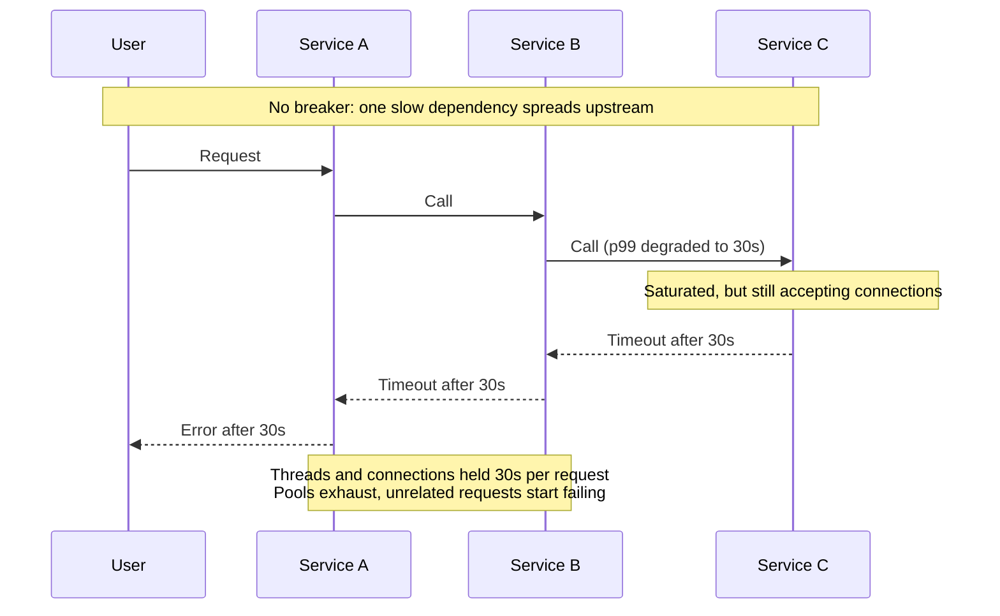
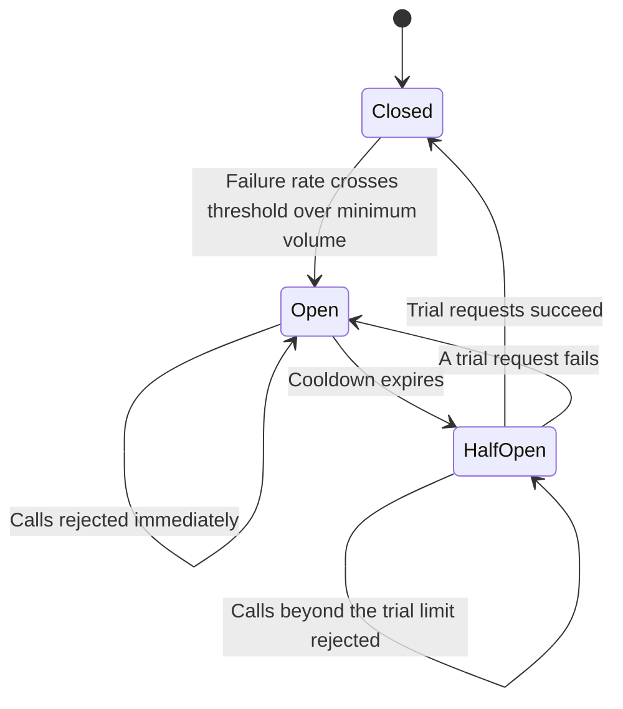
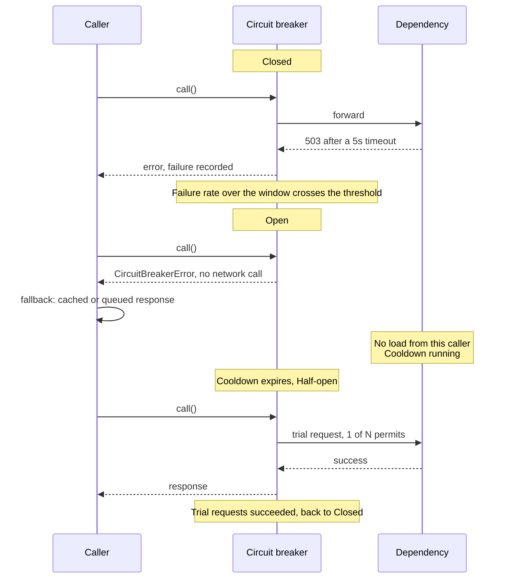
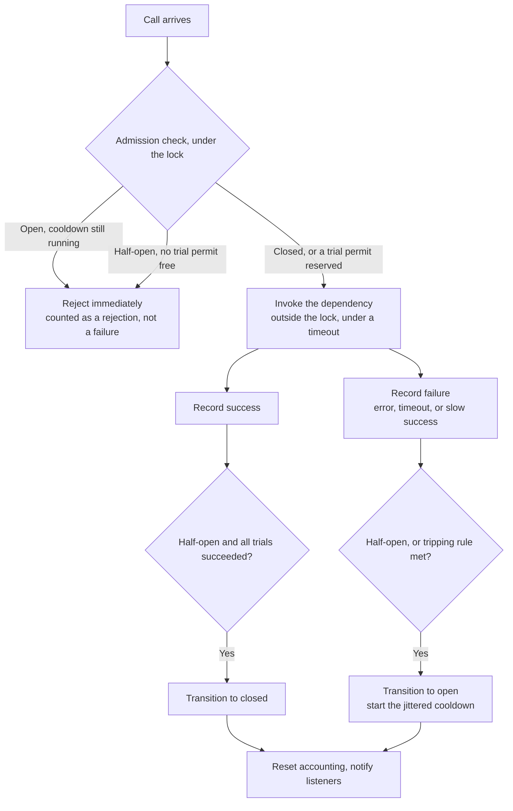
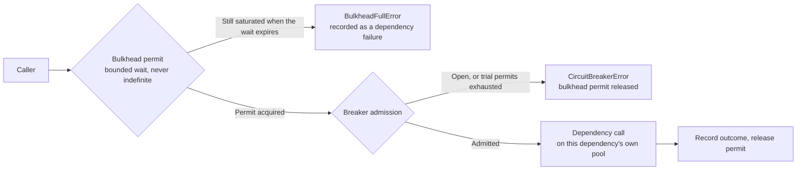

# Circuit breaker

A circuit breaker sits between a caller and one dependency, watches how that dependency is answering, and stops sending it traffic once the failure signal crosses a threshold. Callers then fail fast (or fall back) instead of queueing up behind something that cannot answer.

The name comes from the electrical device: when current exceeds what the wiring can carry, the breaker opens and the circuit stays dead until someone (or a timer) closes it again. Nothing downstream is repaired by the breaker itself; it just stops the damage from spreading while the repair happens.

This document is the detailed treatment: the state machine, how failures are counted and classified, the advanced variants, and the ways teams get it wrong.
The general question of *why* circuit breakers exist and how they sit alongside timeouts, retries, bulkheads, fallbacks, and load shedding is covered in [Resilience](../fundamentals/14-resilience.md) - read that first if you have not seen the pattern before. The state names and transition triggers used here are the same ones defined there.

## Core concept

A circuit breaker does four things, continuously:

1. **Observes** the outcome of every call to one dependency (success, failure, latency)
2. **Trips** to a non-calling state when the observed failure signal crosses a threshold
3. **Rejects** calls immediately while tripped, so no caller resource is spent waiting
4. **Probes** the dependency periodically and restores normal traffic once it answers again

Step 3 is the one that does the work. Without it, a slow dependency converts into exhausted thread pools, connection pools, and memory in every service upstream of it:



The full anatomy of that cascade - no timeout, then resource exhaustion, then a retry storm - is walked through in [Resilience](../fundamentals/14-resilience.md#how-a-small-failure-becomes-an-outage). Two points matter for what follows:

- **A circuit breaker is not a substitute for a timeout**: The breaker can only classify a call as failed once the call has ended. If the call never ends, the breaker never learns anything and the thread stays blocked. Timeouts come first; the breaker is what stops you from paying that timeout thousands of times in a row.
- **The breaker protects the caller first, the dependency second**: Fail-fast keeps the caller's resources free. Removing load from a struggling dependency is a real but secondary benefit, and only materialises if enough callers trip.

## The state machine



- **Closed**: Normal operation. Calls pass through and outcomes are recorded.
- **Open**: Calls are rejected immediately without touching the dependency, for the length of the cooldown.
- **Half-open**: A bounded number of trial requests are admitted to test whether the dependency has recovered. Everything else is still rejected.

| Transition          | Trigger                                                             | Effect on the caller                                    |
| ------------------- | ------------------------------------------------------------------- | ------------------------------------------------------- |
| Closed to Open      | Failure rate crosses the threshold, once minimum call volume is met | Latency drops to near zero, errors become immediate     |
| Open to Half-open   | Cooldown timer expires                                              | Nothing yet; the next few calls become trial requests   |
| Half-open to Closed | The configured number of trial requests all succeed                 | Normal traffic resumes                                  |
| Half-open to Open   | Any trial request fails                                             | Cooldown restarts, usually longer than the previous one |

One request's view of a full trip-and-recover cycle:



Half-open is the state most implementations get wrong, and the one worth being precise about. It exists because there is no way to ask a dependency "are you healthy?" that is more reliable than sending it real work. The rules that make it safe:

- **Admit few**: Sending full traffic at a recovering dependency simply knocks it back over and re-opens the circuit. A handful of concurrent trial requests is enough.
- **Bound in-flight calls, not completed ones**: The limit has to be applied when a call is *admitted*, otherwise a burst of concurrent requests all pass the check before any of them finishes.
- **Fail closed on the first bad trial**: One failure in half-open is enough evidence. A second cooldown is cheap, another cascade is not.
- **Treat trial requests as real requests with real side effects**: They must be safe to repeat - see [trial requests and idempotency](#trial-requests-and-idempotency).

### What counts as a failure

A breaker is only as good as its definition of failure. The common classification:

- **Counts as a failure**: Connection refused, connection reset, timeout, `500`/`502`/`503`/`504`, and a bulkhead or pool rejection on the way out.
- **Counts as a success**: `2xx`, `3xx`, and `4xx` other than `429`. A `400` or `404` means the dependency is alive and answered correctly - the caller sent something it did not like. Counting client errors as failures lets one caller with a bad request trip the circuit for everyone.
- **Judgement call**: `429 Too Many Requests` means the dependency is deliberately rejecting you. Treat it as a failure only if you have nothing better; a `Retry-After`-aware backoff is the more precise response. See [rate limiting](../fundamentals/32-rate-limiting.md#how-clients-should-retry).
- **Often overlooked**: Slow successes. A dependency answering correctly at 10x its normal latency is exhausting your resources just as effectively as one returning errors. Mature breaker libraries let you mark any call over a duration threshold as a failure, which catches degradation that never becomes an outright error.

### Choosing thresholds and windows

- **Trip on failure *rate*, not on a raw count**: A count-based threshold means something completely different at 5 requests per second than at 5,000. Rate is the load-independent signal.
- **Require a minimum volume before the rate can trip anything**: Otherwise a quiet dependency trips on its first two failures, when the rate is 100% of a two-call sample.
- **Size the window in the tens of seconds**: Short enough to react inside a user-visible incident, long enough that one unlucky second cannot dominate it.
- **Set the cooldown from the dependency's realistic recovery time**: Sub-second cooldowns turn the breaker into an expensive retry loop; multi-minute cooldowns keep a recovered dependency offline long after it came back.
- **Jitter the cooldown per instance**: Without jitter, every instance that tripped together goes half-open together, and the recovering dependency is hit by a synchronised probe storm - the same failure mode that makes un-jittered retries dangerous.

Reasonable starting values for a service-to-service call: 50% failure rate, minimum 20 calls, over a 30 second rolling window, with a 30 second jittered cooldown and 3 trial requests. Tune from incident data, not from these numbers.

## Inside the breaker

A breaker is the state machine above wrapped around one dependency's client, plus the accounting that drives its transitions. Each instance holds:

- **The current state, and the monotonic timestamp it entered open**: Cooldown expiry is then a comparison made on the next call, not a timer thread.
- **Outcome accounting for the tripping rule**: A consecutive-failure counter for the naive version, a rolling window of timestamped outcomes for the [rate-based](#rate-based-tripping-over-a-rolling-window) one.
- **Half-open permits**: How many trial requests are currently in flight, and how many have succeeded since the cooldown expired.
- **Separate counters for successes, failures, and rejections**: A rejection is the breaker working and a failure is the dependency breaking. Adding them together makes an incident look worse than it is and hides the moment the breaker engaged.
- **State-change listeners**: Alerting and metrics hang off transitions, rather than polling for state.

The path a single call takes through those pieces:



Everything on that path except admission is bookkeeping. Admission is the piece worth writing out precisely, because the concurrency bug it prevents is easy to reintroduce:

```python
def _admit(self) -> None:
    """Runs before the dependency call. Raises to reject; the call itself runs outside this lock."""
    with self._lock:
        if self._state is CircuitState.OPEN:
            if not self._cooldown_expired():
                self._total_rejected += 1
                raise CircuitBreakerError(f"circuit '{self.name}' is open")
            self._transition_to(CircuitState.HALF_OPEN)

        if self._state is CircuitState.HALF_OPEN:
            # Reserve the trial permit here, at admission, not when the call completes.
            # Otherwise a burst of concurrent callers all pass this check before any of
            # them returns, and the whole burst lands on the recovering dependency.
            if self._half_open_in_flight >= self.half_open_max_calls:
                self._total_rejected += 1
                raise CircuitBreakerError(f"circuit '{self.name}' is probing recovery")
            self._half_open_in_flight += 1
```

The rules that keep the rest of an implementation from becoming the problem it was meant to solve:

- **The dependency call happens outside the lock**: The lock covers admission and outcome recording, never the call. Holding it across a 10 second network call serialises every caller behind the slowest one, reproducing the resource exhaustion the breaker exists to prevent.
- **Time is measured on a monotonic clock, not wall clock**: An NTP correction that moves wall time backwards leaves a breaker stuck open, or expires its cooldown instantly.
- **Accounting resets on every transition**: After a transition, the dependency is judged on what it does next, not on the history that caused the transition.
- **A failure classifier, not a bare `except`**: Only the exception types that mean the dependency is unhealthy are recorded; everything else propagates untouched. See [what counts as a failure](#what-counts-as-a-failure).
- **A listener that throws must not break the call path**: A metrics client that is itself down should not turn a state change into an exception for the caller.

### Using the breaker with a fallback

A breaker without a fallback converts slow failures into fast failures. That is already an improvement - the caller keeps its resources - but the user still sees an error. The value shows up when the rejection has somewhere to go.

The shape of that integration on the caller's side, for a payment call whose fallback is to queue the write:

```python
self.payment_api = CircuitBreaker(
    name="payment_api",
    recovery_timeout=30.0,
    # Only transport-level problems count. A 402 from the processor is a correct
    # answer about this card, not evidence that the processor is down.
    failure_exceptions=(requests.Timeout, requests.ConnectionError, UpstreamError),
)

def charge(self, payment):
    try:
        return self.payment_api.call(self._call_processor, payment)
    except CircuitBreakerError:
        # Open or probing: do not touch the network. Persist the intent and confirm
        # asynchronously, which is why the response says pending, not succeeded.
        self.queue.enqueue("payments.retry", payment)
        return {"status": "pending", "payment_id": payment["idempotency_key"]}
```

The outbound call itself carries an `Idempotency-Key` and a timeout of its own - both are prerequisites for the breaker rather than features of it, for the reasons in [trial requests and idempotency](#trial-requests-and-idempotency).

Useful fallbacks, roughly in order of how often they apply:

- **Serve stale**: Return the last cached value with an explicit staleness marker. Works for reads where slightly old data beats no data.
- **Degrade the feature**: Empty recommendations, a generic ranking, a hidden panel. The page still renders.
- **Queue the write**: Accept the request, persist the intent, confirm asynchronously - as above. The response has to be honest that the work is not done yet.
- **Fail with a useful error**: Sometimes correct. A payment that cannot be taken should not silently look successful.

The constraint on every fallback is that it must be cheaper and more independent than the call it replaces. A "cache fallback" that reads through to the same dead database is not a fallback.

### Trial requests and idempotency

Trial requests are the sharpest edge in this pattern. A half-open probe is an ordinary production request that happens to be carrying an extra job, and it is issued precisely when the dependency's behaviour is least predictable - it may process the request and then fail to answer, so the caller records a failure for work that actually happened.

The rule from [Reliability](../fundamentals/09-reliability.md#idempotency) applies without modification: never retry, and never probe with, an operation you have not made idempotent. In practice that means the same idempotency key travels with the original call and any retry of it, so a duplicate charge is collapsed by the dependency rather than by luck.
That is the whole reason the payment call above carries an `Idempotency-Key`: the breaker will eventually re-issue that class of request as a probe, at the worst possible moment.

The related rule is about ordering: **retry outside the breaker, not inside it.** A client that retries internally, underneath `breaker.call`, hides its attempts from the breaker - three timeouts become one recorded failure, so a five-failure threshold silently becomes a five-user-request threshold and the breaker trips long after the damage is done.
Put the breaker closest to the wire so every attempt is counted, do the retrying above it, and treat `CircuitBreakerError` as a non-retryable outcome - retrying a rejection just burns CPU to get the same answer.

## Advanced circuit breaker patterns

### Rate-based tripping over a rolling window

Consecutive-failure counting is fragile in both directions. A dependency failing 40% of calls may never produce 5 consecutive failures and never trip, while a low-traffic dependency trips on a brief blip. Rate over a rolling window, gated by a minimum call volume, fixes both. Only the tripping rule changes between these variants - the states, the cooldown, and the half-open protocol are identical:

| Tripping rule                      | Trips when                                                                   | What it costs                                                                                |
| ---------------------------------- | ---------------------------------------------------------------------------- | -------------------------------------------------------------------------------------------- |
| Consecutive failures               | N failures land back to back                                                 | Blind to steady partial failure: 40% of calls failing may never produce N in a row           |
| Failure rate over a rolling window | The failure ratio crosses the threshold, once minimum volume is observed     | Needs enough traffic to reach that minimum, so very low-volume dependencies never trip       |
| Rate including slow calls          | Same, plus any success slower than a latency budget is recorded as a failure | One more threshold to tune, in exchange for catching degradation that never becomes an error |
| Adaptive baseline                  | The current window deviates from the dependency's learned normal error rate  | Fewer knobs to tune, but harder to reason about mid-incident                                 |

The window itself is just outcomes tagged with a timestamp, evicted once they age past the window length. That is fine at moderate call rates; high-throughput implementations use bucketed counters instead - fixed-size time buckets each holding a success and failure count, rotated as time advances - which bounds memory regardless of traffic.
That is the same sliding-window-counter trade-off described under [Rate limiting](../fundamentals/32-rate-limiting.md#sliding-window-counter), applied to failure accounting rather than to admission.

Two details in the accounting decide whether it behaves:

- **The minimum-volume gate is checked before the ratio, not after**: Two failures out of two calls is not a 100% failure rate, it is no evidence at all.
- **The latency check happens at recording time, not classification time**: A successful call over the latency budget is flipped to a failure as it enters the window, which is the only place a breaker can see [slow successes](#what-counts-as-a-failure) at all.

Genuinely *adaptive* breakers derive the threshold from observed behaviour rather than from a constant - comparing the current window against a baseline error rate, so a dependency that normally returns 2% errors trips at a different absolute rate than one that normally returns none.
This removes a tuning knob and adds a way to be surprised, so it is worth it mainly for large fleets where per-dependency tuning does not scale.

### Combining with a bulkhead

A breaker limits calls to a dependency *after* it has started failing. A bulkhead limits how much of the caller's resources that dependency can consume *at any time*, including while it looks perfectly healthy. They protect against different halves of the same problem, which is why production clients usually have both.
The pattern itself - isolated pools per dependency, critical traffic separated from non-critical - is covered in [Resilience](../fundamentals/14-resilience.md#bulkheads); what follows is only how the two compose.

Composed, they form two admission gates in front of the same dependency, with the isolated pool behind them:



The ordering and the boundaries are the whole design:

- **The bulkhead is checked first**: Rejecting on a saturated pool is cheaper than any breaker bookkeeping, and it is the gate that applies while the dependency still looks healthy.
- **Waiting for a permit is bounded**: Queueing indefinitely for a slot recreates exactly the resource exhaustion the bulkhead exists to prevent. A quarter of a second is a typical bound; past that, reject.
- **The permit is released in a `finally`, on every path**: A permit leaked on the error path shrinks the pool permanently, and the bulkhead fails closed after enough leaks.
- **The wrapper calls the breaker's public entry point, not its internals**: All state handling stays in one place rather than being half-reimplemented by the wrapper.
- **A bulkhead rejection on the way *out* counts as a breaker failure**: A saturated pool for a dependency is evidence about that dependency. This is what turns a slow dependency into an open circuit before its timeouts have even fired. The same rejection on the way *in* to a service is load shedding and says nothing about anything downstream.

### Breaker granularity

One breaker per *what*, exactly, is a design decision with real consequences:

- **Per dependency (the usual default)**: One breaker per logical downstream service. Simple, and matches how services fail.
- **Per endpoint or operation**: Separate breakers for `GET /products` and `POST /orders` on the same service. Worth it when one expensive endpoint degrades independently of the rest - a single slow report query should not fail-fast the whole catalogue.
- **Per instance or host**: What a load balancer or service mesh does under the name *outlier detection* or *passive health checking*: eject the specific bad instance rather than the whole service. See [Load balancing](../fundamentals/13-load-balancing.md). This composes with, rather than replaces, an application-level breaker - one ejects a bad host, the other gives up on the whole dependency.
- **Per tenant or partition**: Rare, but the right answer when one shard can be sick while the rest are healthy. Requires care: too many breakers means each one sees too little traffic to reach its minimum volume.

The failure mode at both extremes is symmetric. Too coarse (one breaker for everything a service calls) and a single unhealthy endpoint takes out unrelated functionality. Too fine and every breaker is starved of the volume it needs to make a statistically meaningful decision, so none of them ever trips.

### Where the breaker runs

- **In-process library**: The breaker lives in the caller's client (resilience4j, Polly, Hystrix historically). It sees exactly what the caller sees, and it can trigger caller-specific fallbacks. State is per instance.
- **Sidecar or service mesh**: Envoy and similar proxies implement outlier detection and connection-pool limits out of the process. This works uniformly across languages and needs no application change, but the proxy can only return an error - it cannot serve a cached value or queue the write, because it does not know what the request means.
- **Gateway**: Coarse protection at the edge for an entire downstream service. Good blast-radius control, poor precision.

A related question is whether breaker state should be **shared across instances**. Local state is the standard answer: it needs no coordination, and each instance observes its own real experience of the dependency. The cost is that every instance has to independently learn that a dependency is down, so a fleet of 200 instances collectively sends a lot of doomed calls before all of them trip.
Sharing state through Redis or a gossip protocol makes tripping fleet-wide and near-instant, but it adds a dependency to the failure path (what happens when Redis is the thing that is down?) and turns one instance's local network problem into a fleet-wide outage. In practice, local state plus fast per-instance thresholds beats coordination for most systems.

### Observability and operations

A circuit breaker changes behaviour silently, which makes it a common source of "the dashboard looks fine but users are getting errors". The minimum instrumentation:

- **State transitions as events**: Record the previous state, the new state, and the failure rate that caused it. These belong in logs and, for the transition to open, usually in an alert.
- **Time spent open, per breaker**: A breaker that is open 2% of the time is doing its job; one open 60% of the time means the dependency needs fixing, not the threshold.
- **Rejected call count**: Kept separate from failed calls. Rejections are the breaker working; conflating them with dependency errors makes an incident look worse than it is and hides the moment the breaker actually engaged.
- **Fallback execution rate**: How many users actually saw the degraded path.
- **Flap rate**: Repeated open to half-open to open cycling means the cooldown is too short or the dependency is only partially recovered.

See [Observability](../fundamentals/15-observability.md) for how these signals fit into metrics, logs, and traces generally. Two operational affordances are worth building in from the start: a **manual trip** (force a breaker open to shed load from a dependency you know is in trouble) and a **manual reset**, both auditable. Both get used during real incidents.

## Circuit breakers and rate limiting

Both patterns protect a resource from overload, from opposite ends of the call.

|              | Circuit breaker                   | Rate limiter                           |
| ------------ | --------------------------------- | -------------------------------------- |
| Runs on      | The caller's side, per dependency | The callee's side, per client identity |
| Asks         | Is this dependency answering?     | Is this caller within its allowance?   |
| Triggered by | Observed failures and latency     | Request volume, regardless of health   |
| Reacts       | After degradation starts          | Before degradation starts              |
| Rejects      | Everything, briefly               | The excess, continuously               |

They are complementary, and a healthy system runs both: limits at the edge so no caller can saturate the service ([Rate limiting](../fundamentals/32-rate-limiting.md)), and breakers on outbound calls so a saturated dependency cannot drag its callers down.
The interaction to be deliberate about is that a rate limiter's `429` is a *correct* response from a healthy service - see [what counts as a failure](#what-counts-as-a-failure) - so feeding `429`s into breaker failure accounting makes a working limiter look like an outage.

## When to use a circuit breaker

Good fits:

- **Remote calls that can be slow**: External APIs, payment processors, third-party services - anything across a network you do not control.
- **Service-to-service calls in a microservice system**: The canonical case, where the call graph makes a single failure cascade. See [Microservices architecture](./03-microservices-architecture.md).
- **Any call with a meaningful fallback**: The pattern pays for itself fastest where "fail fast" can become "serve something useful fast".
- **Shared, exhaustible resources**: Connection pools and thread pools whose exhaustion would affect unrelated work.

Poor fits:

- **In-process function calls**: A local call cannot exhaust a connection pool or block on a network. The breaker adds state, locking, and a failure mode for nothing.
- **Low-volume operations**: A call made a few times an hour never accumulates enough evidence for a rate threshold to be meaningful. Use a timeout and a retry budget instead.
- **Single-attempt operations where partial results are worse than waiting**: A batch job with no user waiting on it may simply be better off retrying with backoff.
- **Cases where a timeout alone is sufficient**: If the dependency is called once per request, has a tight timeout, and has no fallback, the breaker mostly changes the error message.

## Common anti-patterns

### A breaker on every call

```python
# Anti-pattern: breakers around local, in-process work. Pure functions cannot
# exhaust a pool or hang on a network, so this is locking and state for nothing.
def process_user(self, user_data):
    email = self.validate_email_breaker.call(self.validate_email, user_data["email"])
    tax = self.calculate_tax_breaker.call(self.calculate_tax, user_data["income"])
    return self.payment_api.call(self.charge_payment, user_data["payment"])


# Better: a breaker only where the call crosses a process boundary
def process_user(self, user_data):
    email = self.validate_email(user_data["email"])
    tax = self.calculate_tax(user_data["income"])
    return self.payment_api.call(self.charge_payment, user_data["payment"])
```

### No fallback strategy

```python
# Anti-pattern: the breaker only changes which exception the user sees
def get_recommendations(self, user_id):
    try:
        return self.recommendations_breaker.call(self.call_recommendations_api, user_id)
    except CircuitBreakerError:
        raise


# Better: degrade to something the page can still render
def get_recommendations(self, user_id):
    try:
        return self.recommendations_breaker.call(self.call_recommendations_api, user_id)
    except CircuitBreakerError:
        cached = self.cache.get_recommendations(user_id)  # local cache, not read-through
        return cached if cached is not None else self.popular_items()  # precomputed
```

### Retrying underneath the breaker

```python
# Anti-pattern: the retry loop sits inside the breaker's call, so three timeouts and
# six seconds of held threads are recorded as ONE failure. A 5-failure threshold is
# really a 5-user-request, 30-seconds-of-blocked-threads threshold.
return self.profile_breaker.call(with_retries, user_id)


# Better: breaker closest to the wire, retries above it, rejections not retried
def fetch_profile(self, user_id):
    for attempt in range(3):
        try:
            return self.profile_breaker.call(self.http.get, f"/users/{user_id}", timeout=2)
        except CircuitBreakerError:
            return self.profile_fallback(user_id)  # open: a retry cannot change the answer
        except requests.Timeout:
            time.sleep((2 ** attempt) + random.uniform(0, 0.5))
    return self.profile_fallback(user_id)
```

### Counting client errors as dependency failures

```python
# Anti-pattern: every non-2xx counts, so one caller's bad input trips the circuit
if response.status_code != 200:
    raise UpstreamError(response.status_code)  # 404 and 422 land here too


# Better: only failures that say something about the dependency's health
if response.status_code >= 500:
    raise UpstreamError(response.status_code)       # in failure_exceptions, counted
if response.status_code >= 400:
    raise ClientRequestError(response.status_code)  # not counted, propagates to the caller
```

### Other frequent mistakes

- **A cooldown far shorter than the dependency's recovery time**: The breaker cycles open and half-open continuously, which is just a retry loop with extra steps.
- **Un-jittered cooldowns across a fleet**: Every instance probes at the same instant and knocks the recovering dependency back over.
- **Full traffic in half-open**: The same effect, caused by not bounding trial requests.
- **A breaker with no timeout underneath it**: The breaker never gets an outcome to classify, so it never trips while every thread is blocked.
- **Fallbacks that depend on the failing path**: A read-through cache whose backing store is the dead dependency, or a "backup" service that calls the same downstream.
- **Silent tripping**: No metric and no alert on state changes, so nobody notices the system has been serving the degraded path for six hours.
- **Tuning thresholds by guesswork after an incident**: Change one parameter, and verify it against replayed traffic or a failure-injection drill rather than waiting for the next outage.

## Interview talking points

- Name the three states and their exact transition triggers: closed to open on a failure rate over a minimum volume (not a raw count), open to half-open after a cooldown, half-open to closed or back to open on the trial outcome.
- A breaker classifies outcomes; it does not create them. Without a timeout underneath it, a hung call never resolves, so the breaker never trips — that is the "no timeout" anti-pattern, and it is the first thing to check when a breaker "isn't working".
- Distinguish it from rate limiting: a circuit breaker protects a caller from a failing dependency; a rate limiter protects a callee from too many callers. They solve opposite-facing problems and often sit side by side.
- Half-open trial requests are still real requests to a fragile dependency — they need the same idempotency discipline as any other retry.
- Granularity is a design decision, not a default: one breaker per shared client library call is too coarse (an unrelated failure trips everything behind it); one per request is too fine (no signal ever accumulates). Key it to the dependency that actually fails independently.
- A tripped breaker with no state-change alert is a silent outage — the system is serving a degraded path and nobody knows until someone asks why a feature stopped working.

## Reference materials

- [Circuit Breaker](https://martinfowler.com/bliki/CircuitBreaker.html)
- [Pattern: Circuit Breaker](https://microservices.io/patterns/reliability/circuit-breaker.html)
- [Circuit Breaker pattern (Azure Architecture Center)](https://learn.microsoft.com/en-us/azure/architecture/patterns/circuit-breaker)
- [resilience4j CircuitBreaker](https://resilience4j.readme.io/docs/circuitbreaker)
- [Making the Netflix API More Resilient](https://netflixtechblog.com/making-the-netflix-api-more-resilient-a8ec62159c2d)
- [Fault Tolerance in a High Volume, Distributed System](https://netflixtechblog.com/fault-tolerance-in-a-high-volume-distributed-system-91ab4faae74a)
