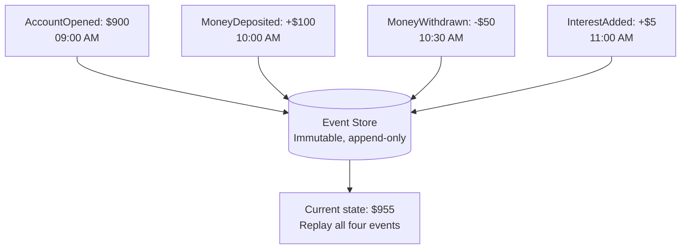
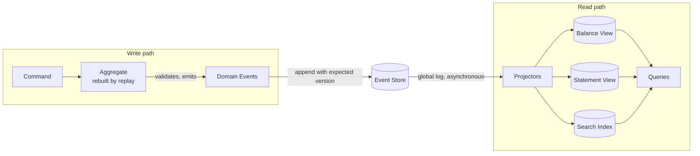
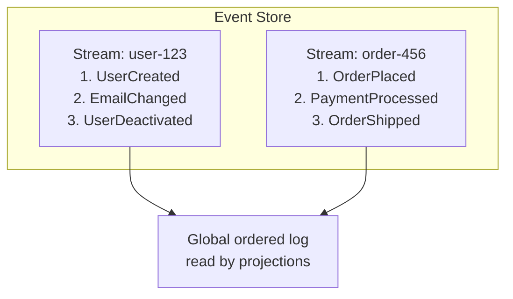
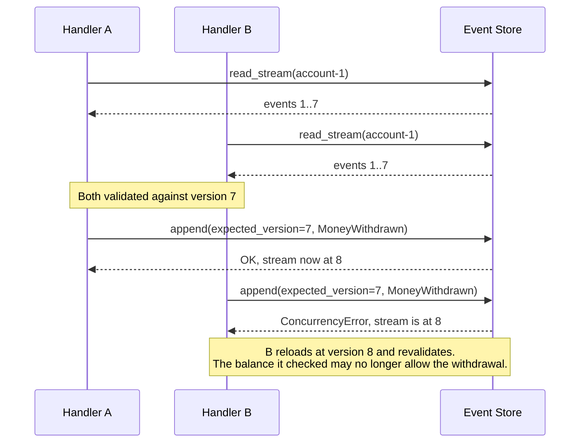
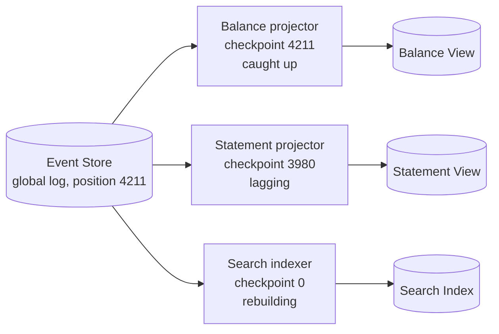
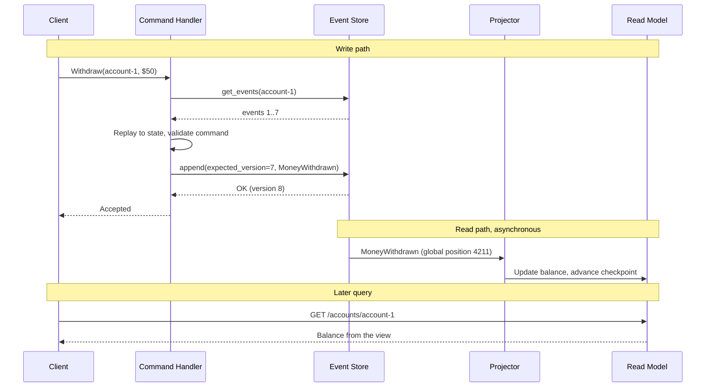
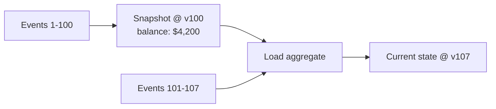

# Event sourcing

Event sourcing changes what the database holds. Instead of storing the current state of an entity and overwriting it on every change, the system stores the complete ordered sequence of immutable events that produced that state.

Current state is not stored at all: it is derived by replaying the events. The history is not an audit log kept alongside the truth, it *is* the truth.

This document owns the mechanics of that idea for this folder. [Event-Driven Architecture](./04-event-driven-architecture.md) covers events as a communication style, and [CQRS](./10-cqrs.md) covers the read/write split that event sourcing almost always ends up needing.

## Core concept

A conventional system updates state by overwriting the previous value, which destroys the information about how that state was reached. Event sourcing keeps that information by appending facts and never updating in place.



Key principles:

- **Events are immutable**: Once written they are never modified or deleted, only compensated by a later event.
- **The stream is append-only**: New events go on the end, which makes writes cheap and contention narrow.
- **State is derived**: Any view of the data is a fold over the events, and can be thrown away and rebuilt.
- **Events are business facts**: Named in the past tense, they record what happened and why, not which rows changed.

The last point is what separates event sourcing from a change-data-capture feed or a database audit table. A CDC stream tells you a column went from `PENDING` to `CANCELLED`; an event tells you the customer cancelled the order and gives you the reason. Only the second one survives a refactor of the schema.

## Architecture components

An event-sourced system has four moving parts, arranged as a write path that appends and a read path that folds.

- **Event store**: An append-only database of event streams, with optimistic concurrency control per stream.
- **Event stream**: The ordered sequence of events for one aggregate, identified by that aggregate's ID.
- **Aggregate**: The consistency boundary. It validates a command against its current state and emits the resulting events.
- **Projection**: A process that consumes events and maintains a read-optimized view (the read model).



The store itself is organized as one stream per aggregate instance, plus a global ordering that projections read:



Reads of a single aggregate go by stream ID and use the per-stream version; projections read the global log and track a position in it. Those are two different access patterns, and an event store is expected to serve both.

### Event store

Whatever the underlying database, an event store exposes three operations. That interface, not the storage engine, is what the rest of the pattern is built on:

| Operation                                     | Called by         | Contract                                                                                           |
| --------------------------------------------- | ----------------- | -------------------------------------------------------------------------------------------------- |
| `append(stream_id, expected_version, events)` | The write path    | Rejects the append if the stream has moved past `expected_version`; assigns each event its version |
| `read_stream(stream_id, from_version)`        | Aggregate loading | Returns one aggregate's events in per-stream version order                                         |
| `read_all(from_position)`                     | Projections       | Returns the global log from a position; that position is the projection's checkpoint               |

Every event carries the same envelope regardless of type: an event ID, the stream (aggregate) ID it belongs to, its type, its version within the stream, a timestamp, the domain payload, and a metadata block. Keep correlation and causation IDs in the metadata rather than the payload — they describe how the event came to be written, not what happened in the domain, and mixing the two makes the payload a moving target for consumers.

The **optimistic concurrency check on append is the entire write-side consistency mechanism**, and it is why an aggregate is a consistency boundary rather than a convention. The caller states the version it read; a concurrent writer that got there first invalidates it.



The retry is not a formality: the loser must re-run the command's validation against the new state, not just re-append its already-computed event. If it blindly reappends, the invariant it checked ("balance covers this withdrawal") was checked against state that no longer exists. See [database concurrency control](../fundamentals/25-database-concurrency-control.md) for the general form of this technique.

### Aggregates

An aggregate is rebuilt by replaying its stream, validates a command against that state, and emits events. It never mutates state except by applying an event, which is what guarantees that replay reproduces exactly what happened live.

Every aggregate splits into two halves that must never be mixed. A command method decides, and an event handler mutates:

```python
class BankAccount(Aggregate):

    # Command half: validate against current state, then emit a fact.
    def withdraw(self, amount: float):
        if not self.is_active:
            raise ValueError("Cannot withdraw from an inactive account")
        if amount > self.balance:
            raise ValueError("Insufficient funds")
        self.raise_event('MoneyWithdrawn', {'amount': amount})

    # Event half: mutate state and nothing else. No validation, no rejection,
    # no clock reads, no calls out -- replay must reproduce the live run exactly.
    def _handle_event(self, event: Event):
        if event.event_type == 'AccountOpened':
            self.balance = event.data['initial_deposit']
            self.is_active = True
        elif event.event_type == 'MoneyWithdrawn':
            self.balance -= event.data['amount']
        else:
            pass  # Unknown type from newer code: replay must not crash on it
```

`raise_event` does two things the aggregate depends on: it applies the event immediately (so a second command in the same request sees the updated balance) and it appends the event to an uncommitted list that the repository later hands to the store.

Loading and saving an aggregate is then mechanical. A repository replays the stream into a fresh instance, and on save it appends the uncommitted events with `expected_version` set to the version it loaded at — current version minus the number of uncommitted events — which is what wires the aggregate into the store's concurrency check.

Three rules keep this correct, and breaking any of them is the usual source of bugs:

- **Validation happens in the command half, never in the event half.** An event is a fact that already happened; refusing to apply it during replay would make history unreplayable, and a rule tightened next year would retroactively invalidate streams that were legal when written.
- **Event handlers must be deterministic and side-effect free.** No clock reads, no random values, no calls to other services. If the event needs a timestamp or a generated ID, it is computed once at emit time and stored in the payload.
- **Unknown event types must be tolerated, not fatal.** During a rolling deploy, older instances will replay streams containing events only the new code understands.

Note what the event carries: `MoneyWithdrawn` holds the amount, not the resulting balance. Storing derived values in an event freezes yesterday's calculation into permanent history; the moment the rule changes, replay produces numbers that no version of the code would compute today.

### Projections

A projection folds the event log into a shape that is cheap to query. Projections are disposable by design: delete one, replay the log, and it is back.

The handler itself is a fold, plus one guard that makes redelivery harmless:

```python
class AccountBalanceProjection:

    def handle_event(self, event: Event):
        # Idempotency: the view records the last version it applied per stream,
        # so a redelivered event is a no-op rather than a double subtraction.
        if event.version <= self.last_applied.get(event.aggregate_id, 0):
            return

        if event.event_type == 'MoneyDeposited':
            self.balances[event.aggregate_id] += event.data['amount']
        elif event.event_type == 'MoneyWithdrawn':
            self.balances[event.aggregate_id] -= event.data['amount']

        self.last_applied[event.aggregate_id] = event.version
```

The guard matters because the delivery path is at-least-once and the fold is not idempotent on its own: applying a `MoneyWithdrawn` twice silently loses money. A projection whose writes are naturally idempotent — an upsert of a whole document keyed by ID — does not need the version check, and is the easier shape to build when you have the choice.

A projector runs that handler over the global log, driven by a component that owns the position it has reached:



Three things about that picture carry the design:

- **The checkpoint is durable, not in-memory.** It is the piece most often left out of a whiteboard design. Without a stored position, a restart either replays the entire log from the beginning or silently skips whatever arrived while the process was down. Advance it only after the view write succeeds, so a crash between the two costs a redelivery rather than a lost event.
- **Each projection owns its own checkpoint.** They are at different positions at the same instant, which is precisely why the read side is eventually consistent, and why a rebuild of one view does not stall the others.
- **A failing projection must not stall the rest, but must not be silent either.** Log the failure, stop that projection's checkpoint from advancing, and alert on its lag. A projector that swallows an error and moves the checkpoint on has permanently corrupted its view, and only a full rebuild will find it.

## Reading and rebuilding

The two paths through an event-sourced system look nothing alike, and keeping them straight is most of understanding the pattern.



Rebuilding is the operation event sourcing makes cheap and that a state-storing system cannot do at all. Because views are derived, a projection bug is fixed by correcting the projector and replaying, rather than by writing a data-migration script and hoping it is right:

1. Deploy the corrected projector writing into a **new, empty** view.
2. Replay the log from position zero into it. The old view keeps serving reads throughout.
3. Once the new view catches up to the live position, switch reads over and drop the old one.

The same procedure creates views that did not exist when the events were written. A question nobody thought to ask in 2023 can be answered over 2023's data, because the raw facts were never discarded.

## Consistency model

Event sourcing gives strong consistency on the write side and eventual consistency on the read side, and the boundary between them is the event store append:

- **Within one aggregate**, the version check serializes writes. The invariants an aggregate enforces (a balance cannot go negative) hold absolutely.
- **Across aggregates**, there is no transaction. Two aggregates that must both change belong either in the same aggregate, or in a [Saga](./06-saga.md).
- **Between the store and any read model**, there is a lag. Every query answers with a view that is correct as of some earlier position in the log.

That is a deliberate PACELC "else, latency over consistency" position: even with no partition, the read path trades freshness for speed and independent scaling. [CAP and PACELC](../fundamentals/27-cap-and-pacelc-theorems.md) covers why this cannot be optimized away, and [CQRS](./10-cqrs.md) covers the strategies for making the lag tolerable in a user interface.

### Publishing events outside the service

An event store is not a message broker. Appending an event makes it durable inside the service; it does not deliver it to anyone else, and a service that appends and then publishes to a broker as a second step has a classic dual write.

The reliable options are the same ones any service has:

- Treat the event store's own stream as the outbox and have a relay publish from it, tracking a checkpoint. This is the [Transactional Outbox](./07-transactional-outbox.md) with the outbox table already built in.
- Use a log-structured broker as the transport for the published stream, so downstream consumers get retention, replay, and per-key ordering for free. See [Kafka Architecture](../advanced/05-kafka-architecture.md).

In both cases delivery is at-least-once, so external consumers need to be idempotent exactly as they would for any other event feed. See [messaging patterns](../fundamentals/31-messaging-patterns.md).

Publish a deliberately chosen **integration event**, not the internal domain event. Internal events are shaped by the aggregate's invariants and change whenever the domain model does; making them the public contract couples every consumer to your refactors.

## Benefits and challenges

**Pros:**

- **Complete audit trail**: Every change is preserved with its context, which is a compliance requirement in finance, healthcare, and legal domains rather than a nice-to-have.
- **Temporal queries**: State at any past moment is reconstructible, which makes "why is this number wrong?" a solvable question.
- **Retroactive views**: New read models can be built over history that predates them.
- **Debuggability**: A production bug can be reproduced by replaying the exact event sequence that caused it.
- **Natural fit with event-driven integration**: The facts other services want are already first-class objects.

**Cons:**

- **Schema evolution is forever**: Old events cannot be rewritten, so every version of every event has to remain readable.
- **Replay cost grows with stream length**: Long-lived aggregates need snapshots to stay fast.
- **Storage grows monotonically**: Nothing is ever deleted, which needs an archival strategy.
- **Eventual consistency on reads**: The UI has to be designed for it, not patched afterward.
- **Deletion is genuinely hard**: "Erase this person's data" conflicts with an immutable log; see below.
- **Unfamiliarity**: It is the pattern most likely to be misapplied, and the cost of getting the aggregate boundaries wrong is high.

Temporal queries fall out of replay almost for free: load the aggregate exactly as the write path does, but stop folding at the first event past the cutoff. Because the stream is stored in version order and versions are assigned at append time, the fold can exit early rather than filtering the whole stream.

Two details make the difference between a correct temporal query and a plausible-looking wrong one:

- **Cut on version where you can, on timestamp only where you must.** Version is the store's own ordering; a timestamp is a value written by a machine whose clock may have drifted, so two events can carry timestamps out of order with their versions.
- **A snapshot may only be used if it sits at or before the cutoff.** Starting from a snapshot taken after the target point restores state that includes events the query is supposed to exclude.

The same replay-to-a-point mechanism answers "what did the system believe when it made this decision?", which is usually the question being asked when someone requests a temporal query.

## Performance optimizations

### Snapshotting

Replaying ten thousand events to answer one command is the first scaling problem an event-sourced system hits. A snapshot stores the aggregate's state at a known version, so loading means restoring the snapshot and replaying only what came after it.



Loading with snapshots is a two-step read: fetch the latest snapshot at or below the version you want, set the aggregate's state and version from it, then read only `from_version = snapshot.version` onward. Everything else about the aggregate is unchanged, which is the point — snapshotting is a repository concern that the domain model never sees.

Guidelines:

- Snapshot on a fixed interval (every 100 to 500 events is a common range) and tune it against measured load time.
- **Write the snapshot only after the events are durably appended**, never before. A snapshot ahead of the log describes state that does not exist, and every subsequent load will replay the wrong suffix on top of it.
- Store snapshots separately from events. A snapshot is a cache, and it must be safe to delete every one of them.
- Version the snapshot format. When the aggregate's internal shape changes, old snapshots are discarded and rebuilt from events; they are never upcast. The events are the only thing with a compatibility obligation.
- Snapshots are an optimization only. If loading from events is not slow, do not add them.

### Stream archival

Streams grow forever, and most of that history is never read on the hot path. Archival moves old events to cheaper storage while keeping the ability to reconstruct anything:

- Define a retention boundary in business terms (for example, events older than the statutory retention period).
- Move archived events to object storage, keeping the stream metadata that says where they went.
- Keep a snapshot at or after the archive boundary so normal operation never touches the archive.
- Accept that a full rebuild from position zero now requires reading the archive, and make that path work before you need it.

### Projection caching

Projections are already read-optimized, so cache in front of them only for genuinely hot keys.

The useful property here is that event sourcing hands you a precise invalidation signal for free: the event that changes a value arrives at the projector, so the projector evicts that key as part of applying it. A TTL is then only a backstop against a missed eviction, not the primary mechanism, and it can be set generously instead of being tuned as a guess about staleness.

Note the ordering: evict after the view is updated, not before, or a concurrent read can repopulate the cache from the stale view and leave it wrong until the TTL expires.

## Schema evolution

Events written years ago must still be readable by today's code, and no migration can change them. There are three workable strategies, in increasing order of cost:

- **Additive change**: Add optional fields and give them defaults when absent. This covers the large majority of changes and requires no machinery at all.
- **Upcasting**: Transform an old event into the current shape as it is read out of the store, so the aggregate only ever sees one version.
- **A new event type**: When the meaning changed rather than the shape, introduce `MoneyWithdrawnV2` and keep handling the old type indefinitely. Do not quietly redefine what an existing event means.

Upcasting is a single function applied wherever events leave the store, so nothing downstream ever sees an old shape:

```python
def upcast(event: Event) -> Event:
    """Applied at the read boundary. The stored event is never modified."""
    if event.event_type == 'MoneyWithdrawn' and 'description' not in event.data:
        # v1 carried only the amount; v2 added a description.
        return event.replacing(data={**event.data, 'description': 'Legacy withdrawal'})
    return event
```

There are two such boundaries, and forgetting the projector is the common mistake: the aggregate repository upcasts as it replays a stream, and the projector upcasts as it reads the global log. Putting version checks inside `_handle_event` instead spreads compatibility logic across every aggregate and every projection, and makes all of them harder to change.

Upcasters accumulate — a chain of them eventually runs v1 to v2 to v3 on every read. That cost is real but bounded, and it is still cheaper than the alternative, which does not exist: there is no migration that can rewrite the history.

## Deleting data from an immutable log

"Delete everything about this customer" and "events are never deleted" are in direct conflict, and this is a real design constraint under GDPR-style regimes rather than a theoretical one.

The usual approaches:

- **Crypto-shredding**: Encrypt personal data in the event payload with a per-subject key held outside the event store. Deleting the key makes every event containing that person's data permanently unreadable, while leaving the stream structurally intact and replayable for everything else. This is the standard answer.
- **Keep personal data out of events**: Store a reference (a customer ID) in the event and keep the identifying attributes in a conventional, mutable store that can be deleted normally. The log then records what happened without recording who, in identifiable terms.
- **Rewrite the stream**: Copy the stream, omitting or redacting the offending events, and switch to the copy. It works, but it breaks immutability, invalidates snapshots and downstream checkpoints, and needs coordination across every consumer. Treat it as a last resort.

Decide this before the first event is written. Retrofitting deletion onto a log full of plaintext personal data is far more expensive than designing for it up front.

## When to use event sourcing

Use it when:

- **History is part of the domain.** Ledgers, trading, insurance claims, medical records, order lifecycles: systems where "how did we get here" is a question the business actually asks.
- **Audit is a hard requirement.** A derived audit table can drift from the data it describes; an event log cannot, because it is the data.
- **Multiple read models are needed over the same facts.** The pattern pairs naturally with [CQRS](./10-cqrs.md).
- **Temporal or retroactive analysis matters.** Reconstructing past state, or answering new questions over old data.

Consider alternatives when:

- **The domain is CRUD.** If nobody will ever ask what a record used to be, an event log is cost with no return.
- **The team is unfamiliar with it and the deadline is short.** Aggregate boundaries chosen badly are expensive to change later, and the pattern punishes learning on the job.
- **Reads must be strongly consistent with writes.** Achievable by querying the aggregate directly, but that discards most of the benefit.
- **Only auditing is needed.** An append-only audit table alongside a normal schema gives most of the traceability for a fraction of the complexity.

A common and sensible middle ground is to event-source the one or two aggregates whose history carries real business weight, and to leave the rest of the system as ordinary CRUD.

## Common anti-patterns

### Events named as commands

An event type of `WithdrawMoney` is an instruction, and an instruction can be refused. Once it is in the store it is a fact that must be replayable forever, so it has to be named for what happened: `MoneyWithdrawn`. The name is not cosmetic — an imperative name is a reliable sign that validation logic has leaked into the event handler, because someone eventually asks what happens when the stored "request" would now be rejected.

### Kitchen-sink events

```python
# Anti-pattern: an event carrying everything the producer had in memory
class OrderProcessedEvent:
    customer_data: dict     # The entire customer object
    product_catalog: dict   # Full product details

# Better: the facts of one decision, and identifiers for the rest
class OrderPlacedEvent:
    order_id: str
    customer_id: str
    product_ids: list[str]
    total_amount: float
```

Oversized events are worse here than in a plain messaging system, because the payload is permanent. Every field in it becomes a contract you can never withdraw, and a copy of data that will diverge from its source the moment that source changes.

### Querying the event store directly

Answering "show me this customer's orders" by scanning the global log is a full table scan of the entire history of the system, and it gets slower every day the system runs. The log is built for two access patterns only: read one stream by ID, and read the global log forward from a position. Every other question belongs to a projection built for it — and if no projection answers it, the fix is to add one and replay, not to scan.

### Aggregates sized by database table

Choosing aggregate boundaries by mirroring the tables of a relational design produces either aggregates too large to write concurrently, or invariants split across aggregates with no transaction to protect them. The boundary should be drawn around the rules that must hold atomically, and nothing wider.

## Interview talking points

- Say what is authoritative: the event log. Current state is a fold over that log — always reconstructible, never a second source of truth. A snapshot is a performance shortcut for replay, not an alternative record.
- Schema evolution can only ever add: events already committed cannot be edited, so changes are additive fields, upcasting, or a new event type — never a migration that rewrites history.
- Name the consistency boundary explicitly: an aggregate is where strong, synchronous consistency ends. Anything that spans aggregates is eventually consistent and needs a saga or process manager, not a bigger aggregate.
- Raise deleting data from an immutable log before being asked — GDPR-style erasure needs a real strategy decided up front (crypto-shredding, or keeping PII out of events entirely), because "just delete the row" does not exist here.
- Distinguish this from event-carried state transfer and from CDC/audit tables: those record that something changed for other systems to react to; here, the events themselves are the entire state, with nothing else stored.
- Event sourcing and CQRS are independent decisions that happen to pair well — don't reach for one just because the other is already in place, and say why they compose (an event stream cannot answer a query without a projection).

## Reference materials

- [Pattern: Event Sourcing](https://microservices.io/patterns/data/event-sourcing.html)
- [Event Sourcing](https://martinfowler.com/eaaDev/EventSourcing.html)
- [Focusing on Events](https://martinfowler.com/eaaDev/EventNarrative.html)
- [Domain Events](https://martinfowler.com/eaaDev/DomainEvent.html)
- [Domain Events vs. Event Sourcing](https://www.innoq.com/en/blog/2019/01/domain-events-versus-event-sourcing/)
- [What is Event Sourcing?](https://www.kurrent.io/resources/eventsourcing/what-is-event-sourcing/)
- [Event Sourcing by Greg Young at GOTO Conference](https://www.youtube.com/watch?v=8JKjvY4etTY)
- [CQRS and Event Sourcing by Greg Young](https://www.youtube.com/watch?v=JHGkaShoyNs)
