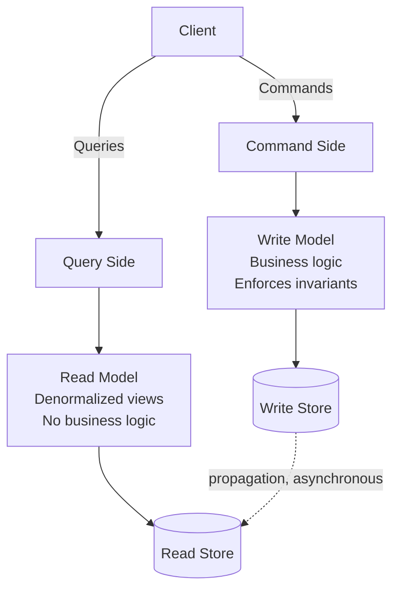
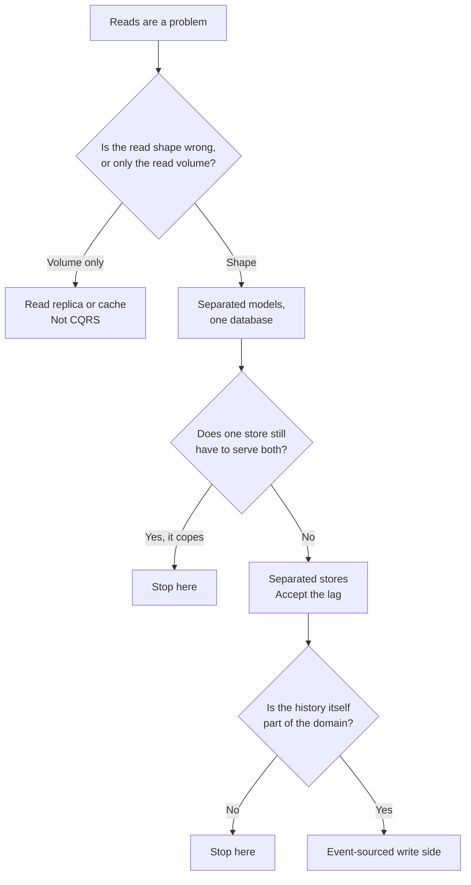
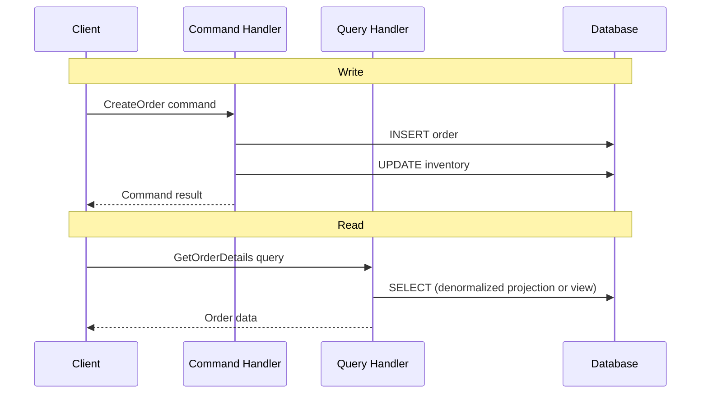
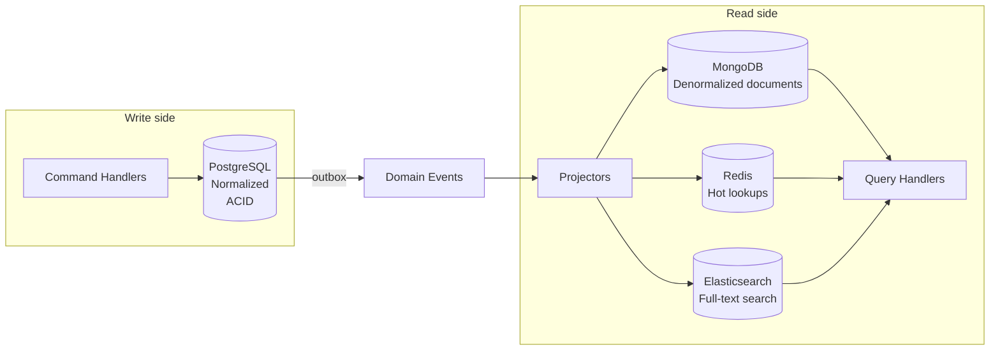
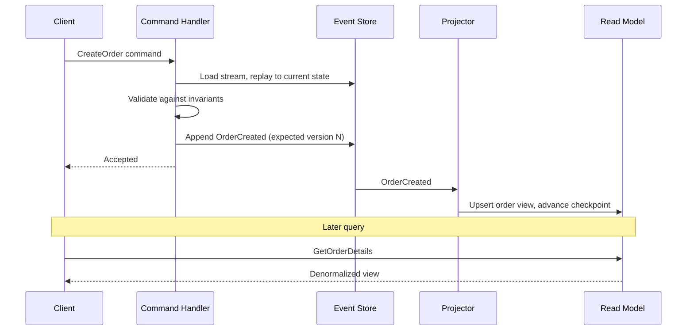
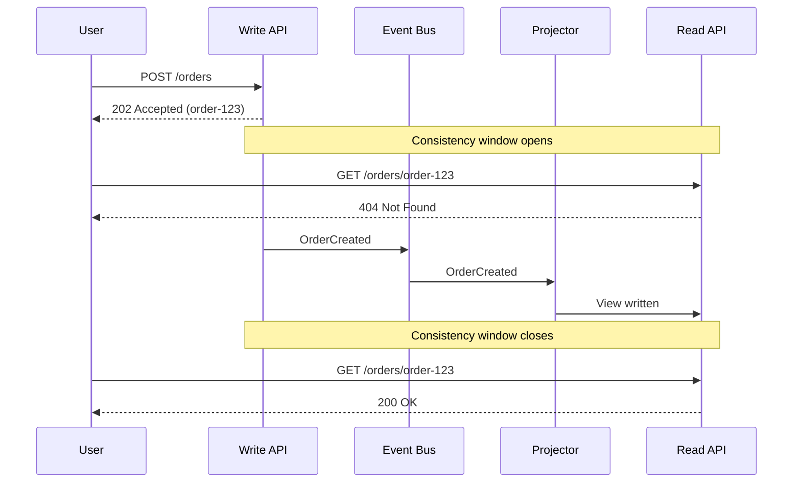

# Command query responsibility segregation (CQRS)

CQRS splits an application into two models: one that handles **commands** (requests to change state) and one that handles **queries** (requests for data). Each is then free to be designed for what it actually does.

A single shared model has to compromise in both directions. It gets normalized for write correctness, which makes reads join across five tables; or denormalized for read speed, which makes every write update five places. CQRS removes the compromise by declining to share the model at all:

- **Write model**: Normalized, invariant-enforcing, shaped by the business rules.
- **Read model**: Denormalized, query-shaped, one view per question the system is asked.

The terminology here is shared with [Event-Driven Architecture](./04-event-driven-architecture.md): a command is an instruction that one handler may accept or reject, and an event is a past-tense fact.

## Core concept



The dotted line is the whole pattern. Everything CQRS gives you, and every problem it creates, follows from the fact that the read store is updated after the write store rather than with it.

What it buys:

- **Independent scaling**: A system doing 100 reads per write can scale the read side alone.
- **Per-side optimization**: The write store can be a normalized relational database while a read model is a document store, a search index, or a cache.
- **Complexity isolation**: Invariant checking, validation, and domain rules live only on the write side, so query handlers stay trivial.
- **Multiple views of one truth**: Adding a new read model is additive, and does not perturb the write side.

## Foundation: command query separation (CQS)

CQRS is the architectural form of Bertrand Meyer's Command Query Separation, an object-design principle: a method should either change state or return data, never both.

```python
class BankAccount:

    def deposit(self, amount: float) -> None:  # Command: mutates, returns nothing
        self._balance += amount

    def get_balance(self) -> float:            # Query: returns data, mutates nothing
        return self._balance

    # Violates CQS: the caller cannot ask the question without also
    # causing the change, so the query can never be repeated or cached
    def deposit_and_get_balance(self, amount: float) -> float:
        self.deposit(amount)
        return self.get_balance()
```

CQRS takes the same rule and applies it one level up, to models, storage, and deployment units rather than to methods. The useful consequence is that a query can never be the thing that corrupts state, and a command never has to be shaped by what a caller wants to read back.

## Implementation levels

CQRS is not one design but a range, and picking the wrong point on it is the most common way to get it wrong. Each level costs more and buys more.

| Level                    | Storage                                  | Consistency | Buys you                                       |
| ------------------------ | ---------------------------------------- | ----------- | ---------------------------------------------- |
| Separated models         | One database                             | Strong      | Code clarity, query freedom, no query-side ORM |
| Separated stores         | Write store plus one or more read stores | Eventual    | Independent scaling, per-view technology       |
| Event-sourced write side | Event store plus projections             | Eventual    | Full history, rebuildable views                |

Start at the top. Most systems that need CQRS need only the first row, and the first row has no eventual consistency in it at all. The step from row one to row two is the expensive one: it is where a synchronous system becomes an asynchronous one, and every consumer of the API inherits a consistency window.



### Separated models over one database

Commands and queries get separate handlers, separate models, and separate paths through the code, but read and write the same database. There is no propagation lag, because there is nothing to propagate.



Commands are explicit objects representing an intent, handled by code that owns the business rules. Queries bypass that model entirely: there is no reason to hydrate an aggregate to render a list, so the read side goes straight to SQL shaped for the screen it feeds.

```python
# Write side: an intent, handled by the code that owns the invariants
class OrderCommandHandler:
    def handle(self, command: CreateOrderCommand):
        order = Order.create(command.customer_id, command.product_ids)  # Validates
        return self.order_repository.save(order)

# Read side: no domain objects, no ORM, one query per screen
class OrderQueryHandler:
    def get_order_details(self, order_id):
        return self.db.query("""
            SELECT o.*, c.name AS customer_name,
                   GROUP_CONCAT(p.name) AS product_names
            FROM orders o
            JOIN customers c ON o.customer_id = c.id
            JOIN order_items oi ON o.id = oi.order_id
            JOIN products p ON oi.product_id = p.id
            WHERE o.id = ? GROUP BY o.id
        """, [order_id])
```

Two things are already true at this level, before any store is split. The query side can be reshaped freely — new joins, new projections, a materialized view — without touching the write model or its invariants. And the write model can be normalized as hard as the domain wants, because no screen depends on its shape any more.

Before going further than this, check whether a read replica solves the problem instead. If the reads are the same shape as the writes and only the volume differs, replication is a cheaper answer than a second model; see [database replication](../fundamentals/23-database-replication.md). CQRS earns its cost when the read *shape* is wrong, not merely the read volume.

### Separated stores

At the next level the read side gets its own storage, updated asynchronously from events the write side publishes. Each read model can then use whatever technology fits its query.



The write side commits its state change and publishes an event describing it, and that pair is where the level's one genuinely dangerous mistake lives. Saving to the database and then publishing to the broker are two separate writes, and a crash between them leaves a read model permanently missing an order.
Publish through the [Transactional Outbox](./07-transactional-outbox.md) so the event is committed in the same transaction as the state change. This is not an optional refinement; without it, the read models silently diverge, and the divergence is invisible until a customer reports it.

Each projector then consumes those events and writes one view. The whole of a projector is usually a handler per event type doing a single idempotent write:

```python
class OrderProjector:
    def handle_order_created(self, event):
        view = {"id": event.order_id, "customer_id": event.customer_id,
                "total": event.total, "status": "PENDING"}
        # Idempotent by construction: an upsert keyed by order id, so a
        # redelivered event rewrites the same row rather than adding a second.
        self.read_repository.upsert(view)
        self.cache.set(f"order:{event.order_id}", view)
        self.search_index.index(view)
```

Event delivery to projectors is at-least-once, so every projector must be idempotent — by upserting on a key like this, or by recording the last event version it applied per entity and skipping anything it has already seen.
The general machinery for this (delivery semantics, dedup, dead-letter handling) is in [Messaging Patterns](../fundamentals/31-messaging-patterns.md), and the fan-out to several independent read models is ordinary [Pub/Sub](../fundamentals/30-pub-sub.md).

Note that the projector writes all three stores from one event, and they can succeed independently. A cache write that fails after the document store write leaves the two disagreeing, so a read that falls back from cache to the store on a miss is the safer shape than one that trusts the cache to be complete.

## CQRS with event sourcing

The two patterns are frequently discussed together, and it is worth being precise about the relationship: **CQRS does not require event sourcing, and event sourcing does not require CQRS, but event sourcing makes CQRS close to inevitable.**

An event-sourced write side stores only events, and an event stream cannot answer "show me all pending orders for this customer" without scanning everything. So it needs projections, and projections are exactly the read models CQRS describes. The read/write split stops being a design choice and becomes a property of the storage.

Running the pair the other way is also natural: if you already have projectors consuming events to build read models, storing those events as the source of truth costs little extra and buys the full history.



What changes on each side when the write side is event-sourced:

- **Write side**: The command handler rebuilds an aggregate by replaying its stream, validates, and appends new events under an expected-version check. There is no UPDATE anywhere. Concurrency is handled by that version check rather than by row locks.
- **Read side**: Identical in role to any other CQRS read side, with one advantage: because the events are retained forever, a read model can be dropped and rebuilt from position zero, and entirely new read models can be built over history that predates them.
- **The seam**: The event store is both the write-side database and the source the projectors read, so there is only one write, not a dual write.

```python
def handle_create_order(self, command: CreateOrderCommand):
    stream = self.event_store.get_events(command.order_id)
    order = OrderAggregate.from_events(stream)   # State is replayed, never read
    order.create(command.customer_id, command.product_ids)

    self.event_store.append_events(command.order_id,
                                   expected_version=len(stream),  # Concurrency check
                                   events=order.uncommitted_events)
    # No second write, and no outbox: projectors read the store's global log.
    return command.order_id
```

The aggregate, event store, projection, snapshot, and schema-evolution mechanics behind this are covered in [Event Sourcing](./09-event-sourcing.md); this section deliberately stops at the seam between the two patterns.

Two cautions worth carrying into an interview:

- Reaching for both patterns at once triples the unfamiliar machinery in a project. If the requirement is read scaling, CQRS alone is the answer. If the requirement is history, event sourcing alone is the answer for that aggregate.
- Neither pattern is a system-wide decision. Apply them per bounded context, and leave the CRUD parts of the system as CRUD.

## Living with eventual consistency

Once the read store is separate, every query answers from a view that is some milliseconds to some seconds behind the write. This is the cost of the pattern, and it has to be designed for at the UI and API level rather than patched afterward.



This is a PACELC "else, latency over consistency" choice: even with a healthy network, the design prefers fast independent reads over freshness. See [CAP and PACELC](../fundamentals/27-cap-and-pacelc-theorems.md) for why the trade is structural rather than an implementation shortcut.

Strategies that make the window tolerable, in rough order of how often they are the right answer:

- **Return what the command produced.** The command handler knows the ID and the resulting state, so respond with it directly instead of making the client re-query. This alone removes most read-after-write complaints.
- **Update the client optimistically.** Render the expected result immediately and reconcile when the view catches up. Standard practice in any responsive UI.
- **Version tokens.** Have the command response carry the write position, and let the read API either wait for a view at least that fresh or report that it is behind. More machinery, but it makes staleness explicit rather than silent.
- **Route the follow-up read to the write side.** For the narrow set of queries that genuinely cannot be stale, query the write model directly and accept that it is not optimized for it.
- **Show the state honestly.** "Processing" is a better answer than an empty list, and it is often the correct product decision rather than a workaround.

What does not work is assuming the window is short enough not to matter. It is exactly long enough to matter when a projector restarts, when the broker backs up, or when a redeployment pauses a consumer.

Monitor projector lag the way you would monitor replica lag: it is the health signal for the entire read side, and it is invisible unless something alerts on it.

## Benefits and challenges

**Pros:**

- **Independent scalability**: Read and write sides scale against their own load profiles, which are usually nothing alike.
- **Per-side optimization**: Each side uses the data structures and storage engine that suit it.
- **Complexity isolation**: Domain rules live on one side; the other side is projections and queries.
- **Additive views**: A new query pattern means a new read model, not a schema migration on the write side.
- **Team boundaries**: The command and query sides can be owned, deployed, and released separately.

**Cons:**

- **Eventual consistency**: The read side lags, and every consumer of the API has to tolerate it.
- **More moving parts**: Projectors, event transport, checkpoints, and lag monitoring are all new things that can break.
- **Duplicated data**: The same facts live in the write store and in every read model.
- **Debugging spans components**: "The number is wrong" now means finding which projector is behind or broken.
- **Easy to over-apply**: The cost is fixed per bounded context and the benefit is not, so applying it broadly loses on both.

## When to use CQRS

Use it when:

- **Read and write loads differ sharply** in volume, shape, or latency requirements.
- **Many different views of the same data** are needed, and no single schema serves them all.
- **Read queries are structurally expensive** against a write-optimized schema: deep joins, aggregations, full-text search.
- **The write side has substantial domain logic** that query paths should not have to load or navigate.
- **The write side is already event-sourced**, in which case projections are required regardless.

Consider alternatives when:

- **The application is CRUD** with similar read and write shapes. A shared model is correct here, and CQRS is pure overhead.
- **Reads must be immediately consistent with writes** and the product cannot expose a window.
- **Only read throughput is the problem.** A read replica or a cache is far cheaper than a second model; see [Database Replication](../fundamentals/23-database-replication.md).
- **The team is small and the domain is not yet understood.** Separated models are hard to refactor across once both sides have consumers.

## Common anti-patterns

### CQRS everywhere

```python
# Anti-pattern: a command object, a command handler, and a query handler,
# all to store one string that carries no invariants and no history
self.command_handler.handle(UpdateThemeCommand(user_id, theme))
return self.query_handler.handle(GetThemeQuery(user_id))

# Better: a plain repository call for a plain operation
self.repository.update_user_theme(user_id, theme)
return self.repository.get_user_theme(user_id)
```

### Ignoring the consistency window

```python
# Anti-pattern: reading back from the query side immediately after a command
def process_order_workflow(command):
    order_id = command_handler.create_order(command)

    # The projector has almost certainly not run yet
    order_details = query_handler.get_order_details(order_id)
    send_confirmation_email(order_details)

# Better: react to the event that says the work is done
def on_order_created(event):
    send_confirmation_email(event)

event_bus.subscribe('OrderCreated', on_order_created)
```

### Business logic on the query side

A query handler that recalculates totals, applies discounts, or decides what a status means has duplicated the domain rules into a place with no invariants and no tests around them. The two copies then drift. Every rule belongs on the write side, and its result belongs in the event, so the projection only has to store what it is told.

### Bloated commands

```python
# Anti-pattern: a command carrying state the handler should look up or already owns
class ComplexOrderCommand:
    customer_data: dict     # Full customer object
    product_catalog: dict   # Entire product catalog
    business_rules: dict    # Rules, passed in by the caller

# Better: a command carrying intent and identifiers
class CreateOrderCommand:
    customer_id: str
    product_ids: list[str]
    shipping_address: str
```

A command that carries the rules has let the caller decide the outcome, which puts the domain logic in the client. It should carry what the user asked for and nothing else.

## Interview talking points

- CQRS is a spectrum, not a binary choice: start with separated models on one database, and only move to separated stores (or an event-sourced write side) once a concrete need — read shape, read scale, or independent evolution — justifies the added consistency lag.
- The read side becomes eventually consistent the instant the stores split. Give a concrete strategy for the write-then-read-your-own-write gap (return the command's result directly, route that one read to the write side, an optimistic UI) rather than just saying "eventually consistent" and stopping.
- Justify the cost correctly: CQRS earns its keep when the read and write *shapes* diverge, not merely when read volume is high — a read replica alone solves the volume problem without any of CQRS's complexity.
- Know the terminology precisely: Command Query Separation (CQS) is the same idea at the method level; CQRS is that idea applied to the architecture, with separate models and often separate stores.
- A query handler that also writes has defeated the entire point of the split — business logic and state mutation belong exclusively on the command side.
- If the write side is event-sourced, name why the two patterns reinforce each other: the event store removes the dual-write problem, since it is simultaneously the write database and the source projections replay from.

## Reference materials

- [Command Query Separation](https://martinfowler.com/bliki/CommandQuerySeparation.html)
- [Pattern: Command Query Responsibility Segregation](https://microservices.io/patterns/data/cqrs.html)
- [CQRS](https://martinfowler.com/bliki/CQRS.html)
- [Clarified CQRS](https://udidahan.com/2009/12/09/clarified-cqrs/)
- [What they don't tell you about event sourcing](https://medium.com/@hugo.oliveira.rocha/what-they-dont-tell-you-about-event-sourcing-6afc23c69e9a)
