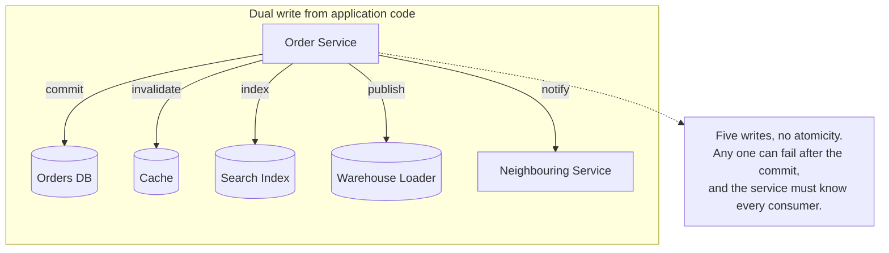
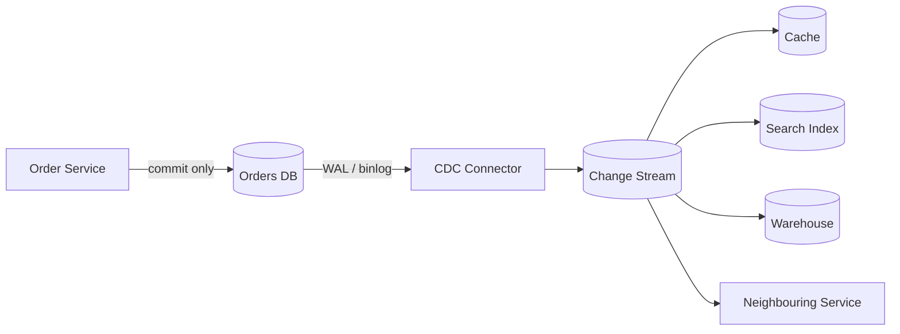
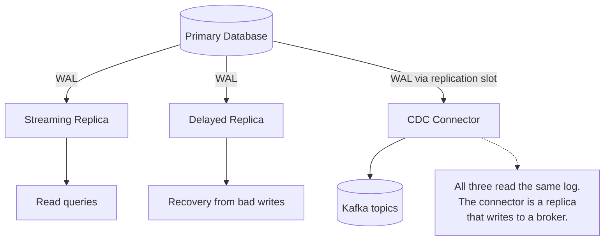
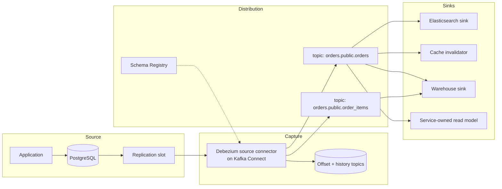
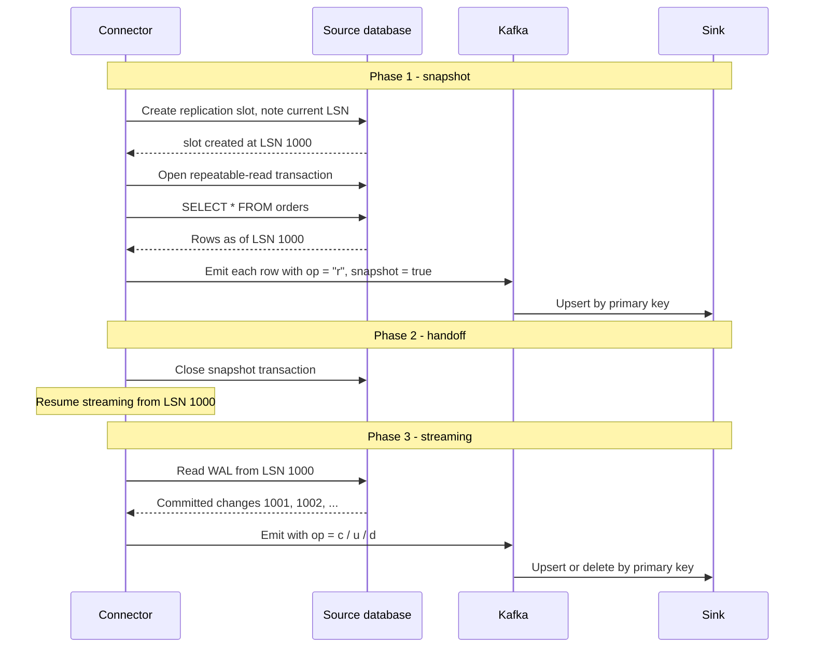
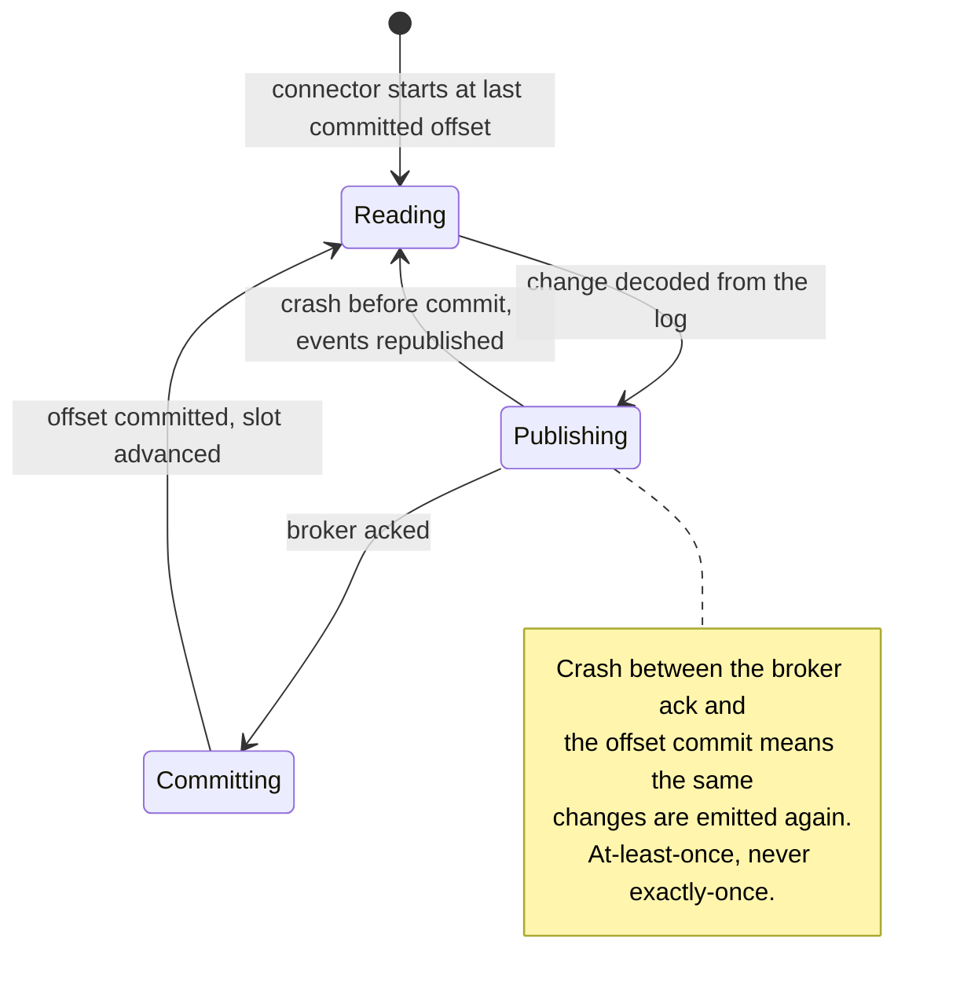
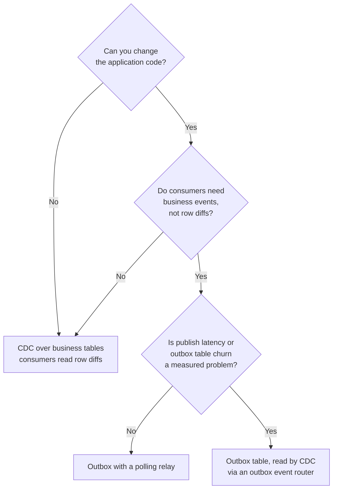
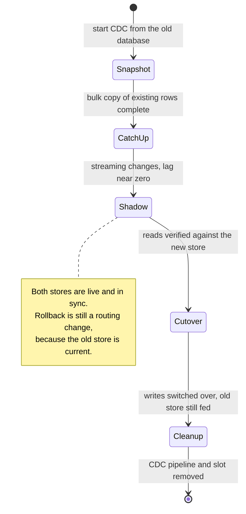

# Change data capture

Change data capture (CDC) turns a database's own change log into a stream of events that other systems can consume. Every committed insert, update, and delete becomes a message describing what changed, in commit order, without the writing application knowing that anyone is listening.

The key move is that CDC does not invent a change-tracking mechanism. It reads the log the database already writes for durability and replication — the PostgreSQL WAL, the MySQL binlog, the MongoDB oplog — so it inherits completeness and ordering from a component the database cannot function without.

[Transactional outbox](./07-transactional-outbox.md) introduces CDC as one way to publish outbox rows. That is a single application of it. This document is the general pattern: what CDC reads, how a pipeline is assembled, how a new consumer bootstraps, what the delivery guarantee actually is, and the operational failure modes that make CDC a database problem as much as a messaging one.

## The problem

A service commits an order. Four other systems now need to know:

- The cache holding the order summary is stale.
- The search index still shows the previous status.
- The analytics warehouse needs the row for tonight's model run.
- A neighbouring service keeps a local read-only copy so it does not have to call the order service on every request.

None of those needs belong in the order service's request path, and each one added there makes the write slower and more fragile.



The naive version is a **dual write**: commit the row, then update the cache, then call the indexer. It fails the same way every dual write fails — a crash or a timeout after the commit leaves the other systems permanently wrong, and no ordering of the calls closes the gap. [Transactional outbox](./07-transactional-outbox.md#the-dual-write-problem) covers why in detail.

Even when the delivery problem is solved, a second problem remains: the producer has to know its consumers. Every new downstream system means a change to the order service, a redeploy, and another failure path in its hot loop.

CDC removes both problems at once. The application writes to its database and nothing else. A separate process reads the committed changes out of the database's log and publishes them, and consumers subscribe without the producer ever learning they exist.



## What CDC actually reads

Every durable database already maintains an ordered, committed record of changes, because it needs one for crash recovery and for replication. CDC is a consumer of that record.

| Database        | Log                                              | How CDC reads it                                                               |
| --------------- | ------------------------------------------------ | ------------------------------------------------------------------------------ |
| PostgreSQL      | WAL, via logical decoding on a replication slot  | `pgoutput` or `wal2json` output plugin, streamed over the replication protocol |
| MySQL / MariaDB | Binlog in `ROW` format                           | Connector registers as a replica and streams binlog events                     |
| MongoDB         | Oplog, exposed as change streams                 | `watch()` cursor with a resume token                                           |
| Oracle          | Redo log                                         | LogMiner or XStream                                                            |
| SQL Server      | Change tables populated from the transaction log | Query the CDC capture tables                                                   |

The mechanism these logs exist for is described in [database replication](../fundamentals/23-database-replication.md#how-the-bytes-move), and the PostgreSQL specifics — LSNs, write-ahead ordering, why the log is the source of truth and the data files a materialized cache of it — in [PostgreSQL internals](../advanced/06-postgresql-internals.md#wal).

The consequence is worth stating explicitly, because it is the reason CDC is trustworthy at all:

- **Completeness is free.** The log contains every committed change, because the database cannot recover or replicate without it. There is no sampling window, no trigger someone forgot to add, no `updated_at` column that a bulk `UPDATE` skipped.
- **Ordering is free.** The log is written in commit order, so the stream reflects the order the database itself considers authoritative.
- **Rolled-back work never appears.** Logical decoding emits a transaction's changes only once it commits, so consumers never see work that was undone.
- **Nothing is added to the write path.** The producer is not slowed down, because the log was being written anyway. Contrast this with trigger-based capture, where every write pays for an extra insert inside its own transaction.

A CDC connector is, functionally, a replica that happens to write its output somewhere other than a database. It has the same position tracking, the same lag question, and the same retention obligations as any other replica.



### What a change event contains

A change event is a row-level fact, not a domain event. A typical Debezium envelope for an update:

```json
{
  "op": "u",
  "ts_ms": 1712345678901,
  "before": { "id": 4711, "status": "PENDING", "total": 99.99 },
  "after":  { "id": 4711, "status": "PAID",    "total": 99.99 },
  "source": {
    "db": "orders",
    "schema": "public",
    "table": "orders",
    "lsn": 24023128,
    "txId": 987654,
    "ts_ms": 1712345678890,
    "snapshot": "false"
  }
}
```

Four fields carry most of the weight:

- **`op`**: The operation — `c` (create), `u` (update), `d` (delete), `r` (read, emitted during the initial snapshot).
- **`before` and `after`**: The row image on each side of the change. What `before` actually contains is configurable and is the subject of a common outage; see [delivery semantics](#delivery-semantics-and-what-the-events-carry).
- **`source.lsn`** (or binlog file plus position): The position in the log. This is the event's identity and the connector's checkpoint.
- **`source.snapshot`**: Whether this event came from the bootstrap snapshot or from live streaming.

This shape is also the pattern's main limitation. A CDC event says a column went from `PENDING` to `PAID`; it does not say the payment was captured by a retry after a gateway timeout. Row diffs are a projection of intent, not intent itself — the distinction [event sourcing](./09-event-sourcing.md) is built on.
If consumers need business meaning rather than row deltas, emit real events through an [outbox](./07-transactional-outbox.md) and let CDC carry that table instead.

## Architecture

A CDC pipeline has three stages, and they are usually three separately operated things.



- **Source connector**: Attaches to the database's log and converts each change into an event. Debezium is the dominant open-source implementation, running as a Kafka Connect plugin (or embedded as a library, or standalone through Debezium Server).
- **Distribution layer**: Almost always Kafka, because CDC needs exactly what a log-structured broker provides — durable retention, replay from an arbitrary offset, per-key ordering, and consumers that own their cursors. See [Kafka architecture](../advanced/05-kafka-architecture.md#consumers-own-the-cursor). One topic per source table is the default layout, keyed by primary key.
- **Sink connectors and consumers**: Apply the changes downstream. Some are off-the-shelf connectors (Elasticsearch, JDBC, S3, Snowflake); some are ordinary application consumers that interpret the changes themselves.

Two properties fall out of that arrangement and are worth naming in an interview:

- **Log compaction makes a topic a snapshot.** A compacted topic keyed by primary key retains the latest value for every key, so a brand-new consumer can rebuild full current state by reading the topic from the beginning rather than re-snapshotting the source database. See [retention and compaction](../advanced/05-kafka-architecture.md#retention-and-compaction).
- **Deletes need tombstones.** With compaction on, a delete must be followed by a null-valued record for that key, or the deleted row lives forever in the compacted view. Debezium's `tombstones.on.delete` does this.

### A source connector configuration

A realistic PostgreSQL connector registration for Kafka Connect:

```json
{
  "name": "orders-postgres-connector",
  "config": {
    "connector.class": "io.debezium.connector.postgresql.PostgresConnector",
    "database.hostname": "orders-db.internal",
    "database.port": "5432",
    "database.user": "debezium",
    "database.password": "${file:/secrets/connect.properties:orders_password}",
    "database.dbname": "orders",

    "topic.prefix": "orders",
    "table.include.list": "public.orders,public.order_items",

    "plugin.name": "pgoutput",
    "slot.name": "debezium_orders",
    "publication.name": "debezium_orders_pub",

    "snapshot.mode": "initial",
    "tombstones.on.delete": "true",

    "key.converter": "io.confluent.connect.avro.AvroConverter",
    "key.converter.schema.registry.url": "http://schema-registry:8081",
    "value.converter": "io.confluent.connect.avro.AvroConverter",
    "value.converter.schema.registry.url": "http://schema-registry:8081",

    "heartbeat.interval.ms": "10000",
    "heartbeat.action.query": "UPDATE debezium_heartbeat SET ts = NOW()",

    "max.batch.size": "2048",
    "poll.interval.ms": "500"
  }
}
```

The lines that matter most are not the credentials:

- **`slot.name` and `publication.name`** define the PostgreSQL-side objects the connector owns. The slot is what makes the stream resumable, and what makes an abandoned connector dangerous.
- **`snapshot.mode`** decides bootstrapping behaviour: `initial` snapshots once then streams, `never` starts from the current log position, `initial_only` snapshots and stops.
- **`table.include.list`** keeps the blast radius small. Capturing every table in a database means every unrelated schema change becomes your problem.
- **`heartbeat.interval.ms`** is not cosmetic. If the captured tables are idle while the rest of the database is busy, the connector has nothing to acknowledge and the slot's position stops advancing, so WAL accumulates even though nothing you care about changed. The heartbeat writes to a dummy table so the slot keeps moving. This is one of the most common CDC-on-PostgreSQL incidents.

## Snapshot plus stream bootstrapping

A new consumer needs the world as it is now, not just what changes from now on. The log usually cannot supply that: retention is finite, and the row inserted three years ago is long gone from the WAL.

The standard solution is **snapshot then stream**: read a consistent snapshot of the existing tables, then switch to the live log at exactly the position the snapshot corresponds to.



The correctness of the handoff rests on two things:

- **The slot is created before the snapshot begins.** From that moment the database retains every subsequent change, so nothing that happens during a long snapshot is lost. The snapshot itself runs in a repeatable-read transaction whose view matches the slot's starting position.
- **Sinks apply changes idempotently, keyed by primary key.** Overlap at the boundary is then harmless: replaying a row that the snapshot already delivered produces the same final state. This is the same reasoning that makes at-least-once delivery workable everywhere else.

Two practical variations:

- **Incremental snapshots** (Debezium's signal-based mechanism) chunk the snapshot and interleave it with live streaming, so a multi-hour snapshot no longer blocks the stream and can be resumed after a restart instead of starting over. They also allow adding a table to an existing connector without re-snapshotting everything.
- **Backfill from a replica.** Snapshots are large sequential scans. Running them against a read replica keeps the primary's buffer cache from being flushed by a bootstrap, at the cost of a slightly older starting position that the slot on the primary must still cover.

A sink written for this contract is short, because the snapshot and streaming paths are the same code:

```python
def handle(self, event):
    doc_id, lsn = self._document_id(event), event['source']['lsn']

    # Stale-write guard: a redelivered or out-of-order event for this key
    # must never overwrite a newer state that was already applied.
    if lsn <= self.positions.get(doc_id, 0):
        return

    if event['op'] == 'd':
        self.index.delete(doc_id)
    else:
        # 'r' (snapshot read), 'c' and 'u' all become the same upsert,
        # which is why the snapshot-to-stream handoff can overlap safely.
        self.index.upsert(doc_id, event['after'])

    self.positions.set(doc_id, lsn)
```

## Delivery semantics and what the events carry

CDC is **at-least-once**, for the same structural reason the outbox is: the connector publishes an event and then records its position, and those two actions are themselves a dual write. A crash in between republishes everything after the last committed offset.



The consumer-side answer is the standard one — see [delivery semantics](../fundamentals/31-messaging-patterns.md#delivery-semantics) and [idempotent consumer](../fundamentals/31-messaging-patterns.md#idempotent-consumer). CDC makes idempotency unusually easy, because change events are keyed by primary key and carry the full row image: applying `after` twice is an upsert, and upserts are naturally idempotent.
That is a real advantage over generic messaging, where the payload may be a delta that cannot be applied twice.

Ordering has one guarantee and one common misreading:

- **Guaranteed**: per-key ordering. All changes for one primary key land on one partition in commit order, because the key is the partition key.
- **Not guaranteed**: ordering across tables, across topics, or across keys. An order and its line items are separate topics with independent partitions and independent consumer lag. A consumer that requires "the order exists before its items arrive" will eventually be wrong. Route related records to the same topic and key, or make the sink tolerate arriving out of order.

Transaction boundaries are similarly lost by default. One source transaction that touched three tables becomes events on three topics with no marker saying they belong together, so downstream a partially applied transaction is visible for a moment. Debezium can emit transaction metadata events for consumers that must reassemble the boundary, but the simpler answer is usually to design sinks that do not need it.

### The before-image gotcha

The most common CDC surprise is that `before` is empty, or contains only the primary key.

On PostgreSQL this is `REPLICA IDENTITY`. The default only logs the primary key for updates and deletes, so:

- A **delete** event tells you which key disappeared and nothing about what it contained.
- An **update** event's `before` has the key but not the old column values, so a consumer cannot tell what actually changed or compute a delta.

```sql
-- Default: the WAL records only the primary key as the old image.
ALTER TABLE orders REPLICA IDENTITY DEFAULT;

-- Full old images, at the cost of more WAL per update and delete.
ALTER TABLE orders REPLICA IDENTITY FULL;
```

MySQL has the same dial as `binlog_row_image` (`FULL` versus `MINIMAL`). Two related traps on PostgreSQL:

- **Unchanged TOAST values.** Large values stored out of line are not re-logged when a row is updated without touching them, so `after` contains a placeholder rather than the real value. A sink that blindly writes `after` will overwrite a good document with the placeholder. Either treat the placeholder as "no change" or set `REPLICA IDENTITY FULL` for those tables.
- **Deletes with no payload.** If the sink needs the deleted row's contents (to remove it from an aggregate, say), the key alone is not enough, and the row is already gone from the source when the event arrives.

Decide this per table before the first consumer is built. Turning `REPLICA IDENTITY FULL` on later does not retroactively fill in the events already published.

## Schema evolution

The source schema will change. Someone adds a column, renames one, drops one, or widens a type — and unlike an outbox, where the event payload is a deliberate contract, a CDC event's shape is the table's shape. A migration on the source is a change to a public interface every consumer depends on.

The standard answer is a **schema registry**: the connector registers the schema of each topic's records, producers reference it by ID, and consumers fetch it to deserialize. The registry then enforces a compatibility rule before a new schema version is allowed.

| Mode     | Guarantee                                      | Allowed changes                    | Who upgrades first    |
| -------- | ---------------------------------------------- | ---------------------------------- | --------------------- |
| Backward | New schema reads data written with the old one | Add optional field, delete field   | Consumers             |
| Forward  | Old schema reads data written with the new one | Add field, delete optional field   | Producers             |
| Full     | Both directions                                | Add or delete optional fields only | Either                |
| None     | Nothing is checked                             | Anything                           | Nobody, and it breaks |

`BACKWARD` is the usual default and fits CDC well: consumers are upgraded first, then the source migration ships, and old and new events are both readable throughout. The transitive variants (`BACKWARD_TRANSITIVE`) apply the check against every previous version rather than just the last one, which matters when consumers replay history from the start of a topic.

Practical rules that keep this manageable:

- **Additive changes are safe; renames are not.** A rename is a delete plus an add, and every consumer that referenced the old name breaks. Add the new column, dual-populate it, migrate consumers, then drop the old one — three deploys, in that order.
- **Never let a consumer deserialize with `SELECT *` semantics.** Consumers should read the fields they need and ignore the rest, so a new column is a non-event rather than a deployment.
- **Watch the type widening.** `INT` to `BIGINT` is compatible in most registries; `VARCHAR` to `INT` is not, and neither is adding a `NOT NULL` column without a default.
- **DDL history is part of the connector's state.** MySQL connectors keep a schema history topic so they can parse binlog rows recorded under an older table definition. Losing that topic means the connector cannot resume and must re-snapshot; treat it as durable state, not scratch space.

## Operational concerns

CDC moves work out of the application and into the database and the connector. That is a good trade, but it is not a free one, and the failure modes are the ones an on-call engineer meets first.

### Replication slots retain WAL

A PostgreSQL replication slot guarantees the primary will keep every WAL segment the consumer has not yet acknowledged. That guarantee is what makes CDC resumable. It is also unbounded by default.

A connector that is stopped, crash-looping, or simply forgotten leaves its slot in place, and the primary keeps WAL forever:

1. WAL accumulates in `pg_wal` and the primary's disk fills.
2. The slot's `xmin` also holds back the vacuum horizon, so dead tuples cannot be reclaimed and tables bloat while this is happening. See [VACUUM](../advanced/06-postgresql-internals.md#vacuum) — an abandoned replication slot is listed there as one of the three things that stall cleanup database-wide.
3. When the disk fills, the primary stops accepting writes. The application outage is caused by a pipeline nobody was watching.

This is the same warning [database replication](../fundamentals/23-database-replication.md#how-the-bytes-move) gives about a dead replica holding a slot open, and the same retention hazard [multi-region replication](../advanced/02-multi-region-replication.md#operating-multi-region) raises for cross-region followers. CDC just makes it likelier, because a connector is easier to forget than a database server.

```sql
-- Retained WAL per slot: the number to alert on, per slot, well before the disk fills.
SELECT slot_name,
       active,
       pg_size_pretty(
           pg_wal_lsn_diff(pg_current_wal_lsn(), restart_lsn)
       ) AS retained_wal
FROM pg_replication_slots
ORDER BY pg_wal_lsn_diff(pg_current_wal_lsn(), restart_lsn) DESC;
```

Three mitigations, in order of preference:

- **Alert on retained WAL per slot** at a threshold measured against free disk, and page on it. An inactive slot with growing retention is an incident in progress.
- **Set `max_slot_wal_keep_size`** so PostgreSQL invalidates a slot rather than filling the disk. The connector then has to re-snapshot, which is painful but strictly better than an outage on the primary.
- **Drop slots as part of decommissioning.** Deleting the connector does not delete its slot. Removing a CDC pipeline is a two-step operation, and forgetting the second step is exactly how the incident above starts.

### Connector failover and restart

The connector stores its position (LSN, binlog coordinates, or resume token) in a durable offset store — a Kafka topic when running on Kafka Connect. On restart it resumes from the last committed offset, republishing anything that was in flight.

- **Only one connector per slot.** Two connectors on one slot is a data race, not redundancy. High availability comes from Kafka Connect restarting the task on another worker, not from running two copies.
- **Failover of the source database matters.** A physical standby promoted to primary does not automatically carry the logical slot's position; depending on version and setup, the connector may need to be recreated and re-snapshot. Test this before you need it, because "the database failed over cleanly and the CDC pipeline silently restarted from empty" is a bad thing to learn during an incident.
- **Offsets are the only progress record.** Nothing is written back to the source tables, which is why CDC avoids the update churn and vacuum pressure that a polling relay creates on an outbox table.

### Monitoring lag

Lag in a CDC pipeline is not one number. Measure it in three places, because they fail differently:

| Metric                | Where it comes from                                           | What it means when it rises                                 |
| --------------------- | ------------------------------------------------------------- | ----------------------------------------------------------- |
| Retained WAL per slot | `pg_replication_slots`                                        | The connector is not consuming; disk and vacuum are at risk |
| Capture lag           | Connector metrics: now minus `source.ts_ms` of the last event | The connector is behind the database                        |
| Consumer lag          | Broker consumer group offsets                                 | The sink is behind the broker, so downstream state is stale |
| End-to-end latency    | Sink timestamp minus `source.ts_ms`                           | What a user actually experiences as staleness               |

Alert on the first one hardest. Consumer lag degrades a search index; retained WAL takes down the primary.

## CDC vs outbox vs dual write

| Aspect                             | Dual write                        | Transactional outbox                         | Change data capture                                   |
| ---------------------------------- | --------------------------------- | -------------------------------------------- | ----------------------------------------------------- |
| Atomicity with the business change | None. Broken by construction      | Yes, one local transaction                   | Yes, the log only contains committed work             |
| Application code changes           | Publish calls in the request path | Insert an outbox row in the same transaction | None                                                  |
| Payload                            | Whatever the caller sends         | A deliberately designed event                | The row diff, shaped by the table                     |
| Infrastructure to operate          | A broker client                   | A relay process you build                    | A connector, plus slot and schema-registry operations |
| Latency                            | Immediate, when it works          | Poll interval, typically 100ms to seconds    | Near real time                                        |
| Portability                        | Any store                         | Any transactional database                   | Database-specific log formats                         |
| Load on the source                 | The publish call                  | Polling queries plus an update per row       | Log reading only                                      |
| Failure mode to watch              | Silent divergence                 | Relay stalls, backlog grows                  | Slot abandoned, WAL fills the primary's disk          |
| Guarantee                          | None                              | At-least-once                                | At-least-once                                         |

Dual write is not a trade-off, it is a bug: the two writes cannot be made atomic and no amount of retrying fixes it. Choose between the other two.

Outbox and CDC are not mutually exclusive, and the best version of each is often the two combined:

- **Outbox alone** with a polling relay is the simplest thing that works, portable across databases, and requires no new infrastructure. Its costs are publish latency and update churn on an OLTP table.
- **CDC alone** over the business tables needs no application change at all, which is why it is the standard answer for systems you cannot modify — legacy applications, vendor databases, and anything that must be integrated without a code deploy. Its cost is that consumers receive row diffs and are therefore coupled to the source schema.
- **CDC over the outbox table** gets both: the application still writes a deliberately designed event into its own transaction, and the connector reads that table's inserts from the log instead of polling. Debezium's outbox event router exists precisely for this, and it is where high-throughput systems tend to land.
  Some implementations even delete the outbox row in the same transaction that inserts it — the insert is already in the log, so the event is captured while the table stays empty.



## Beyond the outbox

Publishing integration events is one use of CDC. These are the others, and together they are why CDC is a pattern rather than a footnote.

- **Cache invalidation.** The event that changed the row is the invalidation signal, which removes the classic problem of an application that updates the database and forgets one of the cache keys. Invalidating from the change stream means the cache is driven by what actually committed rather than by what the code remembered to do.
  Note the ordering hazard: a cache filled by a read that raced the invalidation can end up holding stale data anyway, so keep the TTL as a backstop. See [caching](../fundamentals/11-caching.md#invalidation-strategies).
- **Search-index synchronization.** Elasticsearch or OpenSearch cannot be written to in the same transaction as the database, so the choice is a dual write or CDC. Row-level events keyed by primary key map directly onto document upserts and deletes, and a botched index can be rebuilt by replaying the topic from the beginning.
- **Warehouse and analytics feeds.** CDC replaced nightly full-table extracts in most modern data platforms: instead of scanning the OLTP database once a day, the warehouse consumes a continuous stream of changes. It removes the load spike, cuts freshness from hours to seconds, and preserves the intermediate states that a nightly snapshot silently collapses.
- **Read models owned by other services.** A service that needs a neighbour's data can keep a local read-only copy fed by CDC instead of making a synchronous call on every request. That trades staleness for availability and latency; the copy is a cache with a lag, not a second source of truth, and it must never be written to locally.
- **Near-zero-downtime migrations.** Moving between databases, engines, or schema versions is the use case where CDC is hardest to replace.

The migration flow is worth its own diagram, because it is a common interview question and the phases are what make it safe:



The property that makes this work is that the new store stays continuously current, so the cutover is a traffic change measured in seconds rather than a maintenance window measured in hours, and rollback remains available right up to the moment the old store stops being fed.

## Common anti-patterns

### Treating the replication slot as someone else's problem

The pipeline is owned by the data team; the database is owned by the platform team; the slot belongs to neither, until the primary's disk fills at 3am. A CDC connector holds a resource on a production OLTP database, and stopping the connector does not release it.

```json
{
  "comment": "Anti-pattern: a connector paused indefinitely to stop a noisy sink",
  "name": "orders-postgres-connector",
  "state": "PAUSED"
}
```

Pausing a connector leaves the slot in place and WAL accumulating. If a pipeline is being disabled for more than a short incident, delete the connector *and* drop its slot, and accept that restoring it means a new snapshot:

```sql
SELECT pg_drop_replication_slot('debezium_orders');
```

The whole-system fix is ownership plus a threshold alert on retained WAL per slot, and `max_slot_wal_keep_size` set so the database protects itself when the alert is missed.

### Assuming ordering across tables

Only per-key ordering is guaranteed. A consumer that assumes the `orders` event arrives before the matching `order_items` events is relying on two independent topics, partitions, and consumer lags happening to line up.

```python
# Anti-pattern: assumes cross-topic ordering
def handle_order_item(event):
    order = local_store.get(event['after']['order_id'])
    # Raises whenever the items topic runs ahead of the orders topic,
    # which happens on every rebalance, restart, and backlog drain
    order.add_item(event['after'])

# Better: tolerate arrival in either order
def handle_order_item(event):
    order_id = event['after']['order_id']
    # Upsert a placeholder if the parent has not been seen yet; the parent
    # event will fill it in when it arrives, in whichever order that happens
    local_store.upsert_order_stub(order_id)
    local_store.upsert_item(order_id, event['after'])
```

### Shipping a schema change with no compatibility plan

A column rename on the source is a breaking change to every consumer at the same instant, and it is discovered in production because the migration was reviewed as a database change rather than as an API change.
Registering schemas with `BACKWARD` compatibility turns that into a rejected registration at deploy time, and the expand-migrate-contract sequence (add the new column, dual-populate, migrate consumers, drop the old column) turns one breaking release into three safe ones.

### Using CDC where a synchronous answer is required

CDC is asynchronous and eventually consistent, always. A request path that writes a row and then reads a CDC-fed store expecting to see its own write is broken by design — the lag is small until it is not, and no amount of tuning turns it into a synchronous read.

```python
# Anti-pattern: read-your-writes through a CDC-fed index
def create_order(payload):
    order_id = db.insert_order(payload)
    # The change has not been decoded, published, or indexed yet
    return search_index.get(order_id)

# Better: answer from the store that was just written
def create_order(payload):
    order_id = db.insert_order(payload)
    return db.get_order(order_id)
```

The same applies to using CDC as a command channel. A change event says a row changed; it does not carry intent, cannot be rejected, and has no reply path. If a caller needs a decision, that is a request-response or a command message, not a change stream.

## Interview talking points

- Lead with the mechanism: CDC reads the database's own replication log — PostgreSQL WAL via logical decoding, MySQL binlog, MongoDB oplog — so completeness and commit ordering come for free from a component the database already depends on for durability.
- Frame it against dual write: the producer commits once and knows nothing about its consumers, which is what makes new downstream systems a subscription rather than a code change.
- Be precise about the guarantee: at-least-once, because the connector publishes and then commits its offset. Sinks upsert by primary key, which makes idempotency natural rather than bolted on.
- Explain snapshot-then-stream in one breath: create the slot, snapshot at that position, resume streaming from it, and let idempotent sinks absorb the overlap at the handoff.
- Raise the replication slot before being asked. An abandoned slot retains WAL and holds back the vacuum horizon until the primary's disk fills. Alert on retained WAL per slot, and set a retention cap so the database protects itself.
- Say which ordering you get: per key, not across tables or topics. Any consumer that needs a parent before its children must tolerate either arrival order.
- Name the schema problem: with CDC the table's shape is the public contract, so a schema registry with backward compatibility plus expand-migrate-contract is the answer, and renames are never a single deploy.
- Close with the composition: CDC and outbox are not rivals. Reading the outbox table with CDC gives deliberately designed events and low-latency, low-churn delivery at the same time.

## Reference materials

- [Debezium Documentation](https://debezium.io/documentation/reference/stable/index.html)
- [Debezium Connector for PostgreSQL](https://debezium.io/documentation/reference/stable/connectors/postgresql.html)
- [Reliable Microservices Data Exchange With the Outbox Pattern](https://debezium.io/blog/2019/02/19/reliable-microservices-data-exchange-with-the-outbox-pattern/)
- [Incremental Snapshots in Debezium](https://debezium.io/blog/2021/10/07/incremental-snapshots/)
- [PostgreSQL: Logical Decoding](https://www.postgresql.org/docs/current/logicaldecoding.html)
- [PostgreSQL: Replication Slots](https://www.postgresql.org/docs/current/warm-standby.html#STREAMING-REPLICATION-SLOTS)
- [MySQL: The Binary Log](https://dev.mysql.com/doc/refman/8.0/en/binary-log.html)
- [Pattern: Transaction Log Tailing](https://microservices.io/patterns/data/transaction-log-tailing.html)
- [Turning the Database Inside-Out with Apache Samza](https://martin.kleppmann.com/2015/03/04/turning-the-database-inside-out.html)
- [Confluent Schema Registry: Schema Evolution and Compatibility](https://docs.confluent.io/platform/current/schema-registry/fundamentals/schema-evolution.html)
