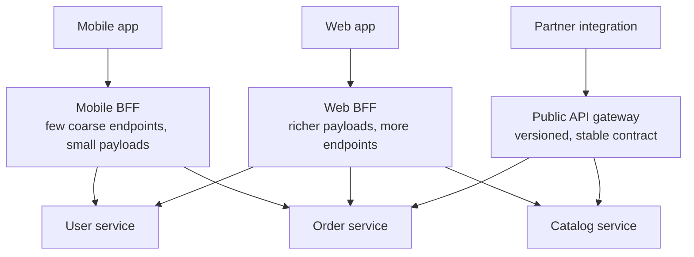
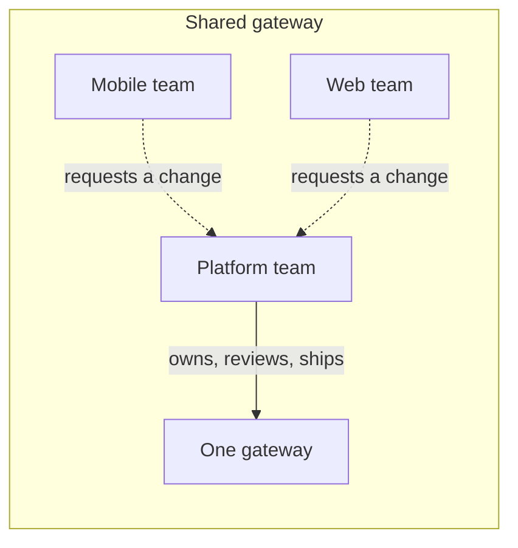
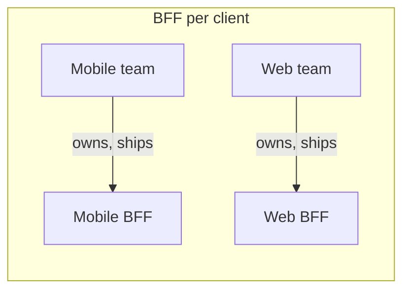
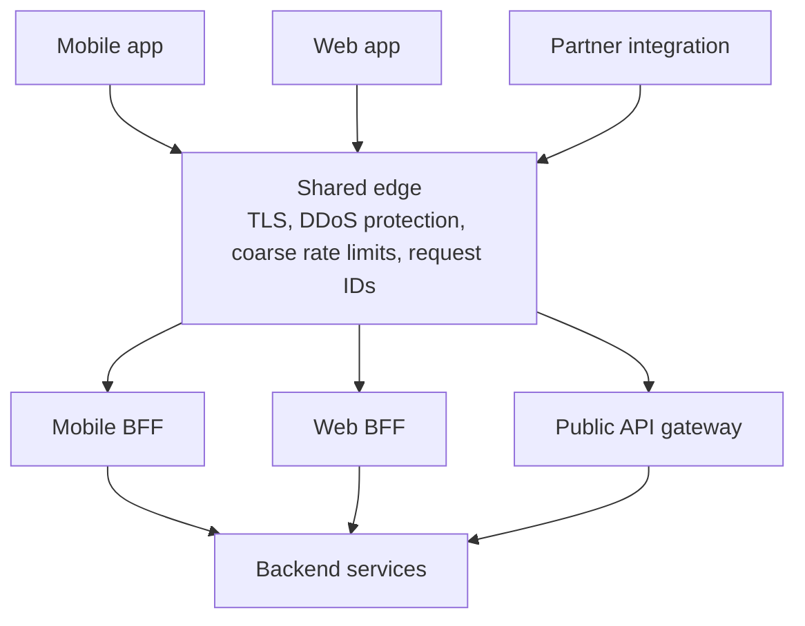
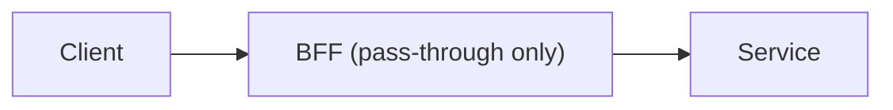

# Backend for frontend (BFF)

A backend for frontend is a server-side component dedicated to exactly one client experience — the mobile app, the web app, a partner integration — that composes and reshapes calls to backend services into whatever that one client actually needs.

It is a specialization of the [API gateway](./11-service-infrastructure-patterns.md#api-gateway): same job (compose, shape, sit between clients and services), but owned per client instead of shared across all of them. That ownership split is the entire point of the pattern.

## Why one gateway is not enough

A single shared gateway serving every client type ends up serving all of them badly, because their needs genuinely diverge:

| Client               | Wants                             | Tolerates                          |
| -------------------- | --------------------------------- | ---------------------------------- |
| Mobile app           | Few, small, pre-composed payloads | Almost no extra round trips        |
| Web app              | Richer payloads, more endpoints   | Chattier calls, larger responses   |
| Partner / public API | A stable, versioned contract      | Nothing that breaks without notice |

Encoding all three in one gateway produces a configuration full of conditionals on `User-Agent` or a client ID, owned by a team that is really three teams pretending to agree. The BFF pattern resolves this by giving each client type its own gateway, owned by the team that owns that client.

## What a BFF actually does

The same four jobs an API gateway does, but scoped to one client and therefore free to be opinionated about the answer:

- **Aggregation**: Fans one client request out to several services and assembles a single response, exactly like a shared gateway — see [aggregation and fan-out](./11-service-infrastructure-patterns.md#aggregation-and-fan-out) for the mechanics (required vs optional upstreams, partial degradation).
- **Response shaping**: Returns only the fields this client renders, in the shape this client's views expect — a mobile BFF might collapse five backend fields into one computed one; a web BFF might return the full record because a details page needs it.
- **Protocol translation**: Nothing requires every BFF to speak the same protocol to its own client. A web BFF exposing GraphQL for flexible querying and a mobile BFF exposing a handful of fixed REST endpoints can sit in front of the same backend services.
- **Session and auth handling**: Terminates the client's authentication concern so services do not each reimplement it. For a browser SPA this is the standard recommendation: the BFF runs the OAuth flow and holds tokens server-side behind a session cookie, so the browser never touches a bearer token — see [storing tokens on the client](../advanced/01-oauth2.md#storing-tokens-on-the-client).

## Ownership is the mechanism, not a side effect

A shared gateway is owned by a platform team that must approve, understand, and test every client's changes before they ship. A BFF inverts that: the team that owns the mobile app also owns the mobile BFF, in the same repository or at least the same release train.

This is Conway's law used deliberately: the system's communication structure is made to match the organization's, instead of fighting it. A mobile release that needs a new aggregated endpoint ships when the mobile team ships it, not when a shared platform backlog gets to it.

## Pros and cons

**Pros:**

- **Each client's shape is optimized independently**: The mobile BFF can collapse five calls into one without the web team caring, or being blocked by it.
- **Ownership matches the change driver**: The team that changes the mobile UI changes the mobile BFF, in the same release.
- **A smaller blast radius**: A bad deploy of the mobile BFF does not take down the partner API.
- **Independent technology choices**: A web BFF can run GraphQL while a mobile BFF stays plain REST, whatever fits that client's query patterns.

**Cons:**

- **Duplicated logic across BFFs**: Auth, pagination, and error mapping get written more than once, so a shared library or a common edge proxy in front of the BFFs becomes necessary.
- **More deployables**: Three gateways is three pipelines, three dashboards, and three on-call surfaces instead of one.
- **The temptation to add domain logic**: A BFF owned by a product team drifts toward holding business rules more easily than a platform-owned gateway does, because the people writing it are optimizing for their client, not for the system's boundaries.
- **Backend services now serve N gateways instead of one**: Every backend team has to think about several callers with different shapes, not a single contract.

## The discipline that keeps a BFF honest

A BFF may reshape, filter, and combine responses. It must not be the only place a business rule exists.

The test: if deleting a BFF would change what the system *means* — a discount calculation, an eligibility check, a state transition — rather than only how it is presented to one client, the rule is in the wrong layer.

That logic belongs in the service that owns the data it operates on, the same boundary [layered architecture](./01-layered-architecture.md#anemic-domain-model) and [hexagonal architecture](./02-hexagonal-architecture.md) argue for inside a single service, applied here at the level of an entire tier.

## Topology: a shared edge plus per-client BFFs

Splitting the gateway does not mean duplicating everything a gateway does. A common pattern for larger systems is a thin shared edge in front of the BFFs:

The edge is platform-owned and rarely changes: TLS termination, DDoS protection, coarse fleet-wide rate limits, request ID assignment — the concerns that are genuinely the same for every client.

The BFFs behind it are product-owned and change constantly: composition, client-specific shaping, session handling. This is the same platform-vs-product split [service infrastructure patterns](./11-service-infrastructure-patterns.md#putting-it-together) draws between the edge/gateway tier and everything that depends on a specific client's needs.

## BFF vs a single shared gateway vs a raw client-to-services call

| Approach                                   | Who owns the composition logic         | Client round trips             | Coordination cost                                                                          |
| ------------------------------------------ | -------------------------------------- | ------------------------------ | ------------------------------------------------------------------------------------------ |
| No gateway, client calls services directly | The client itself                      | One per service needed         | None, but every client reimplements composition and is coupled to every service's contract |
| Single shared gateway                      | A platform team, for every client type | One, gateway does the fan-out  | High: every client's needs go through one backlog                                          |
| BFF per client type                        | Each client's own team                 | One, that BFF does the fan-out | Low per client, moderate across BFFs (shared concerns duplicate)                           |

The middle row is not wrong by default — it is the right starting point when client needs have not diverged yet. The move to BFFs is a response to a specific, observed pain: a shared gateway's owners cannot keep up with divergent client demands, or its configuration has become an unreadable pile of client-specific conditionals.

## When to use it

- **Client needs have genuinely diverged**: Payload shape, round-trip sensitivity, or release cadence differ enough between clients that a shared contract satisfies none of them well.
- **Client teams are organizationally separate**: A mobile team and a web team that ship independently benefit from owning their own integration layer instead of queuing behind a shared one.
- **A client needs an interaction model the others do not**: For example, a web app wants GraphQL's flexible querying while a fixed mobile app is fine with a handful of stable REST endpoints.

### When it is overkill

- **One client, or clients with near-identical needs.** A single gateway (or none at all) is simpler and has nothing to duplicate. Introduce a second BFF when a second client's needs actually diverge, not in anticipation of it.
- **A small team serving all clients.** If one team already owns the gateway and every client, organizational ownership is not the constraint a BFF solves, and splitting it only adds deployables.
- **The variation is a handful of optional fields.** Query parameters or a `fields=` selector on one shared gateway solve that without a second service to run.

## Common anti-patterns

### A BFF per client that is a thin, pointless proxy

Some BFFs just forward the request unchanged and add nothing — no aggregation, no shaping, no client-specific logic. That is a deployable with no job, paying the operational cost of a service (pipeline, on-call, monitoring) for zero benefit over calling the backend directly.

If a BFF's diff against a plain reverse proxy is empty, it should be a plain reverse proxy.

### Business rules leaking into a BFF

The most common way a BFF goes wrong. A pricing calculation, an eligibility check, or a status transition written in the BFF because it was convenient for that one client's release, and now the pricing team cannot change it, cannot test it, and often does not know it exists. Apply [the discipline above](#the-discipline-that-keeps-a-bff-honest): if deleting the BFF would change what the answer *means*, the rule is misplaced.

### No shared library, so every BFF reinvents auth and error mapping

Three BFFs, three slightly different ways of validating a token, paginating a list, and mapping a service error to a client-facing one. The drift is invisible until an incident shows the mobile BFF was silently swallowing a class of errors the web BFF surfaces correctly. Extract the genuinely shared pieces into a library or the shared edge in front of the BFFs, and keep only client-specific shaping in each BFF.

### One BFF per screen instead of per client

Splitting further than per client type — a BFF for the home screen, another for checkout — reintroduces the shared-gateway coordination problem one level down, now with more deployables. The boundary that earns its keep is the one aligned with an owning team and a release cadence, which is usually the client platform, not a single screen within it.

## Interview talking points

- Name what a BFF actually is: a specialization of the API gateway, not a different mechanism — the difference is ownership (per client) rather than capability.
- Justify the split by divergence, not by default: introduce a second BFF when client needs have actually diverged, and say what the observed pain was (payload shape, release cadence, a shared backlog that cannot keep up).
- State the discipline explicitly: a BFF reshapes and composes; it must never be the only place a business rule lives. Give the test — would deleting it change what the system means, or only how it looks.
- Raise the duplication cost unprompted: multiple BFFs duplicate auth, pagination, and error mapping unless a shared library or edge layer absorbs the common parts.
- Know the shared-edge topology: a thin platform-owned edge (TLS, rate limits, request IDs) in front of product-owned BFFs is how larger systems avoid re-solving the same cross-cutting concerns in every BFF.
- Connect it to the OAuth BFF pattern for SPAs: running the token exchange server-side behind a session cookie is the same pattern solving a security problem, not a coincidence of naming.

## Reference materials

- [The pattern's original write-up from SoundCloud: The Back-end for Front-end Pattern (BFF)](https://philcalcado.com/2015/09/18/the_back_end_for_front_end_pattern_bff.html)
- [Pattern: API Gateway / Backends for Frontends](https://learn.microsoft.com/en-us/azure/architecture/patterns/backends-for-frontends)
