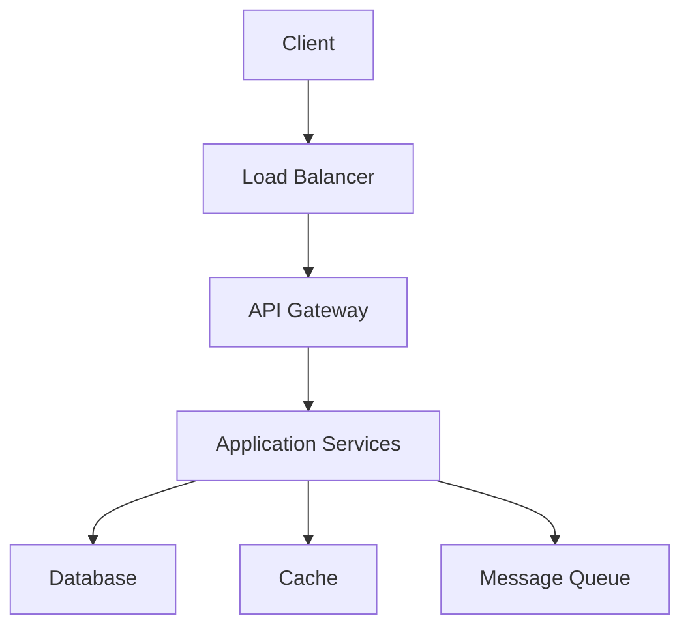

# System Design Interview Template

A practical template for system design interviews, focusing on the most important aspects that interviewers typically evaluate.

## 1. Clarify Requirements (5-10 minutes)

### Functional Requirements

- **Core Features** - Essential functionalities the system must support
- **Use Cases** - Primary user interactions and workflows
- **Data Operations** - What data needs to be stored, retrieved, updated, deleted

### Non-Functional Requirements

- **Scalability** - Expected growth in users, data, and traffic
- **Performance** - Latency and throughput requirements
- **Availability** - Uptime requirements (e.g., 99.9%, 99.99%)
- **Consistency** - Data consistency requirements (strong, eventual, etc.)

### Constraints & Assumptions

- **Technical Constraints** - Technology limitations, budget constraints
- **Assumptions** - Key assumptions about usage patterns, user behavior

### Out of Scope

- **Features not included** - What we're explicitly not building

## 2. Resource Estimation (5-10 minutes)

### Scale Assumptions

- **Daily Active Users (DAU)** - Number of active users per day
- **Peak vs Average Load** - Traffic patterns and peak usage times
- **Geographic Distribution (if relevant)** - Where users are located globally
- **Data Retention (if relevant)** - How long data should be stored

### Traffic Estimation

- **Read-to-Write Ratio** - Balance between read and write operations
- **Queries Per Second (QPS)**
  - Write QPS: `Total Writes per Day / 86400 seconds`
  - Read QPS: `Write QPS × Read-to-Write Ratio`
- **Peak Traffic** - Expected peak load (usually 2-3x average)

### Storage Estimation

- **Data Size per Entity** - Average size of each data record
- **Daily Storage Growth** - `Daily Writes × Average Record Size`
- **Total Storage Requirements** - `Daily Growth × Retention Period`

### Bandwidth Estimation

- **Write Bandwidth** - `Write QPS × Average Request Size`
- **Read Bandwidth** - `Read QPS × Average Response Size`
- **Total Bandwidth** - Combined read and write bandwidth

### Cache Estimation

- **Cache Hit Ratio** - Percentage of requests served from cache
- **Cacheable Data** - What data can be cached
- **Cache Size** - `Cacheable Requests × Average Data Size × Cache Duration`

### Server Estimation

- **Requests per Server** - Typical capacity of a single server
- **Number of Servers** - `Total QPS / Requests per Server`
- **Resource Requirements** - CPU, memory, storage per server

## 3. Core System Components (5-8 minutes)

### System Components

- **Core Services** - Main application services
- **Data Layer** - Databases, caches, file storage
- **Infrastructure** - Load balancers, CDN, message queues
- **External Services** - Third-party integrations

### API Design

- **RESTful Endpoints** - HTTP methods, URLs, parameters
- **Request/Response Format** - JSON schemas, data structures
- **Rate Limiting (if relevant and in scope)** - Request limits per user/IP

#### Example API Endpoints

```plaintext
POST /api/v1/urls
GET /api/v1/urls/{shortUrl}
DELETE /api/v1/urls/{shortUrl}
```

## 4. High-Level Design (10-15 minutes)

### Component Diagram



### Data Flow

- **Request Flow** - How requests move through the system
- **Response Flow** - How responses are generated and returned
- **Background Processing** - Asynchronous operations and workflows

### Scalability Strategy

- **Horizontal Scaling** - Adding more servers/instances
- **Vertical Scaling** - Increasing server resources
- **Database Scaling** - Read replicas, sharding, partitioning

## 5. Detailed Design (15-20 minutes)

### Database Design

- **Database Choice** - SQL vs NoSQL and specific selection
- **Schema Design** - Key tables/collections and relationships
- **Indexing Strategy** - Important indexes for performance
- **Data Partitioning (if relevant and in scope)** - Sharding strategy, partition keys

#### Example Schema

| Field       | Type     | Description          | Example                 |
|-------------|----------|----------------------|-------------------------|
| id          | String   | Primary key          | "abc123"                |
| originalUrl | String   | Original URL         | "<https://example.com>" |
| createdAt   | DateTime | Creation timestamp   | "2024-01-01T00:00:00Z"  |
| expiresAt   | DateTime | Expiration timestamp | "2024-12-31T23:59:59Z"  |

### Core Algorithms (if relevant)

- **Key Algorithms** - Important algorithms for system functionality
- **Data Structures** - Efficient data structures for operations

## 6. Scalability & Reliability (10-15 minutes)

### Scaling Strategies

- **Horizontal Scaling** - Adding more servers/instances
- **Database Scaling** - Read replicas, sharding, partitioning
- **Load Balancing** - How to distribute traffic

### Reliability & Fault Tolerance

- **Data Replication** - How to ensure data availability
- **Failover Mechanisms** - Handling component failures
- **Consistency vs Availability** - Trade-offs and decisions

### Performance Optimization

- **Caching** - Where and what to cache and how to invalidate it
- **Bottlenecks** - Potential performance issues
- **Mitigation Strategies** - How to address bottlenecks
- **Monitoring** - Key metrics to track

## 7. Trade-offs & Discussion (5-10 minutes)

### Design Decisions

- **Technology Choices** - Why specific technologies were selected
- **Architecture Trade-offs** - Pros and cons of chosen approach
- **Alternative Approaches** - Other solutions considered and why not chosen

### Future Considerations

- **Scalability Limits** - How system handles 10x, 100x growth
- **Feature Extensions** - How to add new features

## Interview Tips

### Time Management

- **Total Duration**: 45-60 minutes
- **Clarify Requirements**: 5-10 minutes
- **Resource Estimation**: 5-10 minutes
- **Core System Components**: 5-8 minutes
- **High-Level Design**: 10-15 minutes
- **Detailed Design**: 15-20 minutes
- **Scalability & Reliability**: 10-15 minutes
- **Trade-offs & Discussion**: 5-10 minutes

### Best Practices

1. **Start with Requirements** - Always clarify requirements first
2. **Think Out Loud** - Explain your reasoning process
3. **Ask Questions** - Don't assume, ask for clarification
4. **Use Diagrams** - Visual representations help communication
5. **Consider Trade-offs** - Discuss pros and cons of decisions
6. **Be Practical** - Consider real-world constraints

### Common Pitfalls to Avoid

- Jumping into implementation without understanding requirements
- Over-engineering the initial solution
- Ignoring non-functional requirements
- Not considering failure scenarios
- Forgetting about scalability and performance
- Not discussing trade-offs and alternatives

## Example Applications

This template can be adapted for various system design problems:

- **URL Shortening Service** (like TinyURL)
- **Social Media Feed** (like Twitter)
- **Chat System** (like WhatsApp)
- **Video Streaming** (like Netflix)
- **Ride-sharing Service** (like Uber)
- **E-commerce Platform** (like Amazon)
- **Search Engine** (like Google)
- **File Storage System** (like Dropbox)

Each system will have different emphasis on various sections, but this template provides a practical framework that aligns with typical interview expectations.
